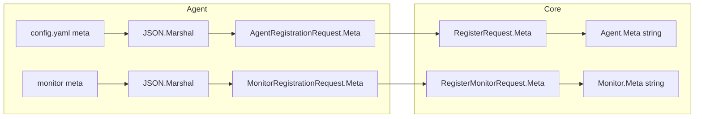

# Meta support (root + monitors) in agent config and backend

## Overview

Support an optional `meta` block at the **root** of `config.yaml` and on each **monitor**. `meta` is an arbitrary key-value object (e.g. `title`, `description`, `tags`). The agent stringifies it to JSON and sends it during registration; the core stores it in new `meta` text columns.

---

## YAML format

**Root:**

```yaml
meta:
  title: "Home"
  description: "Home page"

core_url: http://localhost:8999
interval: 60m
monitors: [...]
```

**Per monitor:**

```yaml
monitors:
  - name: orion-website
    description: orion website
    meta:
      title: "Orion"
      tags: ["web", "critical"]
    type: website
    ...
```

Values can be strings, numbers, booleans, arrays, or nested objects; YAML and JSON handle them. The backend stores the stringified JSON as-is.

---

## 1. Agent: config schema

**Files:** [agent/internal/config/config.go](agent/internal/config/config.go)

- **`UserConfig`:** add

`Meta map[string]interface{} \`yaml:"meta,omitempty"\``

- **`UserMonitor`:** add

`Meta map[string]interface{} \`yaml:"meta,omitempty"\``

Use `map[string]interface{} `so YAML can unmarshal nested structures and arrays; we do not add validation in `validators.go` (optional, arbitrary).

---

## 2. Agent: transport payloads

**File:** [agent/internal/transport/payload.go](agent/internal/transport/payload.go)

- **`AgentRegistrationRequest`:** add

`Meta string \`json:"meta,omitempty"\``

- **`MonitorRegistrationRequest`:** add

`Meta string \`json:"meta,omitempty"\``

The agent will set these to `string(json.Marshal(meta))` when `meta` is non-empty; otherwise leave unset so `omitempty` omits the field.

---

## 3. Agent: registration

**File:** [agent/internal/registration/registration.go](agent/internal/registration/registration.go)

- **`RegisterAgentIfNeeded`** when building `AgentRegistrationRequest`:
  - If `s.userConfig.Meta != nil && len(s.userConfig.Meta) > 0`:

`json.Marshal(s.userConfig.Meta)` and set `req.Meta = string(b)`.

        - Otherwise leave `req.Meta` unset.

- **`RegisterAgentMonitorsIfNeeded`** when building `MonitorRegistrationRequest`:
  - If `monitor.Meta != nil && len(monitor.Meta) > 0`:

`json.Marshal(monitor.Meta)` and set `req.Meta = string(b)`.

        - Otherwise leave `req.Meta` unset.

Root meta is only sent when the agent calls `RegisterAgent` (i.e. when not yet registered). Monitor meta is sent at each monitor registration (create or revive).

---

## 4. Core: DB models

**File:** [core/internal/db/models.go](core/internal/db/models.go)

- **`Agent`:** add

`Meta string \`json:"meta" gorm:"type:text"\``

- **`Monitor`:** add

`Meta string \`json:"meta" gorm:"type:text"\``

GORM `AutoMigrate` in [core/internal/db/db.go](core/internal/db/db.go) will add the new columns on next run.

---

## 5. Core: service layer

**File:** [core/internal/service/agent-service.go](core/internal/service/agent-service.go)

- **`RegisterRequest`:** add

`Meta string \`json:"meta,omitempty"\``

- **`createNewAgent`:** set `agent.Meta = req.Meta`.
- In the re-registration branch (existing agent, `updates` map):

if `req.Meta != ""` then `updates["meta"] = req.Meta`.

**File:** [core/internal/service/monitor-service.go](core/internal/service/monitor-service.go)

- **`RegisterMonitorRequest`:** add

`Meta string \`json:"meta,omitempty"\``

- **`createNewMonitor`:** set `monitor.Meta = req.Meta`.
- In the **revive** branch (deleted monitor, `updates`):

if `req.Meta != ""` then `updates["meta"] = req.Meta`.

---

## 6. Core: API

No handler changes. [core/internal/api/agent.go](core/internal/api/agent.go) and [core/internal/api/monitor.go](core/internal/api/monitor.go) use `c.ShouldBindJSON(&req)`; the new `meta` fields are bound from the request automatically.

---

## 7. Documentation

**File:** [docs/agent-core-contract.md](docs/agent-core-contract.md)

- **Agent Registration** request body: add optional `"meta": "{\"title\":\"Home\"}"` (stringified JSON).
- **Monitor Registration** request body: add optional `"meta": "{\"title\":\"Service A\"}"`.
- **Agent** and **Monitor** data models: add `Meta string` (store for stringified JSON).

---

## 8. Example `config.yaml`

Add an example `meta` at root and on one monitor in [agent/config.yaml](agent/config.yaml) (or in docs) to illustrate:

```yaml
meta:
  title: "Home"
  description: "Home page"

core_url: http://localhost:8999
interval: 60m
monitors:
  - name: orion-website
    description: orion website
    meta:
      title: "Orion"
    type: website
    ...
```

---

## Data flow



---

## Edge cases

- **Empty `meta: {}`**

Treated as “no meta”: not sent (`omitempty`), backend keeps existing value or `""`.

- **Invalid JSON**

We only marshal `map[string]interface{} `produced by YAML; `json.Marshal` should succeed. If it fails, log and omit `meta`.

- **Root meta updates**

Root meta is only sent when the agent is not yet registered. To sync later changes, the agent could call `POST /v1/register` on every startup (idempotent); the core would update `meta` in the re-registration path. That can be a follow-up.

---

## Files to touch

| Layer | File | Changes |

| ------- | --------------------------------------------- | ------------------------------------------------------------------ |

| Agent | `agent/internal/config/config.go` | `UserConfig.Meta`, `UserMonitor.Meta` |

| Agent | `agent/internal/transport/payload.go` | `AgentRegistrationRequest.Meta`, `MonitorRegistrationRequest.Meta` |

| Agent | `agent/internal/registration/registration.go` | Marshal root/monitor meta and set on requests |

| Core | `core/internal/db/models.go` | `Agent.Meta`, `Monitor.Meta` |

| Core | `core/internal/service/agent-service.go` | `RegisterRequest.Meta`, create/update logic |

| Core | `core/internal/service/monitor-service.go` | `RegisterMonitorRequest.Meta`, create/revive logic |

| Docs | `docs/agent-core-contract.md` | Request bodies and data models |

| Example | `agent/config.yaml` (optional) | Example `meta` at root and on one monitor |
