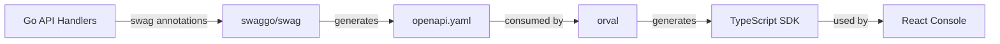

# OpenAPI Spec and TypeScript SDK Generation Plan

## Overview

This plan introduces OpenAPI specification generation for the Go backend using `swaggo/swag` and generates a TypeScript API SDK for the console using `orval`, which will integrate seamlessly with the existing TanStack Query setup.

## Architecture Flow

## Implementation Steps

### 1. Backend: OpenAPI Setup

**Files to modify:**

- [core/go.mod](core/go.mod) - Add swaggo dependencies
- [core/main.go](core/main.go) - Add swagger route and initialization
- [core/internal/api/routes.go](core/internal/api/routes.go) - Add swagger route handler

**Files to annotate with OpenAPI comments:**

- [core/internal/api/agent.go](core/internal/api/agent.go) - All agent endpoints
- [core/internal/api/monitor.go](core/internal/api/monitor.go) - All monitor endpoints
- [core/internal/api/report.go](core/internal/api/report.go) - All report endpoints
- [core/internal/api/health.go](core/internal/api/health.go) - All health endpoints
- [core/internal/api/auth.go](core/internal/api/auth.go) - Auth middleware documentation

**Actions:**

- Install `github.com/swaggo/swag/cmd/swag` and `github.com/swaggo/gin-swagger`
- Add swagger annotations to main.go for API metadata
- Add OpenAPI annotations to all handler functions with request/response schemas
- Create shared schema definitions for common types (Agent, Monitor, Report, etc.)
- Add authentication scheme documentation (Bearer token)
- Generate OpenAPI spec using `swag init`
- Add `/swagger/*` route to serve the spec

### 2. Spec File Management

**New files:**

- [core/docs/swagger.yaml](core/docs/swagger.yaml) - Generated OpenAPI spec (git-ignored or committed based on preference)
- [core/.swagignore](core/.swagignore) - Optional ignore file for swag

**Actions:**

- Configure swag to output spec to `core/docs/` directory
- Decide whether to commit generated spec or regenerate on build
- Add generation script or Makefile target

### 3. Console: SDK Generation Setup

**Files to modify:**

- [core/console/package.json](core/console/package.json) - Add orval and related dependencies
- [core/console/orval.config.ts](core/console/orval.config.ts) - New orval configuration file
- [core/console/vite.config.ts](core/console/vite.config.ts) - May need updates for SDK imports

**New files:**

- [core/console/src/api/generated/](core/console/src/api/generated/) - Generated SDK files (git-ignored)
- [core/console/src/api/client.ts](core/console/src/api/client.ts) - API client configuration wrapper

**Actions:**

- Install `orval` as dev dependency
- Configure orval to:
  - Read OpenAPI spec from `../docs/swagger.yaml`
  - Generate TypeScript types and API functions
  - Generate React Query hooks (integrate with existing TanStack Query)
  - Output to `src/api/generated/`
- Create API client wrapper for base URL configuration
- Add npm script to generate SDK (`npm run generate:api`)

### 4. Integration

**Files to modify:**

- [core/console/src/utils/query-client.ts](core/console/src/utils/query-client.ts) - Ensure compatibility
- [core/console/src/features/home.tsx](core/console/src/features/home.tsx) - Example usage of generated hooks

**Actions:**

- Update console code to use generated API hooks instead of manual `ky` calls
- Ensure generated hooks work with existing QueryClient configuration
- Add environment variable support for API base URL

### 5. Build Integration

**Files to modify:**

- [core/Makefile](core/Makefile) or [core/scripts/generate-spec.sh](core/scripts/generate-spec.sh) - New build scripts

**Actions:**

- Create script to generate OpenAPI spec before console build
- Update console build process to generate SDK before TypeScript compilation
- Consider CI/CD integration for spec generation

## Key Considerations

1. **Spec Location**: The OpenAPI spec should be accessible to both Go (for serving) and console (for SDK generation). Consider placing it in `core/docs/swagger.yaml`.

2. **Type Safety**: Ensure request/response types in Go service layer align with OpenAPI schema definitions.

3. **Authentication**: Document Bearer token authentication in OpenAPI spec for protected routes.

4. **Error Responses**: Standardize error response schemas in OpenAPI spec.

5. **Versioning**: The API uses `/v1` prefix - ensure this is reflected in the OpenAPI spec.

6. **Generated Files**: Decide on git strategy - ignore generated SDK files or commit them for easier development.

## Dependencies to Add

**Go (core):**

- `github.com/swaggo/swag/cmd/swag` (tool)
- `github.com/swaggo/gin-swagger`
- `github.com/swaggo/files`

**TypeScript (console):**

- `orval` (dev dependency)
- `@orval/core` (if needed)