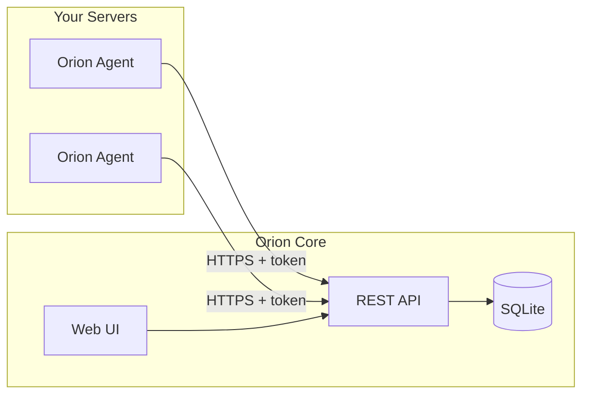

# Orion Open-Source README Plan

## Goals

- **Clarity**: One-sentence and short "what is Orion" plus architecture so new users get it quickly.
- **Ease of use**: Copy-paste steps to build, run, and configure Core and Agent (and optional frontend dev).
- **Open-source ready**: Contributing, docs links, placeholders for license/conduct.

---

## 1. Header and What Is Orion

**Lead**

> Orion is a lightweight, self-hosted monitoring system: agents on your servers collect system metrics and health checks, and a central Core server stores and serves them through a web UI.

**Components**

- **Agent** (Go): Linux/macOS. Auto-registers with Core. Collects CPU/memory/disk; runs monitors (HTTP, website, PM2, internal-service, command).
- **Core** (Go + SQLite): Receives reports, manages agents/monitors, serves REST API and built-in SPA.
- **Frontend** (React/Vite): Dev UI; production builds live in `core/web/`.

**Architecture** (simplified from [docs/system-design.md](docs/system-design.md))



---

## 2. Prerequisites

- **Go 1.25+** (agent and core use 1.25.3).
- **Node 18+** and **npm** — only for frontend dev or rebuilding the UI.
- **SQLite** — embedded in Core; nothing to install.

---

## 3. Quick Start

1. **Build Core**: `cd core && go build -o orion-core . && cd ..`
2. **Build Agent**: `cd agent && go build -o orion-agent . && cd ..`
3. **Run Core**: `./core/orion-core` — creates `core/data/orion.db`, serves on `:8999`.
4. **Agent config** — create `agent/config.yaml`:

   ```yaml
   core_url: http://localhost:8999
   interval: 60s
   monitors: [] # optional
   ```

5. **Run Agent**: `./agent/orion-agent run -config config.yaml -state state.yaml`
6. **Open UI**: `http://localhost:8999` (from `core/web/`). If empty: `make build-static` then restart Core.

---

## 4. Configuration

**Agent** — required: `core_url`, `interval`. Optional: `meta`, `monitors`.

**Monitor types**

| Type | Required config |

|------|-----------------|

| `http-healthcheck` | `http.url`, `http.timeout`, `http.expected_status` |

| `website` | `website.url`; optional `timeout`, `expected_status` |

| `internal-service` | `internal_service.ping.url`, `internal_service.ping.timeout`, `internal_service.process.port` |

| `pm2` | `pm2.app_name` |

| `command` | `command.command` |

**Paths**

- Linux: `/etc/orion/config.yaml`, `/var/lib/orion/state.yaml` ([scripts/orion-agent.service](scripts/orion-agent.service)).
- macOS: `/usr/local/etc/orion/config.yaml`, `/usr/local/var/lib/orion/state.yaml` ([scripts/com.orion.agent.plist](scripts/com.orion.agent.plist)).
- Dev: `config.yaml`, `state.yaml` in agent dir with `-config` / `-state`.

**Core**: Port in [core/main.go](core/main.go) (`:8999`). DB in [core/internal/db/db.go](core/internal/db/db.go) (`data/orion.db`).

---

## 5. Running as a Service

- **Linux (systemd)**: [scripts/orion-agent.service](scripts/orion-agent.service). Binary: `/usr/local/bin/orion-agent`; config: `/etc/orion/config.yaml`; state: `/var/lib/orion/state.yaml`. Create `orion` user/group or adjust.
- **macOS (launchd)**: [scripts/com.orion.agent.plist](scripts/com.orion.agent.plist) — paths in plist.
- **Uninstall**: [scripts/agent-uninstall.sh](scripts/agent-uninstall.sh) (`sudo`).

`agent-install.sh` does not exist. Document manual install (binary + config + service file) and note it as planned.

---

## 6. Project Layout

```
orion/
├── agent/       # Orion Agent (Go)
├── core/        # Orion Core (Go), API + core/web/ SPA
├── frontend/    # React/Vite; production → core/web via make build-static
├── scripts/     # systemd, launchd, uninstall
├── docs/        # system-design, agent-core-contract
├── sdk/         # OpenAPI types (make generate-sdk)
└── Makefile     # generate-sdk, build-static
```

---

## 7. Makefile

- `make generate-sdk` — `sdk/api.d.ts` from `core/openapi.yaml`.
- `make build-static` — build frontend, copy to `core/web/`.

---

## 8. Development

- **Frontend**: `cd frontend && npm install && npm run dev`. `VITE_API_BASE_URL=http://localhost:8999/v1` (fix [frontend/.env.example](frontend/.env.example) from 8080 to 8999).
- **API**: [core/openapi.yaml](core/openapi.yaml). Orval: `npm run generate:api` in frontend.
- **Agent CLI** ([agent/main.go](agent/main.go)): `start`, `stop`, `status`, `restart`, `run`, `maintenance` (`-up`/`-down`), `config` (`validate`, `diff`).

---

## 9. README Structure (Final)

1. Orion — one-liner, description, architecture diagram
2. Prerequisites
3. Quick Start (6 steps)
4. Configuration — agent, monitor types, paths, Core
5. Running as a Service
6. Project Layout
7. Makefile
8. Development
9. Documentation — links to `docs/system-design.md`, `docs/agent-core-contract.md`, `agent/docs/agent-registration.md`, `core/README.md`
10. Contributing — "Contributions welcome. Open an issue or PR." (+ `CONTRIBUTING.md` if added)
11. License — "See LICENSE" or "License TBD"

---

## 10. Files to Create or Update

| File | Action |

|------|--------|

| [README.md](README.md) | Create full README per §9. |

| [frontend/.env.example](frontend/.env.example) | `8080` → `8999` in `VITE_API_BASE_URL`. |

| [core/README.md](core/README.md) | Port 8080 → 8999; `go build ./cmd/orion-core` → `go build -o orion-core .` |

| [scripts/README.md](scripts/README.md) | `agent-install.sh` as planned; document manual install. |

---

## 11. Out of Scope

- `CONTRIBUTING.md`, `LICENSE`
- `agent-install.sh`, new Makefile targets (only document current/planned)
- Docker, prebuilt binaries (optional one-liner "Planned" if desired)
