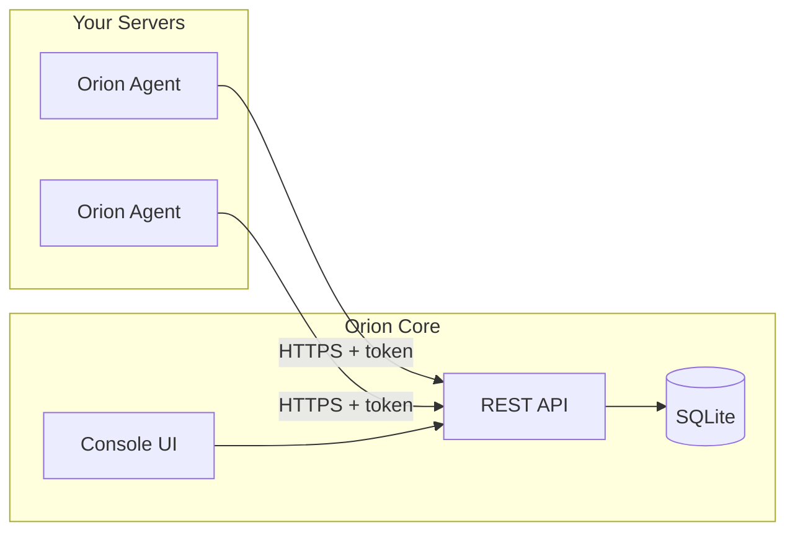

# Orion

Orion is a lightweight, self-hosted monitoring system: agents on your servers collect system metrics and health checks, and a central Core server stores and serves them through a web UI.

## Components

- **Agent** (`apps/agent`, Go): Runs on Linux/macOS. Auto-registers with Core. Collects CPU, memory, and disk; runs monitors (HTTP, website, PM2, internal-service, command).
- **Core** (`apps/core`, Go + SQLite): Receives reports, manages agents and monitors, serves a REST API and built-in SPA.
- **Console** (`apps/console`, React/Vite): Editable UI source; production builds are copied into `apps/core/web/`.



## Prerequisites

- **Go 1.25+**
- **Node 18+** and **npm** — for frontend development or rebuilding the UI
- **SQLite** — embedded in Core; nothing to install

## Quick Start

1. **Build Core**
   ```bash
   cd apps/core && go build -o orion-core . && cd ../..
   ```

2. **Build Agent**
   ```bash
   cd apps/agent && go build -o orion-agent . && cd ../..
   ```

3. **Run Core** — creates `apps/core/data/orion.db`, serves on `:8999`
   ```bash
   cd apps/core && ./orion-core
   ```

4. **Agent config** — create `apps/agent/config.yaml`:
   ```yaml
   core_url: http://localhost:8999
   interval: 60s
   monitors: [] # optional
   ```

5. **Run Agent**
   ```bash
   cd apps/agent && ./orion-agent run -config config.yaml -state state.yaml
   ```

6. **Open UI** — `http://localhost:8999` (from `apps/core/web/`). If the UI is empty, run `make build-static` and restart Core.

## Configuration

### Agent

- **Required**: `core_url`, `interval` (e.g. `60s`)
- **Optional**: `meta` (title, description), `monitors`

### Monitor types

| Type | Required config |
|------|-----------------|
| `http-healthcheck` | `http.url`, `http.timeout`, `http.expected_status`; optional `expected_body`, `expected_body_regex` |
| `website` | `website.url`; optional `timeout`, `expected_status` |
| `internal-service` | `internal_service.ping.url`, `internal_service.ping.timeout`, `internal_service.process.port` |
| `pm2` | `pm2.app_name` |
| `command` | `command.command` |

### Paths

- **Linux**: `/etc/orion/config.yaml`, `/var/lib/orion/state.yaml` — see [deploy/systemd/orion-agent.service](deploy/systemd/orion-agent.service)
- **macOS**: `/usr/local/etc/orion/config.yaml`, `/usr/local/var/lib/orion/state.yaml` — see [deploy/launchd/com.orion.agent.plist](deploy/launchd/com.orion.agent.plist)
- **Dev**: `config.yaml` and `state.yaml` in the agent directory, with `-config` and `-state`

### Core

Port in [apps/core/main.go](apps/core/main.go) (`:8999`). Database in [apps/core/internal/db/db.go](apps/core/internal/db/db.go) (`data/orion.db`).

## Running as a Service

- **Linux (systemd)**: [deploy/systemd/orion-agent.service](deploy/systemd/orion-agent.service). Binary: `/usr/local/bin/orion-agent`; config: `/etc/orion/config.yaml`; state: `/var/lib/orion/state.yaml`. Create the `orion` user/group or adjust.
- **macOS (launchd)**: [deploy/launchd/com.orion.agent.plist](deploy/launchd/com.orion.agent.plist) — paths are in the plist.
- **Uninstall**: [deploy/scripts/agent-uninstall.sh](deploy/scripts/agent-uninstall.sh) (run with `sudo`).

See [deploy/scripts/README.md](deploy/scripts/README.md) for manual install steps until `agent-install.sh` is available.

## Project Layout

```
orion/
├── apps/
│   ├── agent/    # Orion Agent (Go)
│   ├── core/     # Orion Core (Go), API + generated apps/core/web SPA
│   └── console/  # React/Vite UI source
├── deploy/       # Docker Compose, systemd, launchd, install/uninstall helpers
├── docs/         # architecture, contracts, milestones, plans
├── packages/
│   └── sdk/      # OpenAPI types (make generate-sdk)
└── Makefile      # generate-sdk, build-static, docker-build, docker-up
```

## Makefile

- `make generate-sdk` — generate console API client from `apps/core/openapi.yaml` (Orval → `apps/console/src/lib/api.ts`)
- `make build-static` — build console source and copy to `apps/core/web/`
- `make docker-build` — build orion-core Docker image
- `make docker-up` — run orion-core via `docker compose -f deploy/docker-compose.yml up -d` (set `ORION_ADMIN_*`, `ORION_JWT_SECRET` for frontend auth)

## Development

- **Console**: `cd apps/console && npm install && npm run dev`. Set `VITE_API_BASE_URL=http://localhost:8999/v1` in `.env` (see [apps/console/.env.example](apps/console/.env.example)).
- **API**: [apps/core/openapi.yaml](apps/core/openapi.yaml). Regenerate the console client: `npm run generate:api` in `apps/console`.
- **Agent CLI** ([apps/agent/main.go](apps/agent/main.go)): `start`, `stop`, `status`, `restart`, `run`, `maintenance` (`-up` / `-down`), `config` (`validate`, `diff`).

## Documentation

- [System design](docs/system-design.md)
- [Agent–Core contract](docs/agent-core-contract.md)
- [Agent registration](apps/agent/docs/agent-registration.md)
- [Core server](apps/core/README.md)

## Contributing

Contributions are welcome. Open an issue or a pull request.

## License

See [LICENSE](LICENSE).
