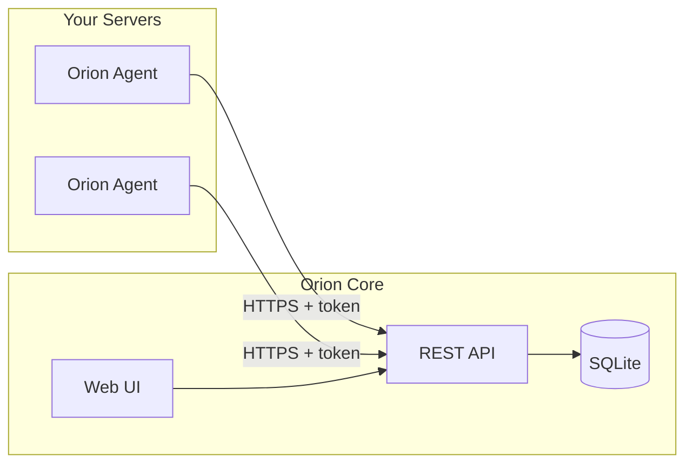

# Orion

Orion is a lightweight, self-hosted monitoring system: agents on your servers collect system metrics and health checks, and a central Core server stores and serves them through a web UI.

## Components

- **Agent** (Go): Runs on Linux/macOS. Auto-registers with Core. Collects CPU, memory, and disk; runs monitors (HTTP, website, PM2, internal-service, command).
- **Core** (Go + SQLite): Receives reports, manages agents and monitors, serves a REST API and built-in SPA.
- **Frontend** (React/Vite): Dev UI; production builds are in `core/web/`.



## Prerequisites

- **Go 1.25+**
- **Node 18+** and **npm** — for frontend development or rebuilding the UI
- **SQLite** — embedded in Core; nothing to install

## Quick Start

1. **Build Core**
   ```bash
   cd core && go build -o orion-core . && cd ..
   ```

2. **Build Agent**
   ```bash
   cd agent && go build -o orion-agent . && cd ..
   ```

3. **Run Core** — creates `core/data/orion.db`, serves on `:8999`
   ```bash
   ./core/orion-core
   ```

4. **Agent config** — create `agent/config.yaml`:
   ```yaml
   core_url: http://localhost:8999
   interval: 60s
   monitors: [] # optional
   ```

5. **Run Agent**
   ```bash
   ./agent/orion-agent run -config config.yaml -state state.yaml
   ```

6. **Open UI** — `http://localhost:8999` (from `core/web/`). If the UI is empty, run `make build-static` and restart Core.

## Configuration

### Agent

- **Required**: `core_url`, `interval` (e.g. `60s`)
- **Optional**: `meta` (title, description), `monitors`

### Monitor types

| Type | Required config |
|------|-----------------|
| `http-healthcheck` | `http.url`, `http.timeout`, `http.expected_status` |
| `website` | `website.url`; optional `timeout`, `expected_status` |
| `internal-service` | `internal_service.ping.url`, `internal_service.ping.timeout`, `internal_service.process.port` |
| `pm2` | `pm2.app_name` |
| `command` | `command.command` |

### Paths

- **Linux**: `/etc/orion/config.yaml`, `/var/lib/orion/state.yaml` — see [scripts/orion-agent.service](scripts/orion-agent.service)
- **macOS**: `/usr/local/etc/orion/config.yaml`, `/usr/local/var/lib/orion/state.yaml` — see [scripts/com.orion.agent.plist](scripts/com.orion.agent.plist)
- **Dev**: `config.yaml` and `state.yaml` in the agent directory, with `-config` and `-state`

### Core

Port in [core/main.go](core/main.go) (`:8999`). Database in [core/internal/db/db.go](core/internal/db/db.go) (`data/orion.db`).

## Running as a Service

- **Linux (systemd)**: [scripts/orion-agent.service](scripts/orion-agent.service). Binary: `/usr/local/bin/orion-agent`; config: `/etc/orion/config.yaml`; state: `/var/lib/orion/state.yaml`. Create the `orion` user/group or adjust.
- **macOS (launchd)**: [scripts/com.orion.agent.plist](scripts/com.orion.agent.plist) — paths are in the plist.
- **Uninstall**: [scripts/agent-uninstall.sh](scripts/agent-uninstall.sh) (run with `sudo`).

See [scripts/README.md](scripts/README.md) for manual install steps until `agent-install.sh` is available.

## Project Layout

```
orion/
├── agent/       # Orion Agent (Go)
├── core/        # Orion Core (Go), API + core/web/ SPA
├── frontend/    # React/Vite; production → core/web via make build-static
├── scripts/     # systemd, launchd, uninstall
├── docs/        # system-design, agent-core-contract
├── sdk/         # OpenAPI types (make generate-sdk)
└── Makefile     # generate-sdk, build-static
```

## Makefile

- `make generate-sdk` — generate `sdk/api.d.ts` from `core/openapi.yaml`
- `make build-static` — build frontend and copy to `core/web/`

## Development

- **Frontend**: `cd frontend && npm install && npm run dev`. Set `VITE_API_BASE_URL=http://localhost:8999/v1` in `.env` (see [frontend/.env.example](frontend/.env.example)).
- **API**: [core/openapi.yaml](core/openapi.yaml). Regenerate the frontend client: `npm run generate:api` in the frontend directory.
- **Agent CLI** ([agent/main.go](agent/main.go)): `start`, `stop`, `status`, `restart`, `run`, `maintenance` (`-up` / `-down`), `config` (`validate`, `diff`).

## Documentation

- [System design](docs/system-design.md)
- [Agent–Core contract](docs/agent-core-contract.md)
- [Agent registration](agent/docs/agent-registration.md)
- [Core server](core/README.md)

## Contributing

Contributions are welcome. Open an issue or a pull request.

## License

See [LICENSE](LICENSE).
