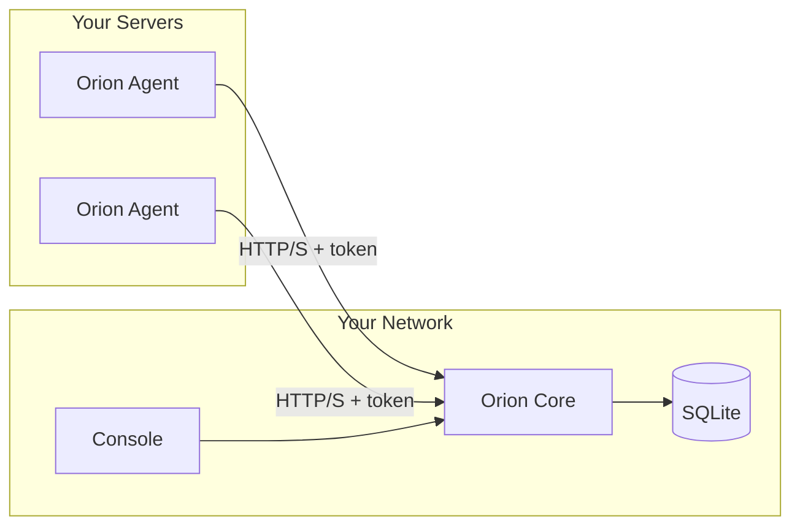

# Orion

Orion is a local-first monitoring app for your own servers.

It runs on infrastructure you control: a small Agent collects system metrics and check results, a
Core server stores everything in SQLite, and the Console gives you a clean operational view of
agents, monitors, incidents, alerts, logs, and data retention.

Orion is built for home labs, small fleets, private networks, and anyone who wants observability
without sending server telemetry to a third-party service.

## How It Works



- **Agent** runs on each server and reports system metrics plus configured monitor checks.
- **Core** receives reports, computes health, stores data locally, and exposes the API.
- **Console** is the web UI for incidents, agents, monitors, alerts, logs, and settings.

## Local-First

Orion is designed around local ownership:

- Data is stored in a local SQLite database.
- Agents can report over your LAN, Tailscale, or another private network.
- Alert and retention settings are controlled by your Core instance.
- The app can run without a hosted SaaS backend.

## Quick Start

### 1. Run Core and Console

Core and Console are deployed together. Core serves the API, stores data in SQLite, and serves the
Console web app from the same process.

Set local admin credentials:

```sh
export ORION_ADMIN_USERNAME=admin
export ORION_ADMIN_PASSWORD='change-me'
export ORION_JWT_SECRET='change-me-to-a-long-random-value'
```

Start Core and Console with the Docker image:

```sh
docker run -d \
  --name orion-core \
  --restart unless-stopped \
  -p 8999:8999 \
  -v orion-data:/data \
  -e ORION_DATA_DIR=/data \
  -e ORION_ADMIN_USERNAME="$ORION_ADMIN_USERNAME" \
  -e ORION_ADMIN_PASSWORD="$ORION_ADMIN_PASSWORD" \
  -e ORION_JWT_SECRET="$ORION_JWT_SECRET" \
  ghcr.io/sunday-studio/orion-core:v0.1.0
```

Core listens on `http://localhost:8999` and stores data in the `orion-data` Docker volume.

The main deployable image is the Core image. It includes both Core and Console.

If you are working from source instead of a published image, use Docker Compose:

```sh
make docker-build
make docker-up
```

See [Core Docker deployment](docs/deployment/core-docker.md) for image and volume details.

### 2. Open Console

Open `http://localhost:8999`.

### 3. Install Agent on a Server

Install the Agent on each machine you want to monitor. The install script writes the config, creates
the service user and directories, installs the system service, and starts the Agent.

Download the Agent binary for the host, then run:

```sh
sudo ./deploy/scripts/agent-install.sh \
  --core-url http://orion-core.local:8999 \
  --binary ./orion-agent
```

The service install script is the recommended path for host monitoring because it gives the Agent
normal access to the host system, service manager, and local state path.

Use a Core URL that the monitored server can reach, for example:

- `http://orion-core.local:8999`
- `http://192.168.x.y:8999`
- `http://100.x.y.z:8999` on Tailscale
- `https://orion.example.com` behind a reverse proxy

The Agent creates its local state database automatically the first time it runs. You do not need to
create or pass a `state.db` path for normal service installs or CLI starts. The install paths are:

- Linux: `/var/lib/orion/state.db`
- macOS: `/usr/local/var/lib/orion/state.db`

### 4. Verify

In Console:

- open **Agents** and confirm the server appears;
- open the agent detail page and check that reports are arriving;
- add monitor config on the Agent host when you want HTTP, TCP, Docker, systemd, PM2, command, or
  resource checks.

See [Agent install and upgrade](docs/deployment/agent-install-upgrade.md) for service commands,
upgrades, rollback, Docker monitor permissions, and local network notes.

## Development

For frontend development against a running Core:

```sh
cd apps/console
npm install
npm run dev
```

Set `VITE_API_BASE_URL=http://localhost:8999/v1` in `apps/console/.env`.

For local source builds:

```sh
cd apps/core && go test ./...
cd apps/agent && go test ./...
cd apps/console && npm run build
```

## Seed Demo Data

For a local UI/API dataset:

```sh
make seed-demo-data
```

This writes demo data to `apps/core/data/orion.db`.

## Common Commands

```sh
cd apps/core && go test ./...
cd apps/agent && go test ./...
cd apps/console && npm run build
make docker-build
make docker-up
make generate-openapi
make generate-sdk
```

## Docker Image

Orion publishes one deployable Docker image:

- `ghcr.io/sunday-studio/orion-core:<version>`: Core API, SQLite runtime, and Console in one image.

Image publishing is manually triggered from GitHub Actions. The `Docker Images` workflow asks for a
version tag, such as `v0.1.0`, and can optionally publish `latest`.

## Monitor Types

Orion supports checks for:

- HTTP health checks
- Websites
- TCP ports
- Resource thresholds
- Docker containers
- systemd services
- PM2 processes
- Commands
- Internal services

See [Agent monitors](docs/architecture/agent-monitors.md) and
[Agent-Core contract](docs/agent-core-contract.md) for details.

## Documentation

- [System design](docs/system-design.md)
- [Architecture overview](docs/architecture/system-overview.md)
- [Core features](docs/architecture/core-features.md)
- [Data ingestion](docs/architecture/data-ingestion.md)
- [Persistence and lifecycle](docs/architecture/persistence-and-lifecycle.md)
- [Incident reconciliation](docs/architecture/incident-reconciliation-flow.md)
- [Deployment guide](docs/deployment/README.md)
- [Core Docker deployment](docs/deployment/core-docker.md)
- [Agent install and upgrade](docs/deployment/agent-install-upgrade.md)
- [Seed demo data](docs/development/seed-demo-data.md)
- [Milestones](docs/milestones/README.md)

## Project Layout

```txt
orion/
├── apps/
│   ├── agent/    # Go daemon and CLI
│   ├── core/     # Go API server, SQLite, OpenAPI, embedded Console
│   └── console/  # React/Vite UI source
├── deploy/       # Docker Compose, systemd, launchd, install scripts
├── docs/         # architecture, deployment, development, milestones
├── packages/     # shared/generated package space
└── Makefile
```
