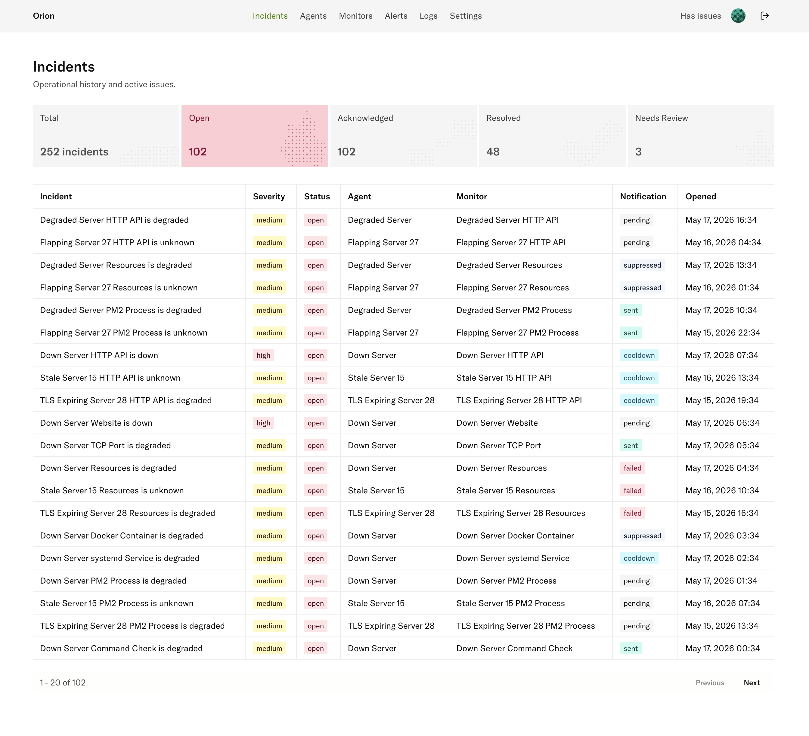
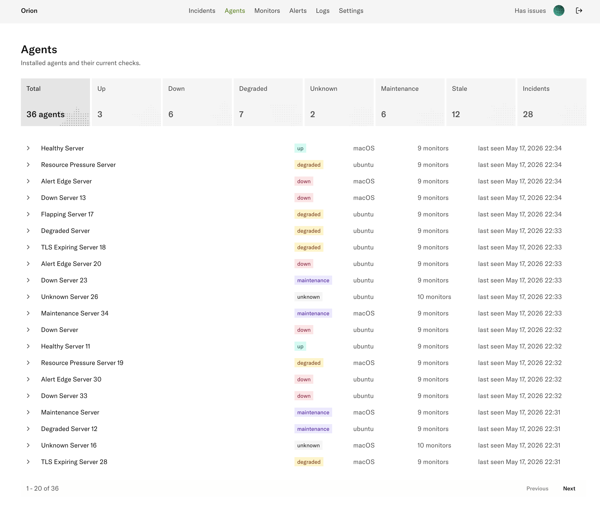
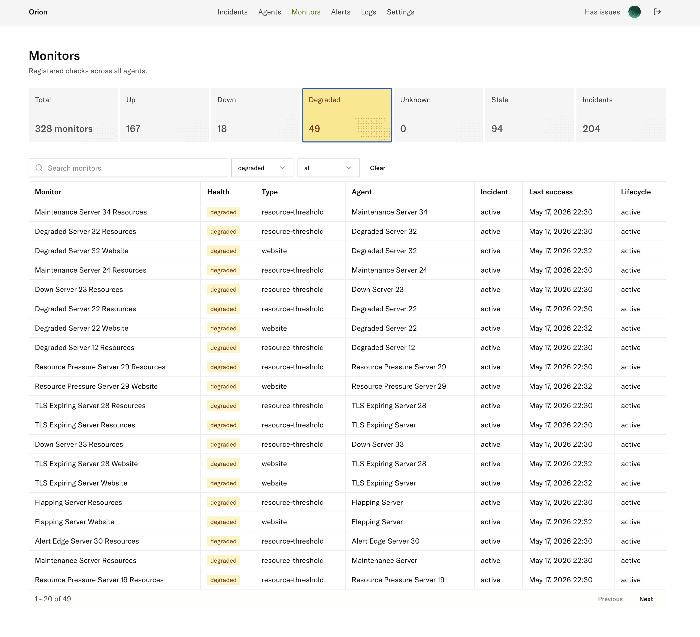
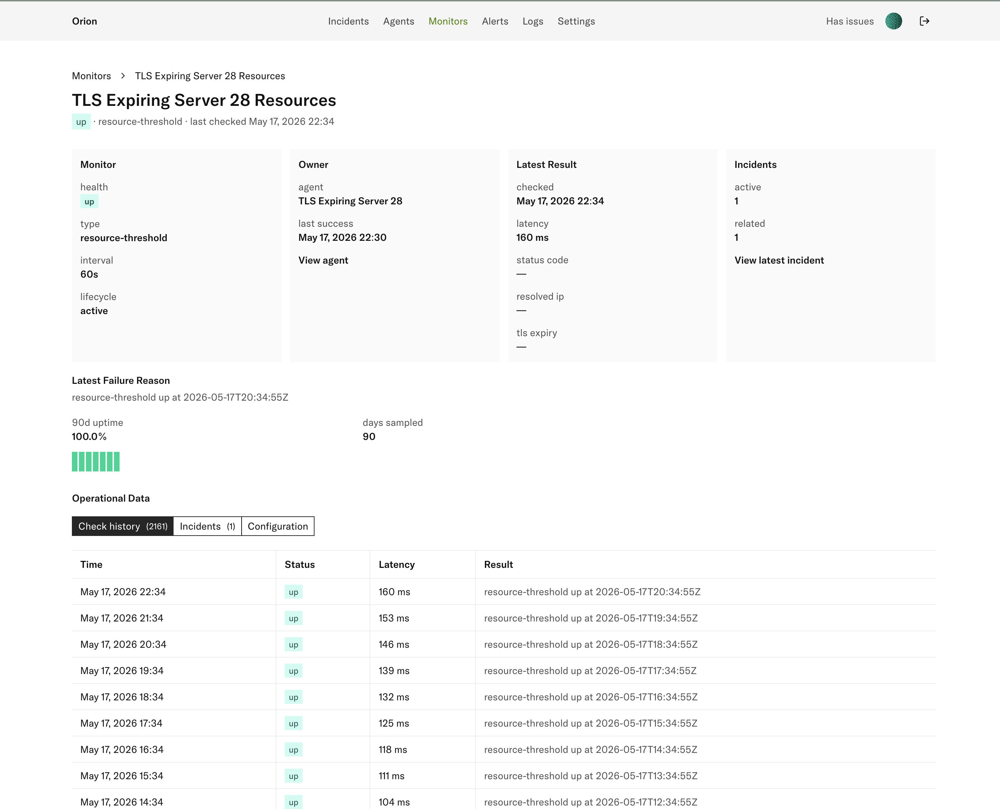
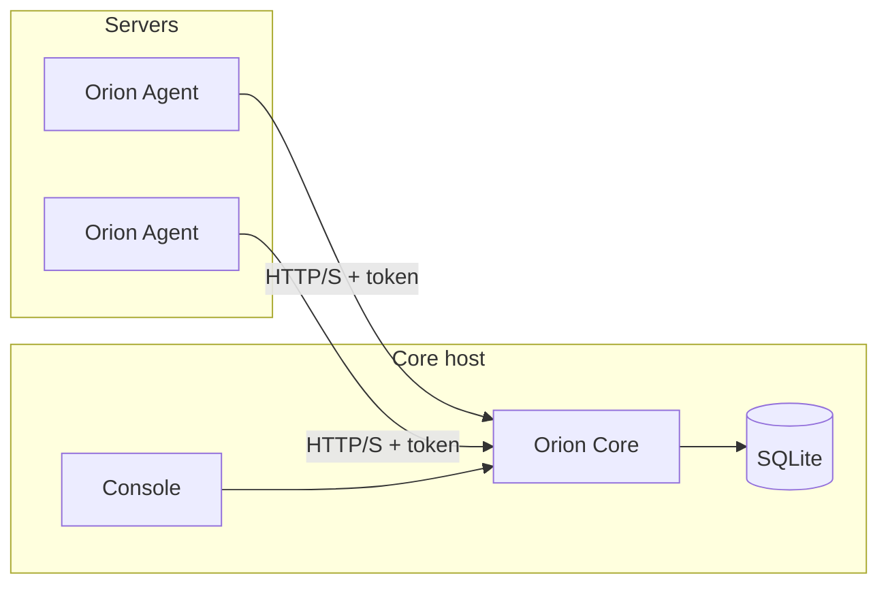

# Orion

Orion is a self-hosted monitoring app for small server setups.

An Agent runs on each machine, collects system metrics and monitor results, and sends them to Core.
Core stores the data in SQLite, computes health, opens incidents, sends alerts, and serves the
Console UI.

## Preview

| Incidents | Agents |
|---|---|
|  |  |

| Monitors | Monitor detail |
|---|---|
|  |  |

## How It Works



- **Agent** runs on Linux/macOS hosts and reports system metrics plus monitor checks.
- **Core** receives reports, stores data, derives health, manages incidents, and serves the API.
- **Console** is the web UI for incidents, agents, monitors, alerts, logs, and settings.

## Quick Start

### 1. Deploy Core

Core and Console are shipped together in one Docker image. The quickest setup is the sample Compose file:

```sh
curl -fsSL -o orion-compose.yaml \
  https://raw.githubusercontent.com/sunday-studio/orion/main/deploy/examples/core-console-compose.yaml
```

Edit `orion-compose.yaml` and change the admin password and JWT secret. Then start Core:

```sh
docker compose -f orion-compose.yaml up -d
```

Open `http://localhost:8999`.

### 2. Install an Agent

Install the Agent on each machine you want to monitor. Use a Core URL the Agent host can reach:

```sh
curl -fsSL https://raw.githubusercontent.com/sunday-studio/orion/main/deploy/scripts/agent-bootstrap.sh | sudo bash -s -- \
  --core-url http://orion-core.local:8999
```

Or start from the sample Agent config:

```sh
curl -fsSL -o orion-agent-config.yaml \
  https://raw.githubusercontent.com/sunday-studio/orion/main/deploy/examples/home-server-config.yaml

# Edit core_url and monitor checks, then install:
curl -fsSL https://raw.githubusercontent.com/sunday-studio/orion/main/deploy/scripts/agent-bootstrap.sh | sudo bash -s -- \
  --config ./orion-agent-config.yaml
```

The Agent keeps local runtime state in SQLite:

- Linux: `/var/lib/orion/state.db`
- macOS: `/usr/local/var/lib/orion/state.db`

Do not delete `state.db` during a normal upgrade. It contains the Agent identity, token,
maintenance state, and monitor mapping.

### 3. Check the Install

In Console:

- open **Agents** and confirm the host appears;
- open the Agent detail page and confirm reports are arriving;
- add monitor config on the Agent host when you are ready to track services.

See [Agent install and upgrade](docs/deployment/agent-install-upgrade.md) for service commands,
rollback, Docker monitor permissions, and local network notes.

## Monitor Types

Supported checks:

- HTTP health checks
- Websites
- TCP ports
- Resource thresholds
- Docker containers
- systemd services
- PM2 processes
- Commands
- Internal services

See [Agent monitors](docs/architecture/agent-monitors.md) for config details.

## Development

Run local tests and builds:

```sh
cd apps/core && go test ./...
cd apps/agent && go test ./...
cd apps/console && npm run build
```

Run the Console dev server against a local Core:

```sh
cd apps/console
npm install
npm run dev
```

Set `VITE_API_BASE_URL=http://localhost:8999/v1` in `apps/console/.env`.

Seed local demo data:

```sh
make seed-demo-data
```

This writes to `apps/core/data/orion.db`.

## Common Commands

```sh
make generate-openapi
make generate-sdk
make agent-build VERSION=v0.1.0
```

OpenAPI is generated from Core route annotations. Do not edit `apps/core/openapi.yaml` or the
generated Console SDK by hand.

## Documentation

- [System design](docs/system-design.md)
- [Architecture overview](docs/architecture/system-overview.md)
- [Core features](docs/architecture/core-features.md)
- [Data ingestion](docs/architecture/data-ingestion.md)
- [Persistence and lifecycle](docs/architecture/persistence-and-lifecycle.md)
- [Incident reconciliation](docs/architecture/incident-reconciliation-flow.md)
- [Deployment guide](docs/deployment/README.md)
- [Core Docker deployment](docs/deployment/core-docker.md)
- [Agent install and upgrade](docs/deployment/agent-install-upgrade.md)
- [Seed demo data](docs/development/seed-demo-data.md)
- [Milestones](docs/milestones/README.md)

## Project Layout

```txt
orion/
├── apps/
│   ├── agent/    # Go daemon and CLI
│   ├── core/     # Go API server, SQLite, OpenAPI, embedded Console
│   └── console/  # React/Vite UI source
├── deploy/       # Docker Compose, systemd, launchd, install scripts
├── docs/         # architecture, deployment, development, milestones
├── packages/     # shared/generated package space
└── Makefile
```
