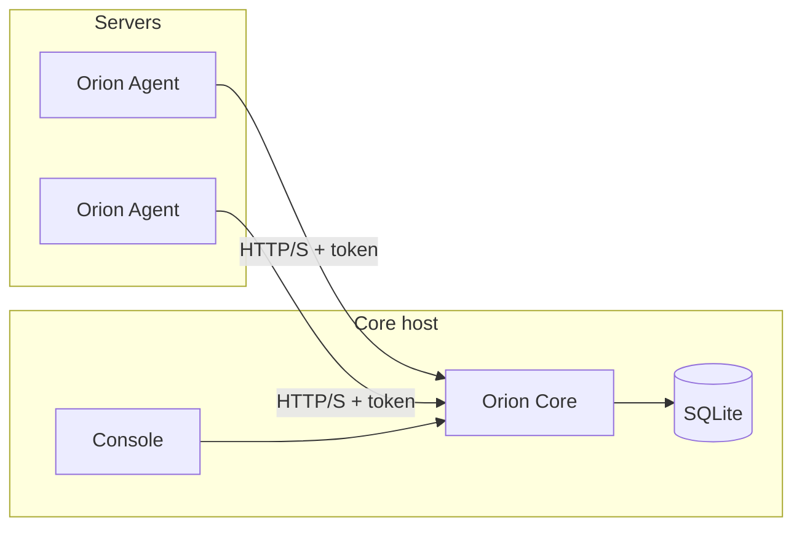

# Orion

Orion is a self-hosted monitoring app for small server setups.

An Agent runs on each machine, collects system metrics and monitor results, and sends them to Core.
Core stores the data in SQLite, computes health, opens incidents, sends alerts, and serves the
Console UI.

## Preview

| Incidents | Agents |
|---|---|
|  |  |

| Monitors | Monitor detail |
|---|---|
|  |  |

## How It Works



- **Agent** runs on Linux/macOS hosts and reports system metrics plus monitor checks.
- **Core** receives reports, stores data, derives health, manages incidents, and serves the API.
- **Console** is the web UI for incidents, agents, monitors, alerts, logs, and settings.

## Deploy

### Core

Deploy Core and Console together from the published Docker image. Core stores data in `/data`, so
mount that path to persistent storage.

With Docker Compose:

```sh
curl -fsSL -o orion-compose.yml \
  https://raw.githubusercontent.com/sunday-studio/orion/main/deploy/docker-compose.yml
```

Create a `.env` file next to `orion-compose.yml`:

```sh
cat > .env <<'EOF'
ORION_CORE_IMAGE=ghcr.io/sunday-studio/orion-core:<version>
ORION_HTTP_PORT=8999
ORION_ADMIN_USERNAME=admin
ORION_ADMIN_PASSWORD=replace-with-a-strong-password
ORION_JWT_SECRET=replace-with-a-long-random-secret
EOF
```

Start it:

```sh
docker compose -f orion-compose.yml up -d
```

With plain Docker:

```sh
docker run -d \
  --name orion-core \
  --restart unless-stopped \
  -p 8999:8999 \
  -v orion-data:/data \
  -e ORION_DATA_DIR=/data \
  -e ORION_PORT=8999 \
  -e ORION_ADMIN_USERNAME=admin \
  -e ORION_ADMIN_PASSWORD='replace-with-a-strong-password' \
  -e ORION_JWT_SECRET='replace-with-a-long-random-secret' \
  ghcr.io/sunday-studio/orion-core:<version>
```

Expose Core through a stable URL that Agents can reach, then open that URL in the browser. See
[Core Docker deployment](docs/deployment/core-docker.md) for backup, CORS, and upgrade details.

### Agent

Install the Agent on each Linux or macOS host you want to monitor. Use the Core URL that host can
reach:

```sh
curl -fsSL https://github.com/sunday-studio/orion/releases/latest/download/orion-agent-installer.sh | bash -s -- \
  --core-url https://core.your-domain.tld
```

Pin a release when you want reproducible installs:

```sh
curl -fsSL https://github.com/sunday-studio/orion/releases/latest/download/orion-agent-installer.sh | bash -s -- \
  --version 0.1.2 \
  --core-url https://core.your-domain.tld
```

The installer creates an editable config with the Core URL, a default reporting interval, location
collection disabled, and no monitor checks:

```yaml
core_url: https://core.your-domain.tld
interval: 60s
geo_location: false
monitors: []
```

Add monitor checks to the installed config when you are ready to track services.

The Agent keeps local runtime state in SQLite:

- Linux config: `/etc/orion/config.yaml`
- Linux state: `/var/lib/orion/state.db`
- macOS config: `/usr/local/etc/orion/config.yaml`
- macOS state: `/usr/local/var/lib/orion/state.db`

Do not delete `state.db` during a normal upgrade. It contains the Agent identity, token,
maintenance state, and monitor mapping.

## Operate

Check the installed Agent:

```sh
orion-agent version
sudo orion-agent status
sudo orion-agent logs
```

Run one collection cycle with the installed config and state:

```sh
sudo orion-agent run -once
```

Use verbose output when diagnosing registration, monitor collection, transport, or retry behavior:

```sh
sudo orion-agent run -once -verbose
```

Normal monitor config changes do not need a new install. Edit the installed config, then restart the
service so the Agent reconciles monitors by name.

Linux:

```sh
sudo orion-agent restart
```

macOS:

```sh
sudo orion-agent restart
```

If you change `core_url`, point the Agent at a fresh Core database, or otherwise need a new Agent
identity, use reconfigure:

```sh
sudo orion-agent reconfigure
```

Update the installed Agent binary while preserving config and state. The update command also resets
service failure throttles, starts the service again, prints service status, and shows recent service
logs:

```sh
sudo orion-agent update
sudo orion-agent update -version 0.1.2
```

See [Agent install and upgrade](docs/deployment/agent-install-upgrade.md) for service logs,
rollback, Docker monitor permissions, and local network notes.

## Monitor Types

Supported checks:

- HTTP health checks
- Websites
- TCP ports
- Resource thresholds
- Docker containers
- systemd services
- PM2 processes
- Commands
- Internal services

See [Agent monitors](docs/architecture/agent-monitors.md) for config details.

## Running Locally

Runtime examples live under `deploy/examples/`. Use them for local smoke tests or as a starting
point for your own Compose file.

Run the bundled Core and Console example from this repository:

```sh
cd deploy/examples
docker compose -f ./core-console-compose up -d
curl http://localhost:8999/health
```

Run the Console dev server against local Core:

```sh
cd apps/console
npm install
npm run dev
```

Set `VITE_API_BASE_URL=http://localhost:8999/v1` in `apps/console/.env`.

Seed local demo data:

```sh
make seed-demo-data
```

This writes to `apps/core/data/orion.db`.

## Development

Run tests and builds:

```sh
cd apps/core && go test ./...
cd apps/agent && go test ./...
cd apps/console && npm run build
```

Common maintainer commands:

```sh
make generate-openapi
make generate-sdk
make agent-build VERSION=0.1.2
```

OpenAPI is generated from Core route annotations. Do not edit `apps/core/openapi.yaml` or the
generated Console SDK by hand.

## Documentation

- [System design](docs/system-design.md)
- [Architecture overview](docs/architecture/system-overview.md)
- [Core features](docs/architecture/core-features.md)
- [Data ingestion](docs/architecture/data-ingestion.md)
- [Persistence and lifecycle](docs/architecture/persistence-and-lifecycle.md)
- [Incident reconciliation](docs/architecture/incident-reconciliation-flow.md)
- [Deployment guide](docs/deployment/README.md)
- [Core Docker deployment](docs/deployment/core-docker.md)
- [Agent install and upgrade](docs/deployment/agent-install-upgrade.md)
- [Seed demo data](docs/development/seed-demo-data.md)
- [Milestones](docs/milestones/README.md)

## Project Layout

```txt
orion/
├── apps/
│   ├── agent/    # Go daemon and CLI
│   ├── core/     # Go API server, SQLite, OpenAPI, embedded Console
│   └── console/  # React/Vite UI source
├── deploy/       # Docker Compose, systemd, launchd, install scripts
├── docs/         # architecture, deployment, development, milestones
├── packages/     # shared/generated package space
└── Makefile
```
