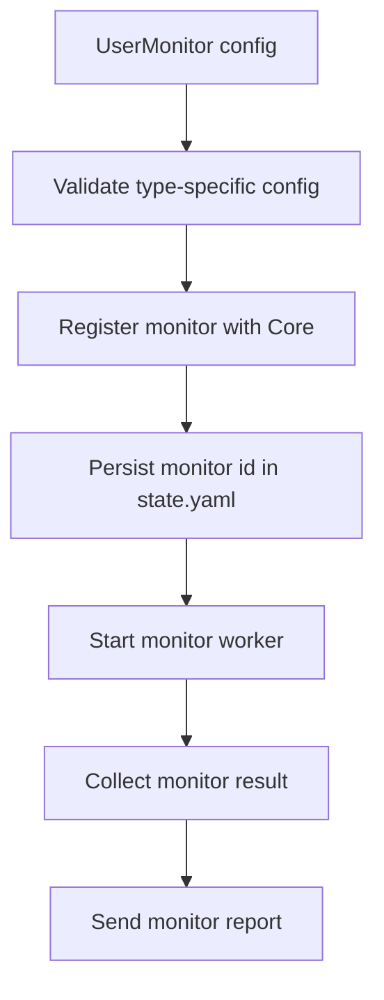
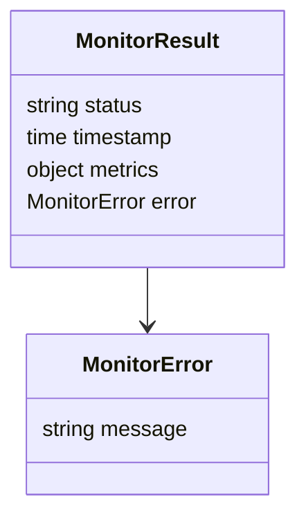

# Agent Monitors

## Monitor Runtime Model

Each monitor is configured in `config.yaml` with:

- `name`
- `description`
- `type`
- `interval`
- optional `meta`
- one type-specific config block

The Agent validates config before runtime. Monitor names must be unique. Each monitor gets a Core-side id during registration and that id is stored in `state.yaml`.

## Monitor Types

### `http-healthcheck`

Purpose: check an HTTP endpoint for expected status and optional body expectations.

Config:

- `http.url`: required absolute HTTP/HTTPS URL.
- `http.timeout`: required positive duration.
- `http.expected_status`: required HTTP status from 100-599.
- `http.expected_body`: optional substring that must be present.
- `http.expected_body_regex`: optional regex that must match.

Behavior:

- Sends an HTTP request.
- Measures response time.
- Captures response status code and response body expectations.
- Returns `up` when status and body checks pass.
- Returns `down` when request, status, body, or regex checks fail.

### `website`

Purpose: check public website reachability with DNS, HTTP status, latency, and TLS metadata.

Config:

- `website.url`: required absolute HTTP/HTTPS URL.
- `website.timeout`: optional positive duration.
- `website.expected_status`: optional HTTP status from 100-599.

Behavior:

- Resolves the hostname.
- Sends an HTTP request.
- Captures response status and response time.
- For HTTPS, captures TLS expiry data when available.
- Returns `up` when DNS and HTTP expectations pass.
- Returns `down` when DNS resolution, request, status, or TLS inspection fails.

Core uses `tls_days_remaining` in website metrics to open a degraded incident when a certificate is near expiry.

### `tcp`

Purpose: check whether a TCP port accepts a connection.

Config:

- `tcp.host`: required host.
- `tcp.port`: required port from 1-65535.
- `tcp.timeout`: optional positive duration.

Behavior:

- Attempts a TCP connection with timeout.
- Returns `up` when the connection succeeds.
- Returns `down` with error details when dialing fails.

### `resource-threshold`

Purpose: turn local resource pressure into a monitor result.

Config requires at least one threshold:

- `resource.max_cpu_percent`: optional 0-100.
- `resource.max_memory_percent`: optional 0-100.
- `resource.max_disk_percent`: optional 0-100.
- `resource.max_load_1`: optional value >= 0.

Behavior:

- Reuses the system metrics collector.
- Compares current CPU, memory, disk, and load values against configured thresholds.
- Returns `up` when all configured thresholds pass.
- Returns `down` when any configured threshold is exceeded.

### `docker-container`

Purpose: check the state of a local Docker container.

Config:

- `docker.name`: required container name.

Behavior:

- Runs `docker inspect`.
- Parses container state.
- Returns `up` when the container is running and not restarting.
- Returns `down` when Docker is unavailable, the container is missing, JSON is invalid, or the container is not running.
- Captures Docker status, running/restarting flags, exit code, and start/finish timestamps when available.

### `systemd-service`

Purpose: check a local systemd unit.

Config:

- `systemd.name`: required service name.

Behavior:

- Runs `systemctl show`.
- Reads `LoadState`, `ActiveState`, `SubState`, and `Result`.
- Returns `up` when the service is loaded, active, and running/successful.
- Returns `down` when systemctl fails or the unit is not healthy.

### `pm2`

Purpose: check a local PM2 process.

Config:

- `pm2.app_name`: required PM2 app name.

Behavior:

- Runs PM2 process listing.
- Finds the configured app.
- Returns `up` when PM2 status is `online`.
- Returns `down` when PM2 is unavailable, app is missing, or app status is not online.
- Captures PM2 status, PID, memory, CPU, restart count, and uptime when available.

### `command`

Purpose: run a local shell command and use the exit code as health.

Config:

- `command.command`: required shell command.
- `command.timeout`: optional positive duration.

Behavior:

- Runs the command with timeout.
- Captures exit code, stdout, stderr, and timeout state.
- Returns `up` when exit code is `0`.
- Returns `down` when exit code is non-zero, execution fails, or timeout is reached.

### `internal-service`

Purpose: check a local service with both HTTP ping and port/process evidence.

Config:

- `internal_service.ping.url`: required HTTP/HTTPS URL.
- `internal_service.ping.timeout`: required positive duration.
- `internal_service.process.port`: required port from 1-65535.

Behavior:

- Performs an HTTP ping.
- Checks local process/port data.
- Returns `up` only when the service ping and port/process checks pass.
- Returns `down` when either side fails.

## Monitor Result Shape

Successful checks generally place details under `metrics`. Failed checks place structured details under `error` when available. Core stores metrics or error JSON in `monitor_reports.payload`.

