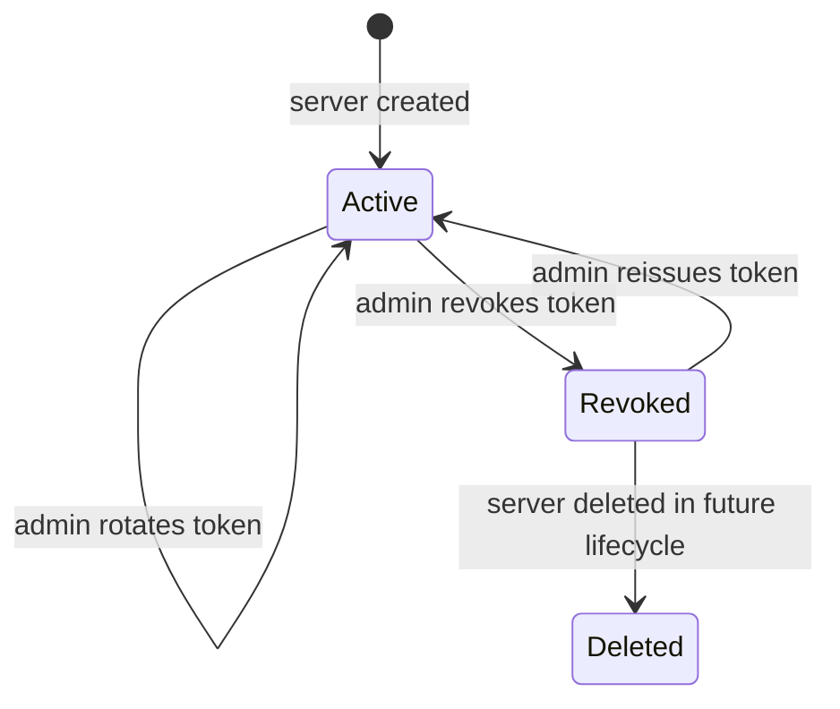
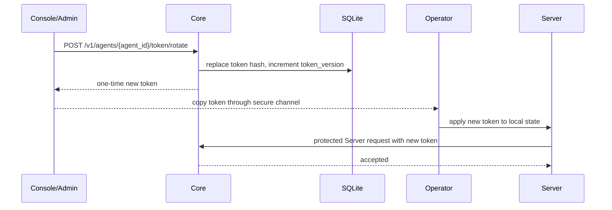
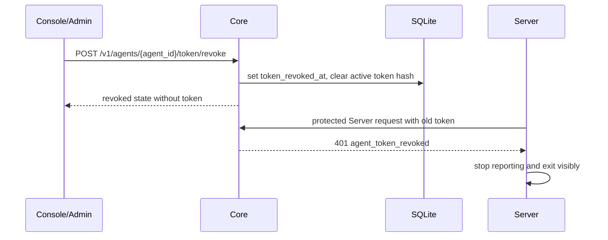

# Server Token Lifecycle

## Purpose

Server bearer tokens authenticate Server-owned report, monitor registration, maintenance, and log
ingestion routes. This document defines how Orion should rotate and revoke those tokens without
renaming Servers, losing monitor mappings, or letting a revoked Server silently recover through
unauthenticated registration.

## Goals

- Preserve the existing `agent_id`, `machine_id`, monitor IDs, reports, incidents, and status page
  component mappings when a token rotates.
- Give an administrator a direct way to revoke a suspected leaked Server token.
- Keep Server behavior deterministic: authentication failures stop reporting until an operator fixes
  credentials.
- Make token recovery explicit and auditable instead of relying on automatic re-registration.
- Avoid using Server-scoped bearer tokens to authorize lifecycle actions for those same tokens.

## Non-Goals

- This is not a Server enrollment or device attestation system.
- This does not change Core-managed monitor ownership or heartbeat monitor tokens.
- This does not delete Server, monitor, report, incident, or status page history when a token is
  revoked.

## Current State

Core stores one token on the `agents` row and validates protected Server routes by matching
`agent_id` plus bearer token. If a Server loses local state, `POST /v1/register` can return the
existing token for the same `machine_id`.

That behavior is convenient for first-run recovery, but it is incompatible with real revocation:
a revoked Server could clear local state, call unauthenticated registration with the same
`machine_id`, and receive a valid token again. Token lifecycle implementation must close that path.

## Token States



- `active`: exactly one current Server token authenticates protected Server routes.
- `revoked`: no Server token authenticates protected Server routes for this Server.
- `deleted`: future Server deletion lifecycle, not part of this design.

Core should store token lifecycle metadata separately from public Server response fields:

- `token_hash`: hash of the active token, replacing plaintext comparison when implemented.
- `token_version`: monotonically increasing integer returned in diagnostics and audit events, not
  as a secret.
- `token_rotated_at`: latest time a replacement token was generated.
- `token_revoked_at`: latest time credentials were revoked, nullable.
- `token_revocation_reason`: short operator-supplied reason, redacted from public routes if needed.

During the migration from the existing plaintext `agents.token` column, Core may support both
storage shapes internally, but API responses must continue to avoid exposing Server tokens except
for the one-time lifecycle response that generated a new token.

## API Contract

Token lifecycle actions are frontend/admin authenticated actions. They must not accept an
Server-scoped bearer token as authorization because a compromised Server token must not be able to
rotate itself into a fresh credential.

Planned routes:

- `POST /v1/agents/:agent_id/token/rotate`
  Generates a new token for an active Server, increments `token_version`, clears
  `token_revoked_at`, and returns the token once in the response.
- `POST /v1/agents/:agent_id/token/revoke`
  Marks the Server token revoked, rejects all existing Server-scoped tokens for that Server, records
  an optional reason, and returns no token.
- `POST /v1/agents/:agent_id/token/reissue`
  Generates a new token for a revoked Server, increments `token_version`, clears
  `token_revoked_at`, and returns the token once in the response.
- `GET /v1/agents/:agent_id/token/status`
  Returns non-secret lifecycle metadata: state, version, rotated time, revoked time, and whether a
  token exists.

All lifecycle responses should include request IDs. Token-bearing responses should be marked
`Cache-Control: no-store`.

## Registration Contract

`POST /v1/register` remains responsible for first-time Server creation and metadata reconciliation.
After token lifecycle is implemented, existing `machine_id` registration must not be a universal
token recovery mechanism.

Rules:

- New `machine_id`: create a Server and return a token as the current first-run behavior does,
  unless a future enrollment policy requires an enrollment secret.
- Existing active `machine_id` with local Server state: normal Servers should not need to call
  unauthenticated registration; they should reconcile monitors with the stored token.
- Existing active `machine_id` without local state: Core may return the current token only while
  the deployment has not enabled strict token lifecycle enforcement. Once lifecycle enforcement is
  enabled, Core should require an admin reissue or enrollment credential.
- Existing revoked `machine_id`: return `401` or `409` with a stable error code such as
  `agent_token_revoked`; never return a token from unauthenticated registration.

The implementation should prefer an explicit Core setting for the compatibility window so
self-hosted first-run users are not surprised, while production guidance can recommend strict
mode.

## Rotation Flow



Rotation semantics:

- Rotation preserves `agent_id`, `machine_id`, monitor IDs, monitor lifecycle, reports, incidents,
  status page mappings, and maintenance state.
- The previous token becomes invalid as soon as Core commits the new token.
- If the Server has not yet received the new token, the next protected request returns `401`; the
  Server exits visibly and stops queueing new reports.
- Existing queued reports may remain local, but they must not be sent with the old token.
- Replaying old monitor reports after token replacement is allowed only after the operator applies
  the new token, because report ownership is still tied to the same Server and monitor IDs.

## Revocation Flow



Revocation semantics:

- Revocation is immediate and applies to all protected Server routes for that `agent_id`.
- Revocation does not delete the Server row or any Server-owned monitors.
- Health naturally becomes stale after missed intervals; Core should not invent a special health
  state in the first implementation.
- Console should show the token state so operators can distinguish stale due to revoked credentials
  from stale due to network or host failure.
- An administrator can reissue a replacement token when the host is trusted again.

## Server Behavior

On `401` from a protected Server route:

- Treat the error as terminal for the current process.
- Stop monitor and system report workers.
- Stop queueing new reports.
- Keep local state intact so diagnostics can show the `agent_id`, Core URL, and monitor mappings.
- Log a redacted, visible message that credentials were rejected.
- Exit with a non-zero status so systemd, launchd, Docker, or another supervisor surfaces the
  failure.

Operator recovery commands should support both common cases:

- Apply a new token to existing local state when Core rotated or reissued the token for the same
  `agent_id`.
- Reset and re-register only when the operator intentionally wants a new Server identity.

The existing `reconfigure` flow resets local registration and can create a new identity. It should
not be the only recovery path for rotation because rotation is supposed to preserve Server and
monitor identity.

Server recovery command:

```sh
orion-agent token apply --token-file /secure/path/replacement-token
orion-agent restart
```

`token apply` updates only the local token for the existing state row. It preserves `agent_id`,
Core URL, monitor mappings, maintenance state, and durable report spool entries. Prefer
`--token-file` so the one-time replacement token does not land in shell history; an inline token
argument is acceptable for controlled automation. Use `reconfigure` only when the operator intends
to discard the current local identity and register as a new Server.

## Operational Guidance

- Use `rotate` for routine credential hygiene or suspected local disclosure when the host is still
  trusted.
- Use `revoke` when the host or token is no longer trusted and should stop sending reports
  immediately.
- Use `reissue` after revocation only when the operator has regained trust in the host and wants
  the same Server identity to resume.
- Copy newly issued tokens through an operator-controlled secure channel. Core should not persist
  or display the plaintext token after the response is returned.
- Audit events should record who performed the action, target Server, token version, reason, and
  request ID without recording plaintext tokens.

## Implementation Slices

1. Core token storage and auth semantics
   Add token hash/version/revocation metadata, admin lifecycle service methods, admin API routes,
   registration safeguards for revoked Servers, response redaction, and audit events.
2. Server credential recovery UX
   Add a command that applies a replacement token to existing state, make auth failures surface the
   stable error code, and document when to use token apply versus reconfigure.
3. Console controls
   Show token lifecycle state on Server detail, add rotate/revoke/reissue controls behind admin auth,
   display one-time token responses, and warn operators that rotation preserves identity while
   reconfigure can create a new one.

## Open Follow-Ups

- Decide whether strict registration recovery should be controlled by an environment variable or
  always enabled once token lifecycle routes ship.
- Decide whether the first implementation should migrate immediately to token hashes or keep the
  current plaintext column behind a service boundary for one release.
