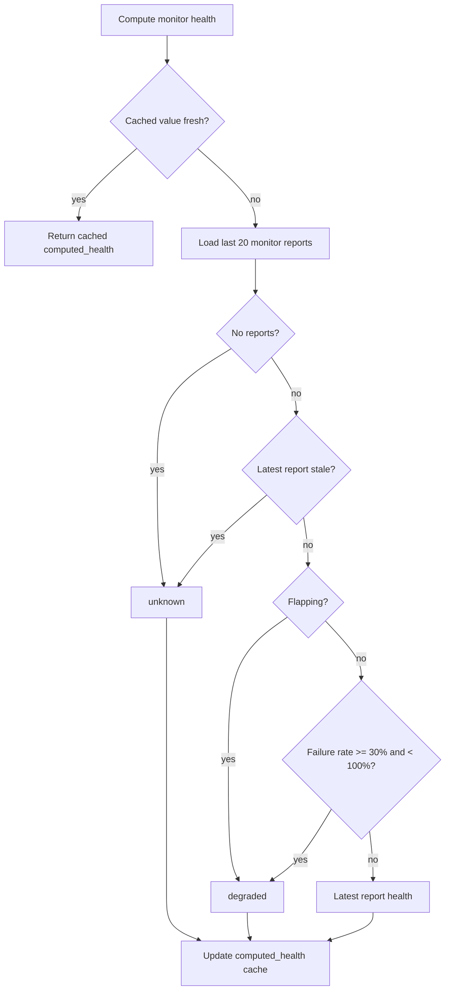
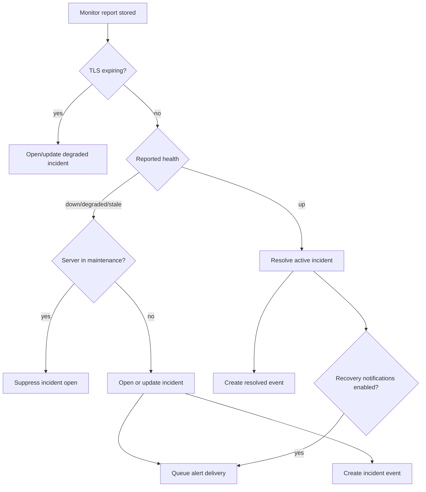
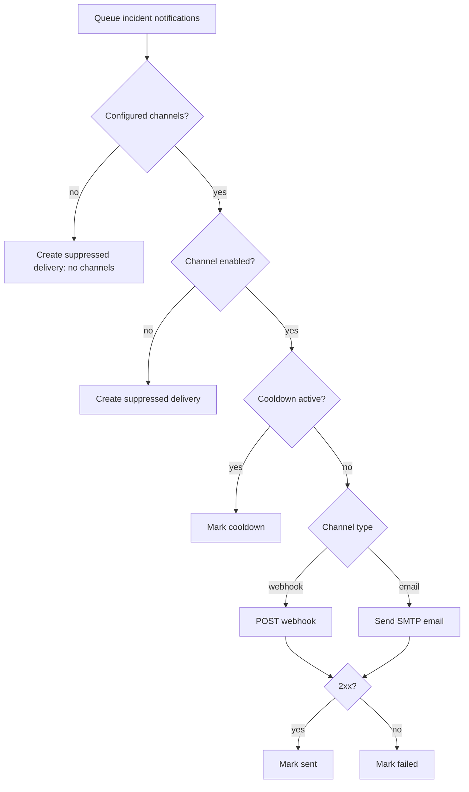

# Core Features

## API Surface

Core uses Gin and serves these route groups:

- Public:
  - `POST /v1/register`
  - `POST /v1/auth/login`
- Frontend-facing, JWT-protected only when frontend auth is configured:
  - `GET /v1/agents`
  - `GET /v1/agents/:id`
  - `GET /v1/agents/:id/health`
  - `GET /v1/agents/:id/reports`
  - `GET /v1/agents/:id/uptime`
  - `GET /v1/agents/:id/monitors`
  - `GET /v1/monitors/:id`
  - `GET /v1/monitors/:id/uptime`
  - `GET /v1/monitors/:id/history`
  - `GET /v1/health/summary`
  - `GET /v1/health/issues`
  - `GET /v1/incidents/candidates`
  - `GET /v1/settings/data-lifecycle`
  - `PUT /v1/settings/data-lifecycle`
  - `POST /v1/settings/data-lifecycle/actions/rollup`
  - `POST /v1/settings/data-lifecycle/actions/archive`
- Agent-protected:
  - `POST /v1/agents/:agent_id/register-monitor`
  - `POST /v1/agents/:agent_id/unregister-monitor`
  - `POST /v1/agents/:agent_id/report`
  - `POST /v1/agents/:agent_id/:monitor_id/report`
  - `PUT /v1/agents/:agent_id/maintenance`
- Other:
  - `GET /health`
  - `GET /swagger/*any`

## Authentication

Agent auth:

- Agent receives a token at registration.
- Protected Agent routes require `Authorization: Bearer <token>`.
- Core validates that token belongs to the route `agent_id`.

Frontend auth:

- Enabled only when `ORION_ADMIN_USERNAME` and `ORION_ADMIN_PASSWORD` are set.
- `ORION_JWT_SECRET` is required when frontend auth is enabled.
- Login uses constant-time username/password comparison.
- Failed login attempts are rate limited per client IP.
- Successful login returns a 24-hour JWT.

## Health Computation

Monitor health is derived from recent reports and cached on the monitor row.

Defaults:

- stale threshold: 15 minutes;
- flapping threshold: 3 transitions;
- degraded failure rate: 30%;
- last 20 reports are used for monitor health.

Server health is derived from Agent and monitor state:

- maintenance server returns `maintenance`;
- stale `last_seen` returns `stale`;
- server with no active monitors returns `up`;
- otherwise health priority is `down`, then `degraded`, then `unknown`, then `up`.

## Incident Management

Core reconciles incidents after monitor reports and after system reports.

Incident rules:

- `down` and `stale` map to high severity.
- `degraded` maps to medium severity.
- other states map to low severity.
- Active incidents are matched by monitor id and status `open` or `acknowledged`.
- New failures update the current active incident instead of creating duplicates.
- Recovery resolves the active incident and records `resolved_at`.
- Stale monitor incidents are checked when an Agent system report is received.

## Alerts

Alert deliveries are created for incident opened/resolved events.

Implemented alert channels:

- webhook;
- email;
- none/suppressed when no channels exist.

Configured behavior:

- disabled channels create suppressed delivery rows;
- cooldown can prevent repeated sent alerts;
- recovery notifications can be disabled;
- TLS expiry threshold defaults to 14 days.

## Maintenance

There are two maintenance concepts:

- Agent local state can pause report workers.
- Core `agents.maintenance_mode` suppresses incident opening and makes server health return `maintenance`.

The Agent CLI can call Core to set maintenance mode. The Agent also rereads local state before every report cycle so it can stop sending reports if local maintenance state changes.

## Settings

Core stores a singleton data lifecycle settings row:

- raw report hot days: default `90`;
- archive raw reports: default `true`;
- archive directory: default `<data_dir>/archive`;
- rollups enabled: default `true`;
- rollup retention days: optional;
- archive schedule: `daily` or `manual`;
- last rollup/archive run metadata.

Validation rules:

- `raw_report_hot_days` must be at least 1.
- archive directory is required when archiving is enabled.
- rollups must be enabled when archiving is enabled.
- rollup retention is either null or at least 1.
- archive schedule must be `daily` or `manual`.

