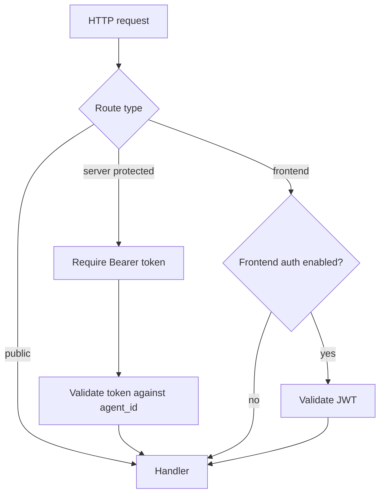
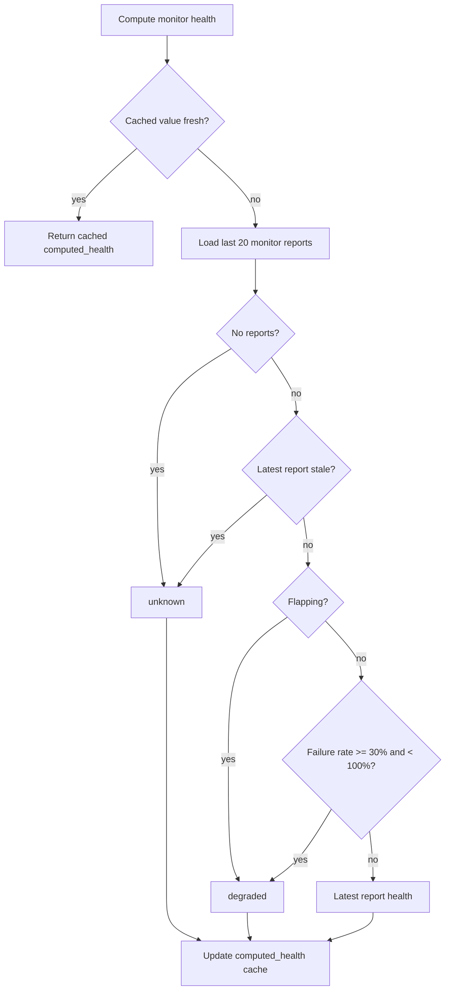
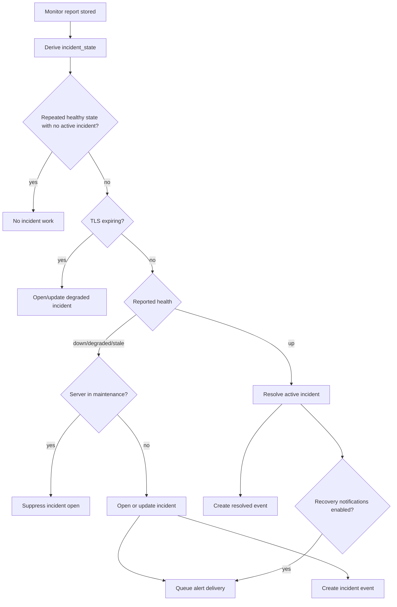
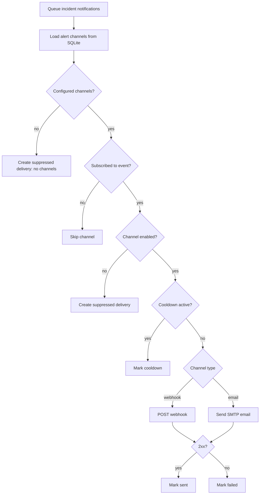

# Core Features

## API Surface

Core uses Gin and serves these route groups:

- Public:
  - `POST /v1/register`
  - `POST /v1/auth/login`
- Frontend-facing, JWT-protected only when frontend auth is configured:
  - `GET /v1/agents`
  - `GET /v1/agents/:id`
  - `GET /v1/agents/:id/health`
  - `GET /v1/agents/:id/reports`
  - `GET /v1/agents/:id/uptime`
  - `GET /v1/agents/:id/monitors`
  - `GET /v1/monitors/:id`
  - `GET /v1/monitors/:id/uptime`
  - `GET /v1/monitors/:id/history`
  - `GET /v1/health/summary`
  - `GET /v1/health/issues`
  - `GET /v1/incidents/candidates`
  - `GET /v1/settings/data-lifecycle`
  - `PUT /v1/settings/data-lifecycle`
  - `POST /v1/settings/data-lifecycle/actions/rollup`
  - `POST /v1/settings/data-lifecycle/actions/archive`
- Server-protected:
  - `POST /v1/agents/:agent_id/register-monitor`
  - `POST /v1/agents/:agent_id/unregister-monitor`
  - `POST /v1/agents/:agent_id/report`
  - `POST /v1/agents/:agent_id/:monitor_id/report`
  - `PUT /v1/agents/:agent_id/maintenance`
- Other:
  - `GET /health`
  - `GET /swagger/*any`

## Authentication

Server auth:

- Server receives a token at registration.
- Protected Server routes require `Authorization: Bearer <token>`.
- Core validates that token belongs to the route `agent_id`.

Frontend auth:

- Enabled only when `ORION_ADMIN_USERNAME` and `ORION_ADMIN_PASSWORD` are set.
- `ORION_JWT_SECRET` is required when frontend auth is enabled.
- Exposed deployments should set `ORION_REQUIRE_FRONTEND_AUTH=true`; startup then fails unless
  username, password, and JWT secret are all configured.
- Login uses constant-time username/password comparison.
- Failed login attempts are rate limited per client IP.
- Successful login returns a 24-hour JWT.

## Health Computation

Monitor health is derived from recent reports and cached on the monitor row.

Defaults:

- stale threshold: five missed reporting intervals, with a five-minute minimum window;
- flapping threshold: 3 transitions;
- degraded failure rate: 30%;
- last 20 reports are used for monitor health.

Server health is derived from Server and monitor state:

- maintenance server returns `maintenance`;
- stale `last_seen` returns `stale` based on the Server reporting interval;
- server with no active monitors returns `up`;
- fresh server availability stays `up` while monitor failures are rolled up separately;
- mixed monitor failures return `overall_health = degraded`, so one failing monitor does not make a live Server look down;
- `overall_health = down` is reserved for a fresh server whose active monitors are all failing;
- stale monitor reports affect monitor rollup health and explanations, not Server availability.

## Incident Management

Core reconciles incidents after monitor reports and after system reports.

Incident rules:

- `down` and `stale` map to high severity.
- `degraded` maps to medium severity.
- other states map to low severity.
- Monitors cache `active_incident_id` and `incident_state` for the ingestion path.
- Active incidents are resolved or updated by cached id when possible.
- Fallback active incident lookup is matched by monitor id and status `open` or `acknowledged`.
- New failures update the current active incident instead of creating duplicates.
- Recovery resolves the active incident and records `resolved_at`.
- Stale monitor incidents are checked when a Server system report is received.

## Alerts

Alert deliveries are created for incident opened/resolved events.

Implemented alert channels:

- API-managed webhooks;
- webhook event subscriptions for incident opened and incident resolved events;
- none/suppressed when no channels exist.

Configured behavior:

- multiple channels can be created and toggled independently;
- each webhook can subscribe to incident opened, incident resolved, or both;
- disabled channels create suppressed delivery rows;
- unsubscribed event/channel pairs are skipped and do not create delivery rows;
- explicit alert routes evaluate incident alert events after incidents exist; Core maintenance mode stays outside route matching because it suppresses incident candidates before alert delivery is queued;
- cooldown can prevent repeated sent alerts;
- recovery notifications can be disabled;
- TLS expiry threshold defaults to 14 days.

## Maintenance

There are two maintenance concepts:

- Server local state can pause report workers.
- Core `agents.maintenance_mode` suppresses incident opening and makes server health return `maintenance`.

The Server CLI can call Core to set maintenance mode. The Server also rereads local state before every report cycle so it can stop sending reports if local maintenance state changes.

## Settings

Core stores a singleton data lifecycle settings row:

- raw report hot days: default `90`;
- archive raw reports: default `true`;
- archive directory: default `<data_dir>/archive`;
- rollups enabled: default `true`;
- rollup retention days: optional;
- archive schedule: `daily` or `manual`;
- last rollup/archive run metadata.

Validation rules:

- `raw_report_hot_days` must be at least 1.
- archive directory is required when archiving is enabled.
- rollups must be enabled when archiving is enabled.
- rollup retention is either null or at least 1.
- archive schedule must be `daily` or `manual`.
