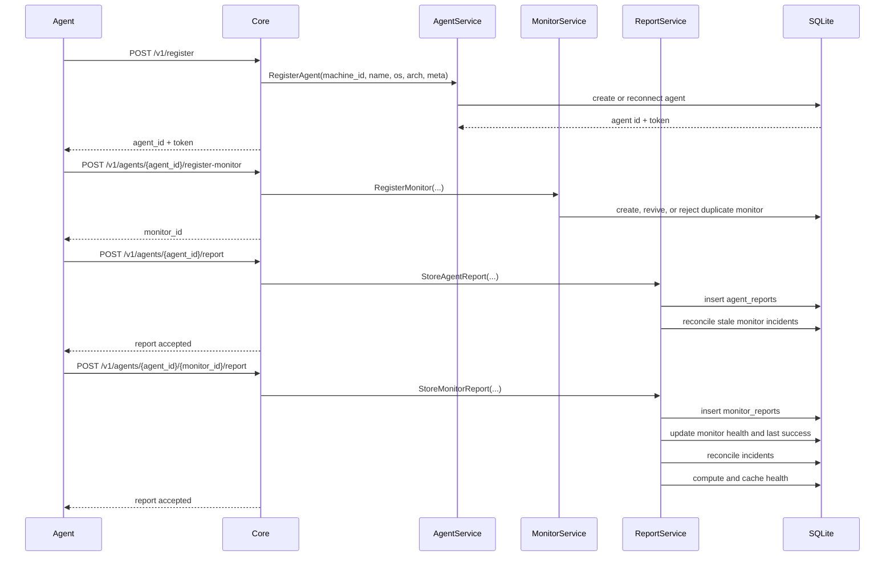
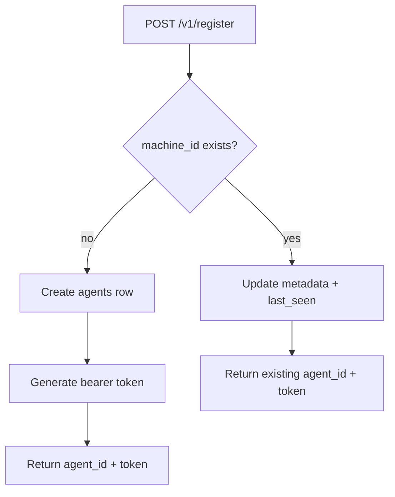
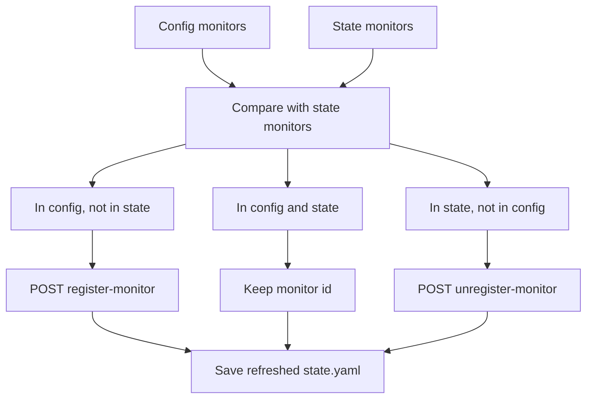
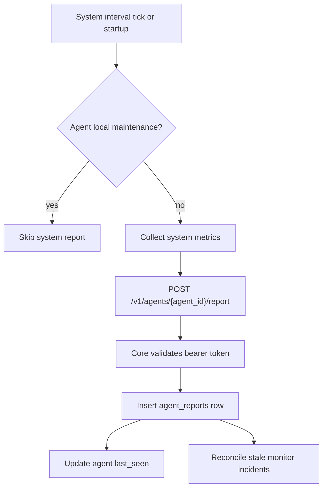
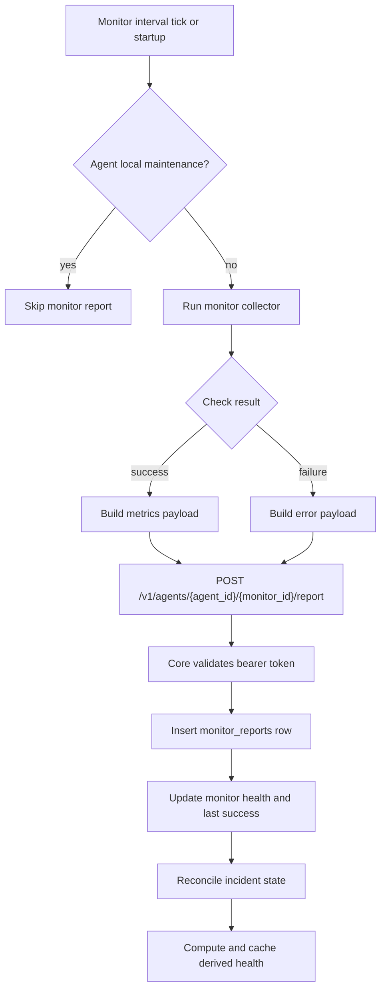
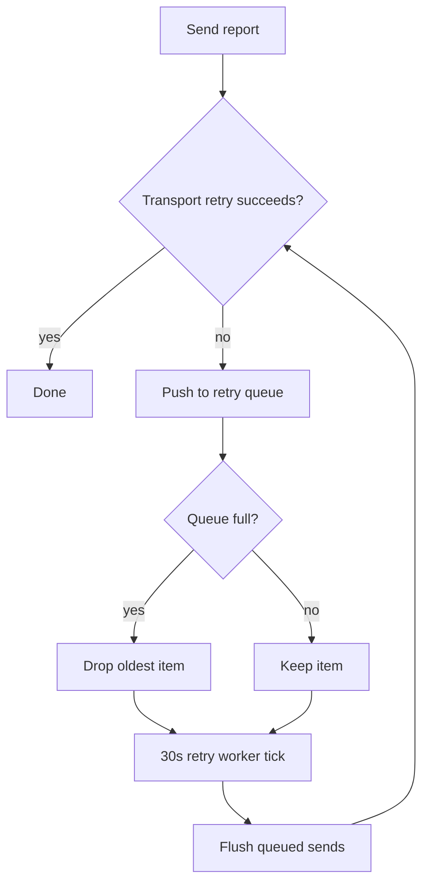

# Data Ingestion

## High-Level Flow

## Agent Registration

The Agent stores its durable identity in `state.yaml`.

On first registration:

- Agent generates or reads a machine identity.
- Agent reads local system name, OS, and architecture.
- Agent sends `machine_id`, `name`, `os`, `arch`, and optional config `meta`.
- Core creates an `agents` row with a generated `agent-*` id and token.
- Agent saves `agent_id`, `token`, `core_url`, and registration state.

On reconnect:

- Core looks up the existing `machine_id`.
- Core returns the same token.
- Core refreshes `last_seen`.
- Core updates changed name, OS, arch, and meta.

## Monitor Registration

After Agent registration, configured monitors are reconciled against internal state:

- Configured monitor exists in state: keep it.
- Configured monitor missing from state: register it with Core.
- State monitor missing from config: unregister it from Core.

Core monitor registration behavior:

- New monitor creates a `monitors` row with `lifecycle = active`, `health = unknown`, and `computed_health = unknown`.
- Previously deleted monitor with the same server/name is revived.
- Active duplicate monitor names for a server are rejected.
- Removed monitors are soft-deleted by setting `lifecycle = deleted`, `health = unknown`, and `deleted_at`.

## System Report Ingestion

System reports are sent:

- once immediately when the Agent runtime starts;
- then on the global `interval` from config.

Agent collects:

- hostname, OS, platform, architecture, kernel;
- uptime seconds;
- CPU core count, CPU usage, load 1/5/15;
- memory total/used/free/available/percent;
- root disk total/used/free/percent;
- optional location metadata;
- Agent version;
- config summary with reporting interval, monitor count, and monitor type counts.

Core stores system reports in `agent_reports`.

## Monitor Report Ingestion

Each monitor runs in its own worker on its own configured interval. The Agent also runs every monitor once at startup.

Monitor reports contain:

- report timestamp;
- health: generally `up` or `down`, with Core-derived states later adding `degraded`, `unknown`, and `stale`;
- metrics payload for successful checks;
- error payload for failed checks.

Core stores monitor reports in `monitor_reports`. If a monitor reports `up`, Core updates `last_successful_report_at`.

## Retry Behavior

The Agent transport performs short request retries first:

- max attempts: 3;
- base delay: 200ms;
- max delay: 5s;
- jitter ratio: 20%;
- retries on network errors, HTTP `429`, and HTTP `5xx`.

If a system or monitor report still fails after transport retries:

- Agent pushes a send closure into a bounded retry queue.
- Queue capacity defaults to 100.
- If full, oldest item is dropped and replaced.
- A retry worker flushes the queue every 30 seconds.
- Shutdown flushes the queue once with a background context.

