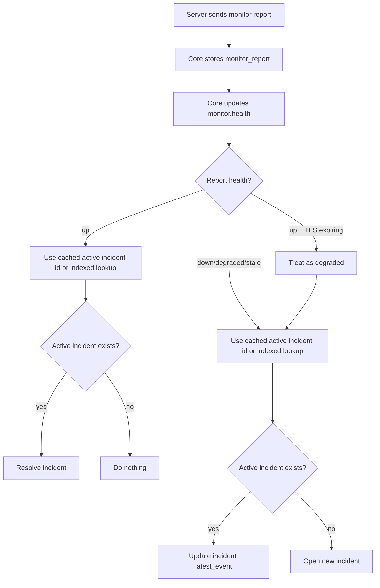
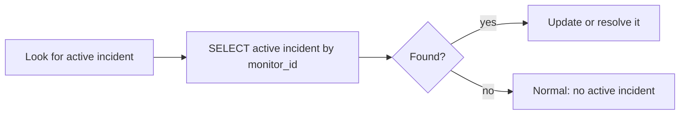
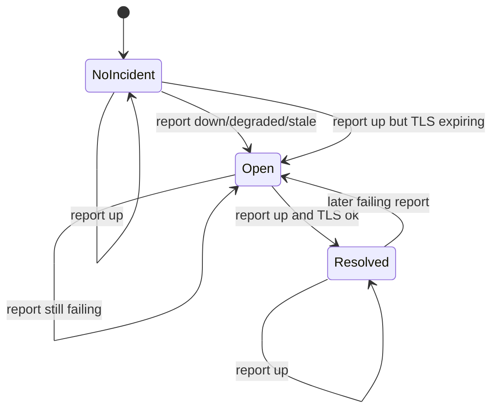
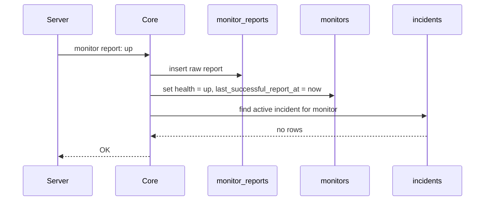
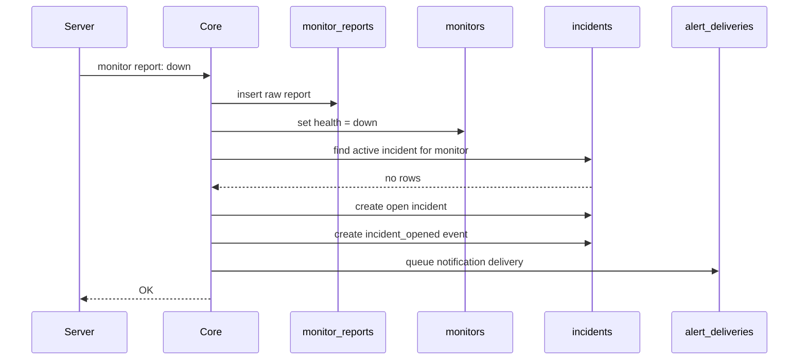
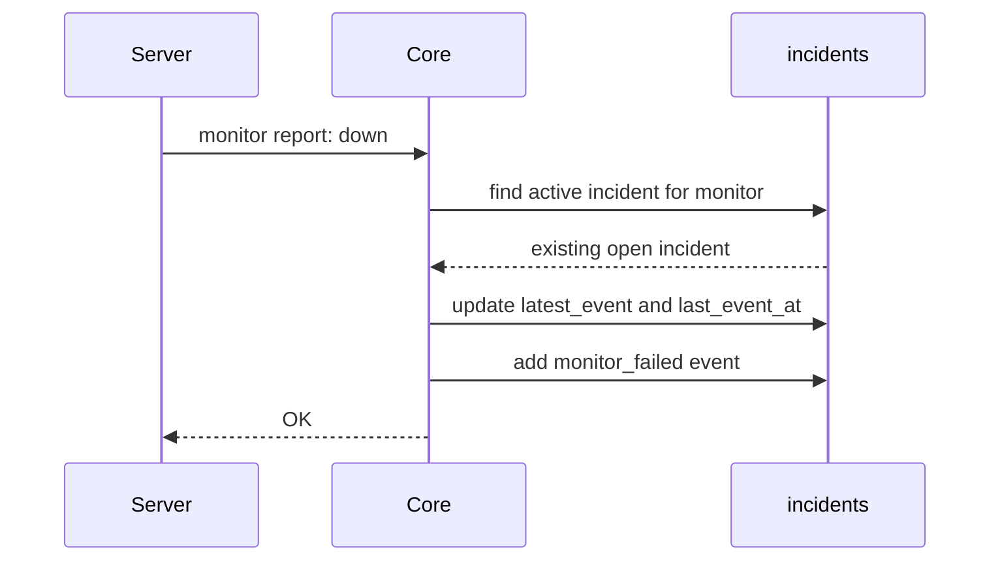
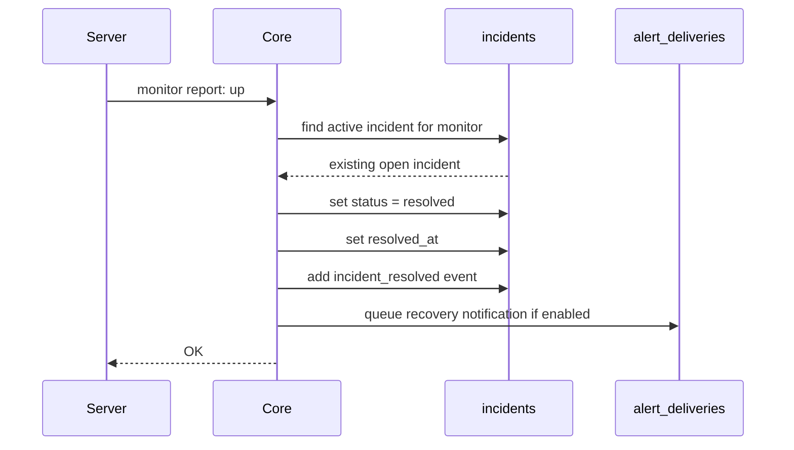
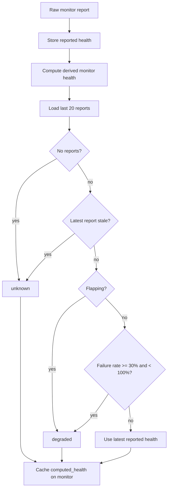
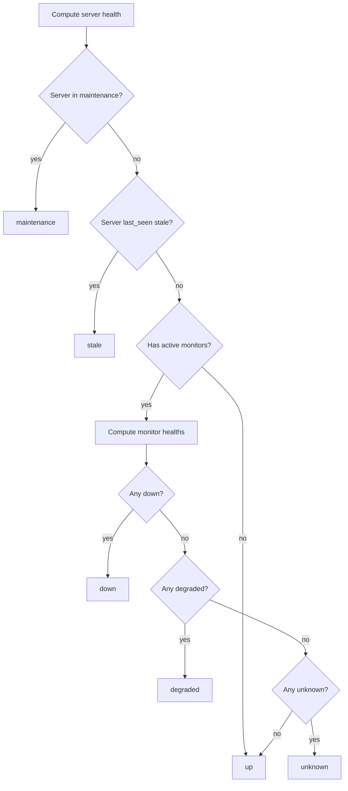

# Incident Reconciliation Flow

This note explains why Core checks for an active incident on monitor reports, why `record not found` can appear in logs, and how raw report ingestion turns into derived monitor/server state.

## Why Core Looks For An Incident On Every Monitor Report

Every monitor report is a chance to move the incident state machine forward:

- healthy report with no active incident: do nothing;
- healthy report with an active incident: resolve it;
- failing report with no active incident: open one;
- failing report with an active incident: update it;
- healthy report with expiring TLS: treat it as degraded and open/update an incident.



## The Normal No-Incident Case

The noisy log appears when this lookup returns no rows:

```sql
SELECT *
FROM incidents
WHERE monitor_id = ?
  AND status IN ("open", "acknowledged")
ORDER BY opened_at DESC
LIMIT 1;
```

That does not mean ingestion failed. For a healthy monitor, no active incident is the expected state.



## Incident State Machine



## Healthy Report With No Incident



## Failing Report With No Incident



## Continued Failure



## Recovery



## Derived Monitor Health

Incident reconciliation uses the reported health and TLS checks directly. Core also computes a derived monitor health for broader health views.
Stale checks use the stored reporting interval for the Server or monitor, not a single global timeout.



## Derived Server Health

Server health rolls monitor state up to the server level.



## Current Performance Behavior

The active incident lookup is conceptually correct, but it should not be an expensive table scan or a noisy expected miss.

Core now uses targeted behavior:

- `monitors.active_incident_id` caches the active incident id when one exists;
- `monitors.incident_state` stores the last incident-relevant state;
- repeated healthy reports skip the active incident lookup;
- active incidents are updated or resolved by cached incident id when possible;
- fallback lookup uses an index on `incidents(monitor_id, status, opened_at)`;
- expected empty results use `Find()` plus `RowsAffected`, not `First()` returning `record not found`;
- slow active incident lookups and slow reconciliation calls are logged.
