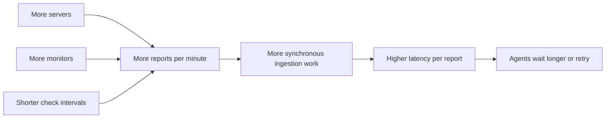
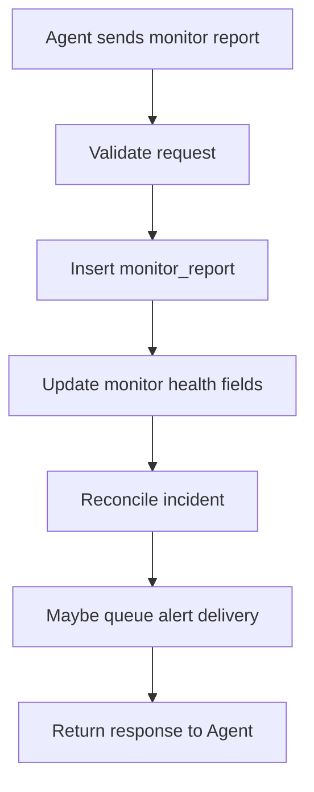
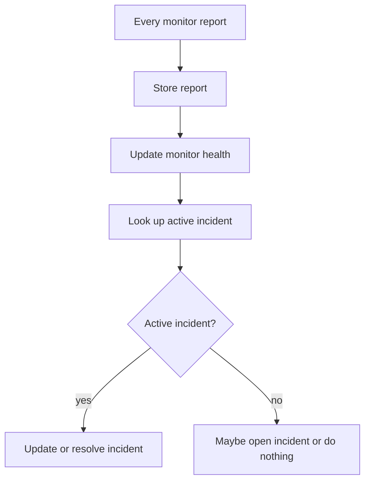
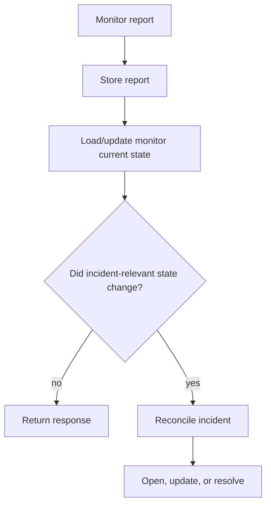
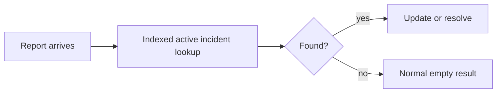
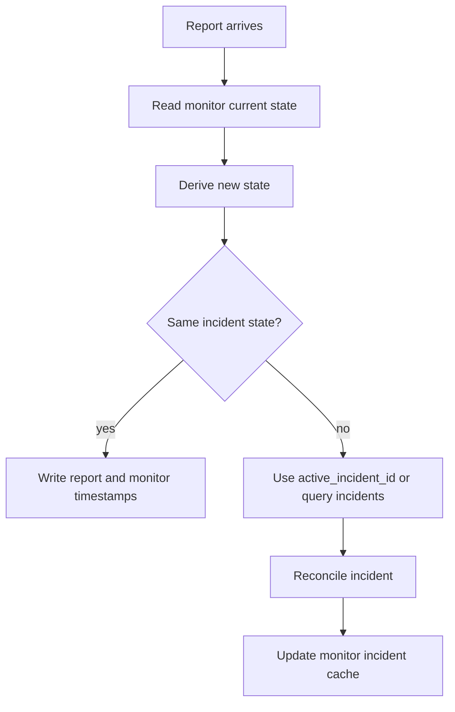
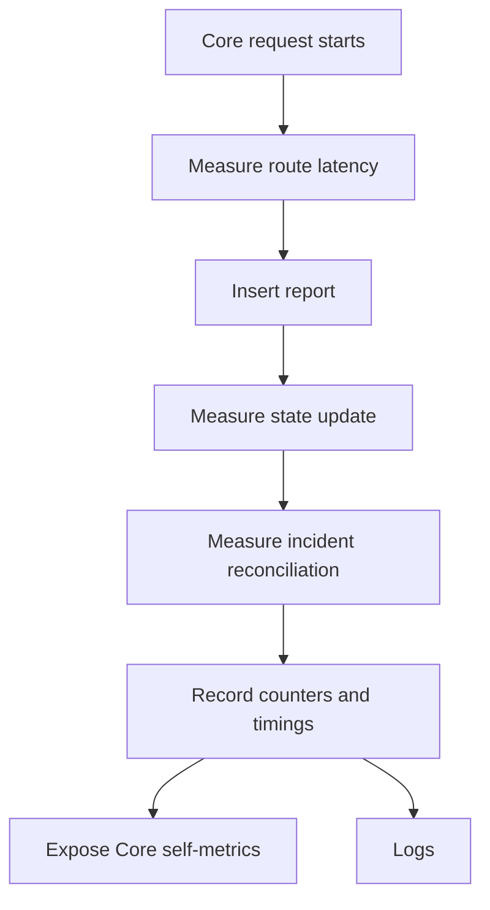
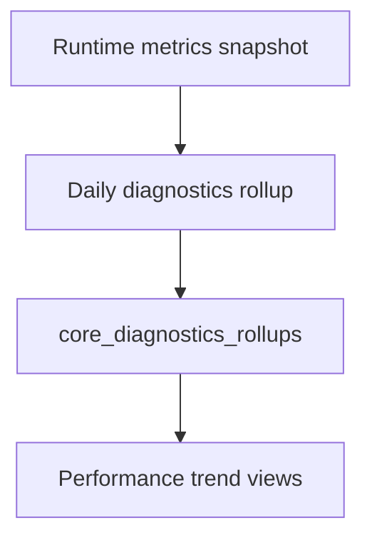

# Ingestion Performance And Observability

This note documents the assumption that Orion report volume will grow over time and how Core should know when report ingestion is becoming slow.

The main concern here is not long-term storage. Orion can keep historical data forever through rollups, archives, and backups. The concern is the amount of work Core performs while an Agent is waiting for a report request to finish.

## Ingestion Growth Assumption

Assume report volume grows forever.

More servers, more monitors, and shorter monitor intervals all increase the number of report requests Core must process.



## Current Synchronous Work

When Core receives a monitor report, the request currently does more than insert raw data. It also derives operational state.



That synchronous path is valuable because it keeps current health and incidents fresh immediately. The risk is that every extra lookup on this path multiplies by report volume.

## What Should Stay In The Request Path

Keep the request path small and deterministic:

- validate the payload;
- insert the raw report;
- update the monitor's latest state;
- detect whether the monitor state changed;
- do minimal incident reconciliation when a state change requires it.

Avoid work that scans history, computes broad summaries, or performs slow external calls while the Agent is waiting.

## Incident Reconciliation On Reports

The current behavior checks for an active incident during report ingestion so Core can open, update, or resolve incidents immediately.

That is correct behavior, but the lookup should not happen with equal cost forever.

Current shape:



Preferred shape:



Incident-relevant state changes include:

- `up` to `down`, `degraded`, or `stale`;
- `down`, `degraded`, or `stale` to `up`;
- TLS expiry crossing the warning threshold;
- monitor entering or leaving maintenance suppression rules in the future.

For continued healthy reports and continued failing reports, Core can usually avoid doing the full active incident lookup every time.

## Implemented Near-Term Fix

Core now keeps the current path cheaper and quieter:

- active incident lookup is indexed by monitor id, status, and opened time;
- `findActiveIncident` uses `Find()` and `RowsAffected` so "no active incident" is normal control flow;
- slow active incident lookups are logged when they exceed 50ms;
- slow incident reconciliation calls are logged when they exceed 100ms.



This keeps behavior unchanged while making the current path cheaper and quieter.

## Implemented Transition-Aware Reconciliation

Core now stores enough current incident state on the monitor row to avoid repeated incident table reads in the common healthy path:

- `active_incident_id`;
- `incident_state`.

The database remains the source of truth. The cached fields only make the common ingestion path cheaper.



## How Core Should Know Ingestion Is Slow

Core should record lightweight internal metrics for ingestion. This is separate from monitored server metrics. These metrics answer: is Orion itself keeping up with reports?

The first useful metrics are:

- report request count by route and status;
- report request latency by route;
- monitor report insert duration;
- monitor state update duration;
- incident reconciliation count and duration;
- active incident lookup duration and miss count;
- alert queue duration;
- SQLite busy/retry count;
- p50/p95/p99 ingestion latency.



## Recommended Observability Shape

Use three layers.

### 1. Structured Logs

Logs should keep important lifecycle events and slow operations:

- report request completed with route, method, status, and duration;
- slow database operation over a threshold;
- slow incident reconciliation over a threshold;
- incident opened/updated/resolved.

Logs are useful for debugging one event, but they are not enough for trend tracking.

### 2. Internal Metrics Snapshot

Core should keep an in-memory metrics snapshot for cheap counters, timings, and gauges. This avoids writing a database row for every internal measurement.

Example shape:

```txt
core.uptime_seconds
core.requests_total{route,status}
core.request_duration_ms{route}
core.ingestion_duration_ms{kind}
core.db_query_duration_ms{operation}
core.monitor_report_insert_duration_ms
core.incident_reconciliation_duration_ms
core.active_incident_lookup_miss_total
core.sqlite_busy_total
```

Expose it through a read-only diagnostics endpoint later, for example:

```txt
GET /v1/settings/diagnostics
```

That endpoint can power a future UI without requiring a separate monitoring stack.

### 3. Persistent Daily Core Metrics

For trend history, Core should roll up its own performance once per day into a small table. This keeps trend data forever without storing every internal timing sample.



Useful daily rollup fields:

- date;
- ingestion count;
- p50/p95 ingestion latency;
- p99 ingestion latency;
- incident reconciliation count;
- p50/p95 incident reconciliation latency;
- active incident lookup miss count;
- SQLite busy count;
- slow operation count.

## What Counts As A Problem

Start with simple thresholds that can be shown in diagnostics:

- ingestion p95 above 500ms;
- ingestion p99 above 2000ms;
- incident reconciliation p95 above 100ms;
- active incident lookup p95 above 50ms;
- SQLite busy errors during report ingestion;
- increasing Agent report retries;
- slow operation count increasing day over day.

These thresholds should not page the user by default. They should first appear as local diagnostics and warnings because this is self-hosted software.

## Decision

Do not remove incident reconciliation from ingestion entirely. Users expect current incidents and health to update as reports arrive.

The ingestion path is transition-aware:

- now: keep reconciliation synchronous, use the active incident id cache when one exists, and skip incident lookup for repeated healthy reports;
- next: add a diagnostics endpoint for ingestion timing;
- later: move non-critical fan-out work, such as notification delivery attempts, outside the Agent request path.

## Implementation Order

1. Completed: add the active incident lookup index and quiet expected no-row lookups.
2. Completed: add incident reconciliation timing and slow reconciliation logs.
3. Completed: add transition-aware incident state on monitors.
4. Add a read-only diagnostics endpoint.
5. Add broader ingestion latency logging.

This keeps the current product behavior while making report ingestion visibly fast and easier to optimize.
