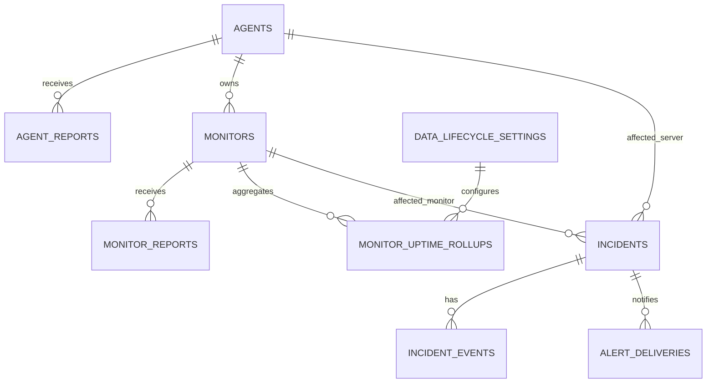
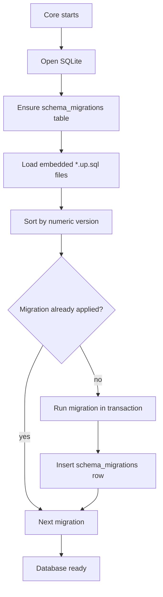
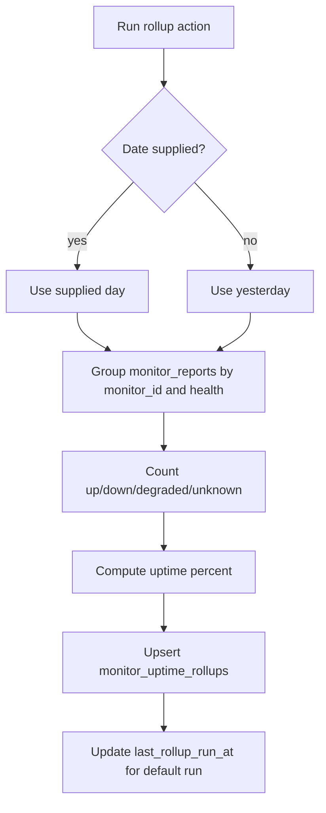
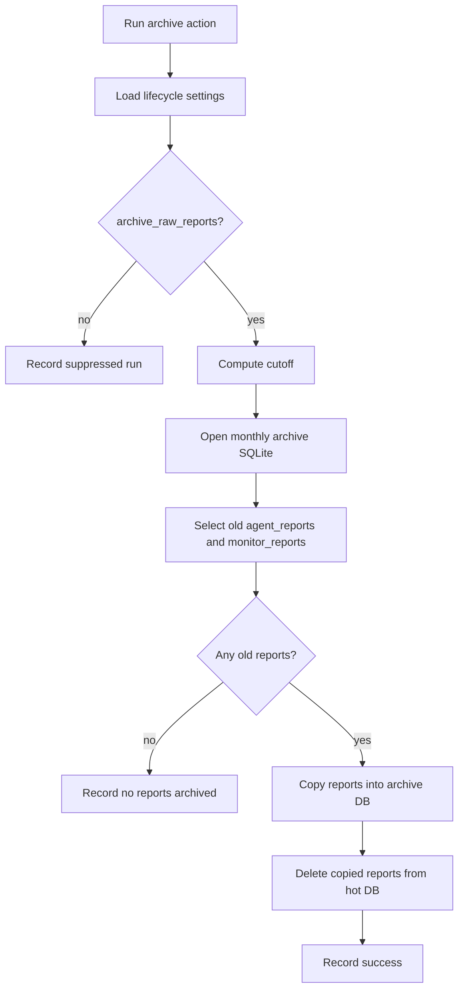
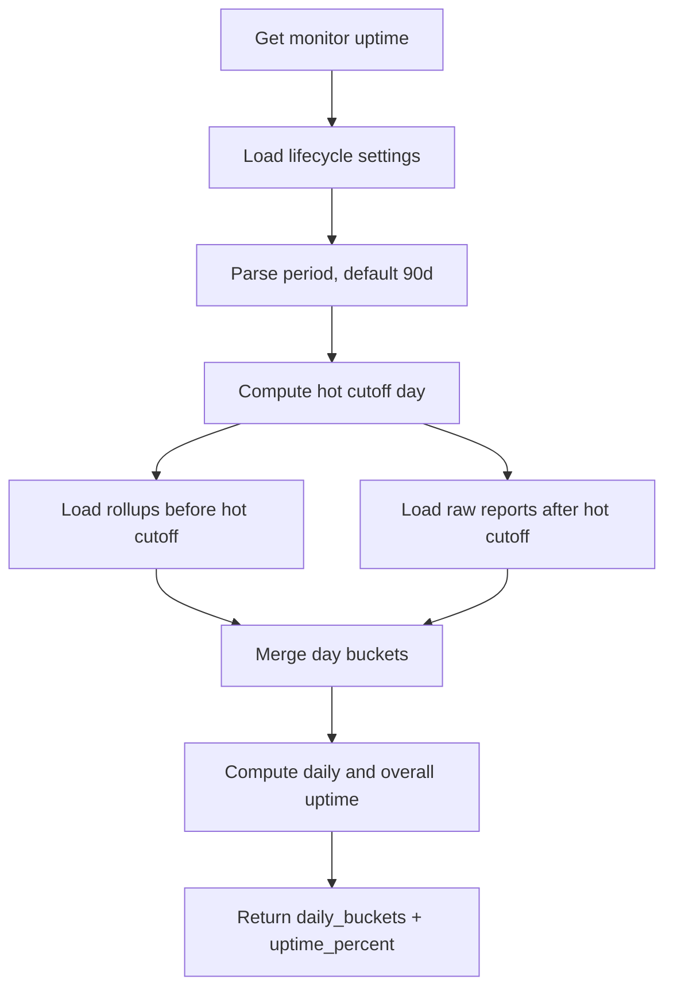
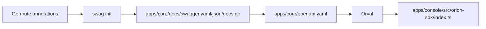

# Persistence And Data Lifecycle

## SQLite Databases

Core stores runtime state in SQLite at `<ORION_DATA_DIR>/orion.db`. The default data directory is `data`.

The Agent also stores its local runtime state in SQLite at `state.db`. User-facing monitor configuration remains in YAML.



## Tables

### `schema_migrations`

Tracks embedded SQL migrations that have already run.

### `agents`

Stores registered servers:

- stable Agent id;
- `machine_id`;
- display name, OS, platform, kernel, architecture;
- bearer token;
- maintenance flag;
- reporting interval;
- created/deleted/last-seen timestamps;
- location and meta JSON/text.

### `agent_reports`

Stores system metrics reports:

- Agent version and config summary;
- uptime seconds and report timestamp;
- CPU, memory, disk, and location JSON;
- Core `created_at`.

### `monitors`

Stores registered monitor inventory:

- monitor id, server id, name, type, description;
- lifecycle: `active`, `disabled`, or `deleted`;
- current reported health;
- computed health cache;
- cached active incident id;
- cached incident state;
- reporting interval;
- last successful report timestamp;
- meta and timestamps.

### `monitor_reports`

Stores raw monitor report payloads:

- monitor id;
- raw JSON payload for metrics or error;
- collected timestamp from Agent;
- reported health;
- Core `created_at`.

### `monitor_uptime_rollups`

Stores daily monitor uptime aggregates:

- monitor id;
- date;
- up/down/degraded/unknown counts;
- total count;
- uptime percent.

The unique key is monitor id plus date, making rollups idempotent.

### `incidents`

Stores operational failures:

- status, severity, title;
- affected server and monitor;
- opened/resolved timestamps;
- latest event;
- notification status.

### `incident_events`

Stores incident timeline events:

- incident opened;
- monitor failed;
- incident resolved;
- linked monitor report id when available.

### `alert_deliveries`

Stores notification attempts:

- incident id;
- event type;
- channel name and type;
- status;
- error details;
- timestamps.

### `alert_channels`

Stores API-managed notification targets:

- channel name and type;
- enabled state;
- webhook URL or email transport fields;
- subscribed incident event types;
- timestamps.

Secret fields are stored for delivery but redacted from API responses.

### `data_lifecycle_settings`

Stores singleton lifecycle settings:

- hot raw report window;
- archive enablement and path;
- rollup enablement;
- optional rollup retention;
- archive schedule;
- last rollup/archive run metadata.

## Migrations

Core embeds SQL files from `apps/core/internal/db/migrations/*.up.sql`.



Current migrations:

- `000001_init_schema.up.sql`: base Agent, report, monitor, incident, and alert tables.
- `000002_data_lifecycle_settings.up.sql`: lifecycle settings.
- `000003_monitor_uptime_rollups.up.sql`: daily uptime rollups.
- `000004_incident_reconciliation_state.up.sql`: monitor incident-state cache and active incident lookup index.

## Uptime Rollups

Rollups aggregate raw monitor reports into daily per-monitor rows.

Manual action:

- `POST /v1/settings/data-lifecycle/actions/rollup`
- Optional body: `{"date":"YYYY-MM-DD"}`
- If no date is given, Core rolls up yesterday.



## Raw Report Archive

Archiving moves old raw reports out of the hot database into monthly SQLite archive files. It does not discard data.

Manual action:

- `POST /v1/settings/data-lifecycle/actions/archive`

Archive behavior:

- reads data lifecycle settings;
- skips when `archive_raw_reports` is false;
- computes cutoff as `now - raw_report_hot_days`;
- opens/creates `raw-reports-YYYY-MM.sqlite` in configured archive directory;
- copies old `agent_reports` and `monitor_reports` into the archive database;
- deletes copied rows from the hot database inside the Core database transaction;
- records last archive run status and error.



## Uptime Read Path

Monitor uptime combines:

- rollups for older days outside the hot raw-report window;
- raw monitor reports for recent days inside the hot window.



Agent uptime averages each active monitor uptime percentage and uses the first monitor's daily bucket shape as the current implementation.

## Generated OpenAPI Contract

The API contract is generated from Core route annotations.

Commands:

```sh
make generate-openapi
make generate-sdk
```

Generation flow:



Do not hand-edit generated API contract or SDK files. Update route annotations, then regenerate.

## Agent Local State Layer

The Agent's local SQLite state is intentionally not user-facing configuration. It stores data the Agent owns:

- registered Agent id;
- Agent auth token;
- Core URL used for registration;
- last sync time;
- local maintenance flag and reason;
- monitor name to Core monitor id mapping;
- monitor runtime status and last checked time.

Keeping this in SQLite gives the Agent an atomic state layer without making users edit a database. This product direction allows future Agent features without changing the YAML config model:

- durable offline report spool;
- retry attempts with next retry time and last error;
- local Agent event log;
- last check result cache per monitor;
- richer `orion-agent status` and future `doctor` output;
- safer concurrent access from daemon and CLI;
- future Agent update bookkeeping;
- future token rotation or credential metadata;
- local diagnostics without requiring Core to be reachable.
