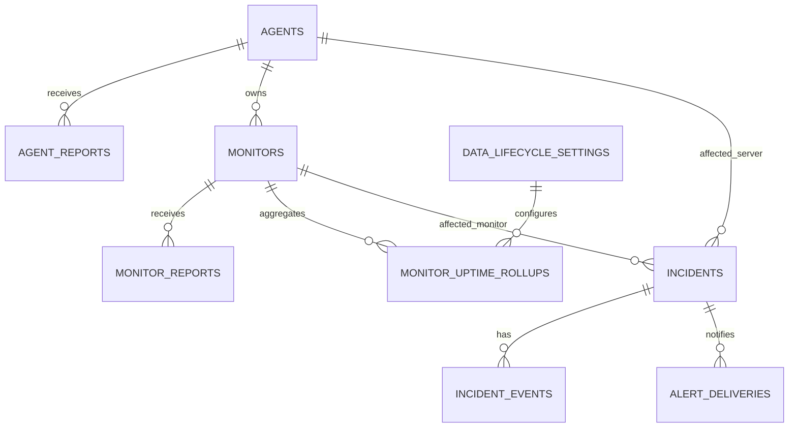
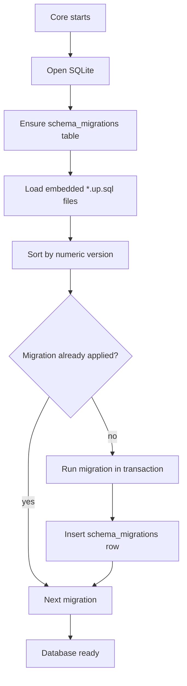
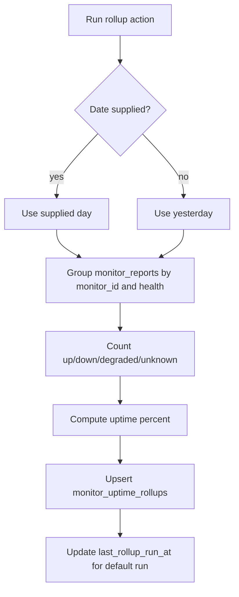
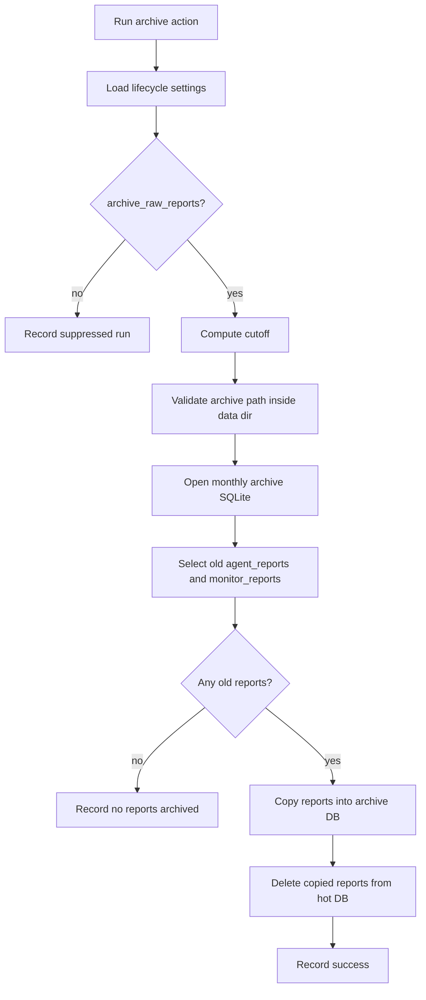
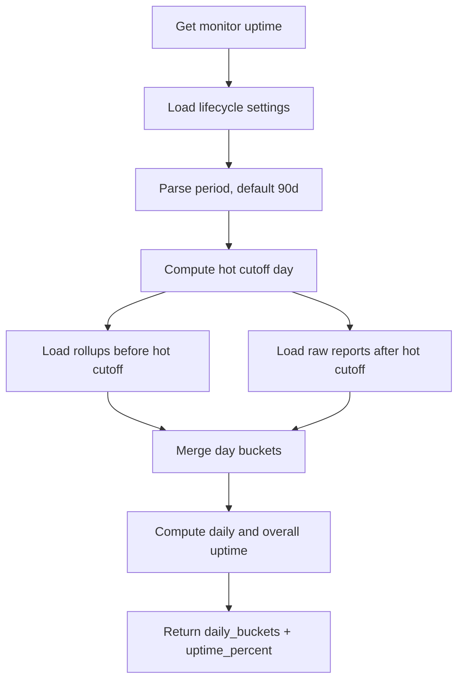
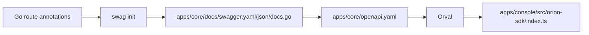

# Persistence And Data Lifecycle

## SQLite Databases

Core stores runtime state in SQLite at `<ORION_DATA_DIR>/orion.db`. The default data directory is `data`.

The Server also stores its local runtime state in SQLite at `state.db`. User-facing monitor configuration remains in YAML.



## Tables

### `schema_migrations`

Tracks embedded SQL migrations that have already run.

### `agents`

Stores registered servers:

- stable Server id;
- `machine_id`;
- display name, OS, platform, kernel, architecture;
- bearer token;
- maintenance flag;
- reporting interval;
- created/deleted/last-seen timestamps;
- location and meta JSON/text.

### `agent_reports`

Stores system metrics reports:

- Server version and config summary;
- uptime seconds and report timestamp;
- CPU, memory, disk, and location JSON;
- Core `created_at`.

### `monitors`

Stores registered monitor inventory:

- monitor id, server id, name, type, description;
- lifecycle: `active`, `disabled`, or `deleted`;
- current reported health;
- computed health cache;
- cached active incident id;
- cached incident state;
- reporting interval;
- last successful report timestamp;
- meta and timestamps.

### `monitor_reports`

Stores raw monitor report payloads:

- monitor id;
- raw JSON payload for metrics or error;
- collected timestamp from Server;
- reported health;
- Core `created_at`.

### `monitor_uptime_rollups`

Stores daily monitor uptime aggregates:

- monitor id;
- date;
- up/down/degraded/unknown counts;
- total count;
- uptime percent.

The unique key is monitor id plus date, making rollups idempotent.

### `incidents`

Stores operational failures:

- status, severity, title;
- affected server and monitor;
- opened/resolved timestamps;
- latest event;
- notification status.

### `incident_events`

Stores incident timeline events:

- incident opened;
- monitor failed;
- incident resolved;
- linked monitor report id when available.

### `alert_deliveries`

Stores notification attempts:

- incident id;
- event type;
- channel name and type;
- status;
- error details;
- timestamps.

### `alert_channels`

Stores API-managed notification targets:

- channel name and type;
- enabled state;
- webhook URL or email transport fields;
- subscribed incident event types;
- timestamps.

Secret fields are stored for delivery but redacted from API responses.

### `audit_events`

Stores durable audit records for lifecycle-sensitive operator actions:

- action name;
- actor id and actor type when known;
- affected object type and id;
- safe metadata JSON;
- created timestamp.

### `data_lifecycle_settings`

Stores singleton lifecycle settings:

- hot raw report window;
- archive enablement and path;
- rollup enablement;
- optional rollup retention;
- archive schedule;
- last rollup/archive run metadata.

The Settings page and `/v1/settings/data-lifecycle` API own this row. Core creates the row on first read with these defaults:

- `raw_report_hot_days`: `90`;
- `archive_raw_reports`: `true`;
- `archive_dir`: `<ORION_DATA_DIR>/archive`;
- `rollups_enabled`: `true`;
- `rollup_retention_days`: `null`;
- `archive_schedule`: `daily`.

The current validation contract is:

- `raw_report_hot_days` must be at least `1`;
- `archive_dir` is required when raw report archiving is enabled;
- `rollups_enabled` must stay enabled when raw report archiving is enabled, because archived raw reports need daily rollups for uptime reads;
- `rollup_retention_days` is either `null` or at least `1`;
- `archive_schedule` is either `daily` or `manual`.

Current mainline archive path behavior is intentionally treated as not release-ready: Core persists the supplied `archive_dir`, creates that directory, and writes the monthly archive file there. The first-release archive directory policy to enforce before release is:

- empty archive paths are rejected when `archive_raw_reports` is enabled;
- relative archive paths resolve under `<ORION_DATA_DIR>` after path cleaning;
- traversal that escapes `<ORION_DATA_DIR>` is rejected;
- absolute archive paths outside `<ORION_DATA_DIR>` are rejected for the first release;
- operators who need a different physical disk should mount it under `<ORION_DATA_DIR>` and use a relative archive path;
- API errors should describe the policy without echoing sensitive host filesystem details.

## Migrations

Core embeds SQL files from `apps/core/internal/db/migrations/*.up.sql`.



Current lifecycle-relevant migrations:

- `000001_init_schema.up.sql`: base Server, report, monitor, incident, and alert tables.
- `000002_data_lifecycle_settings.up.sql`: lifecycle settings.
- `000003_monitor_uptime_rollups.up.sql`: daily uptime rollups.
- `000004_incident_reconciliation_state.up.sql`: monitor incident-state cache and active incident lookup index.
- `000014_audit_events.up.sql`: durable audit event table.
- `000023_incident_lifecycle_fields.up.sql`: structured incident lifecycle fields.
- `000024_agent_token_lifecycle.up.sql`: Server token lifecycle metadata.

## Uptime Rollups

Rollups aggregate raw monitor reports into daily per-monitor rows.

Manual action:

- `POST /v1/settings/data-lifecycle/actions/rollup`
- Optional body: `{"date":"YYYY-MM-DD"}`
- If no date is given, Core rolls up yesterday.
- The manual endpoint can be run even when automatic rollups are disabled.
- `last_rollup_run_at` is updated only for the default yesterday rollup path.



Automatic action:

- Core starts a data lifecycle scheduler during API server startup.
- `ORION_DATA_LIFECYCLE_SCHEDULER_SECONDS` controls the scheduler wakeup interval and defaults to `3600`.
- The scheduler checks the singleton settings row and runs daily rollup work at most once per UTC day when `rollups_enabled` is true and `archive_schedule` is `daily`.
- `archive_schedule=manual` skips both scheduled rollup and scheduled archive work; operators can still run manual actions from the API or Console.

## Raw Report Archive

Archiving moves old raw reports out of the hot database into monthly SQLite archive files. It does not discard data.

Manual action:

- `POST /v1/settings/data-lifecycle/actions/archive`

Archive behavior:

- reads data lifecycle settings;
- skips when `archive_raw_reports` is false;
- computes cutoff as `now - raw_report_hot_days`;
- opens/creates `raw-reports-YYYY-MM.sqlite` in the configured archive directory;
- copies old `agent_reports` and `monitor_reports` into the archive database;
- deletes copied rows from the hot database inside the Core database transaction;
- records last archive run status and error.

Manual archive safety:

- the API action runs immediately and returns counts, cutoff, archive path, and skip flags;
- the Console Settings workflow must confirm a manual archive before calling the API, because old raw reports move out of the hot Core database;
- archive and rollup actions refresh the settings row after completion so last-run metadata and errors are visible to operators;
- duplicate manual action prevention belongs in the caller until Core adds durable action leasing.

Archive directory policy:

- `archive_dir` must resolve inside Core's configured `ORION_DATA_DIR`;
- relative `archive_dir` values are resolved relative to `ORION_DATA_DIR`;
- absolute `archive_dir` values are accepted only when they resolve inside `ORION_DATA_DIR`;
- the data directory itself is not a valid archive directory;
- traversal, null-byte, and external absolute paths are rejected with user-safe validation errors;
- archive execution re-checks the path before writing and rejects archive directories that resolve outside `ORION_DATA_DIR` through existing symlinks;
- raw report hot retention and rollup retention are capped at 3650 days.



Automatic archive behavior:

- the scheduler runs archive work at most once per UTC day when `archive_raw_reports` is true and `archive_schedule` is `daily`;
- archive failures are logged and recorded on `data_lifecycle_settings.last_archive_status` and `last_archive_error`;
- scheduled archive work shares the same archive service and path behavior as the manual action.

## Lifecycle Auditability

Settings readiness uses two event surfaces:

- operational event logs derive rollup and archive events from `last_rollup_run_at`, `last_archive_run_at`, and `last_archive_status`;
- explicit audit events should be written for settings updates and lifecycle actions when the action changes persisted operator-facing state.

Audit metadata must be safe to expose in Console logs. Store action type, actor identity, affected object, and bounded non-secret metadata. Do not store raw archive filesystem errors, webhook secrets, bearer tokens, or full request bodies in audit metadata.

## Uptime Read Path

Monitor uptime combines:

- rollups for older days outside the hot raw-report window;
- raw monitor reports for recent days inside the hot window.



Server uptime averages each active monitor uptime percentage and uses the first monitor's daily bucket shape as the current implementation.

## Automatic Lifecycle Scheduler

Core starts a data lifecycle scheduler with the API process.

Scheduler behavior:

- runs once at Core startup and then on `ORION_DATA_LIFECYCLE_SCHEDULER_SECONDS`;
- uses a one-hour interval when the configured interval is zero or negative;
- skips all automatic lifecycle jobs when `archive_schedule` is `manual`;
- when `archive_schedule` is `daily`, runs at most one rollup and one archive per calendar day;
- runs automatic rollups only when `rollups_enabled` is true;
- runs automatic archives only when `archive_raw_reports` is true.

Manual rollup and archive endpoints are independent of the scheduler cadence.

## Settings Audit And Logs

Current implemented visibility:

- the event log derives `retention_rollup_ran` from `last_rollup_run_at`;
- the event log derives `retention_archive_ran` from `last_archive_run_at` and `last_archive_status`;
- Console Logs can filter those lifecycle event types through the regular event log filters.

Open readiness gaps:

- updating data lifecycle settings does not yet write a durable `audit_events` row;
- manual rollup and archive actions do not yet write durable `audit_events` rows;
- archive path errors may include filesystem details from the underlying operation;
- Console does not yet require an archive confirmation step with cutoff and destination details.

These gaps are implementation tickets, not accepted architecture behavior.

## Settings PR Closeout

Settings readiness PRs should use
[`docs/plans/settings-pr-closeout-checklist.md`](../plans/settings-pr-closeout-checklist.md)
before review.

## Generated OpenAPI Contract

The API contract is generated from Core route annotations.

Commands:

```sh
make generate-openapi
make generate-sdk
```

Generation flow:



Do not hand-edit generated API contract or SDK files. Update route annotations, then regenerate.

## Server Local State Layer

The Server's local SQLite state is intentionally not user-facing configuration. It stores data the Server owns:

- registered Server id;
- Server auth token;
- Core URL used for registration;
- last sync time;
- local maintenance flag and reason;
- monitor name to Core monitor id mapping;
- monitor runtime status and last checked time.

Keeping this in SQLite gives the Server an atomic state layer without making users edit a database. This product direction allows future Server features without changing the YAML config model:

- durable offline report spool;
- retry attempts with next retry time and last error;
- local Server event log;
- last check result cache per monitor;
- richer `orion-agent status` and future `doctor` output;
- safer concurrent access from daemon and CLI;
- future Server update bookkeeping;
- future token rotation or credential metadata;
- local diagnostics without requiring Core to be reachable.
