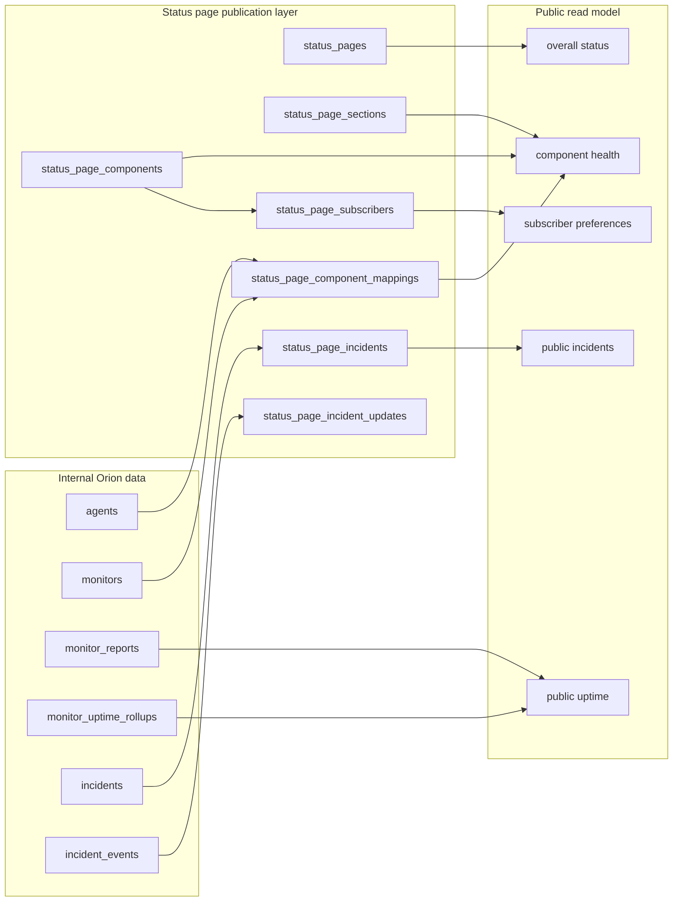
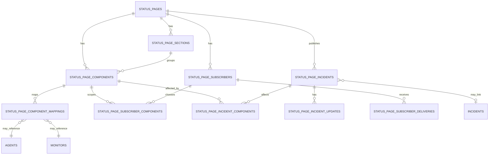
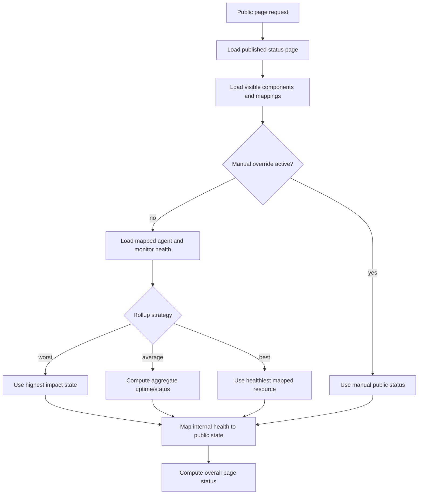
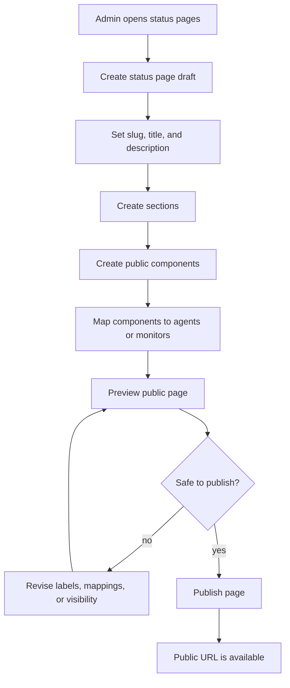
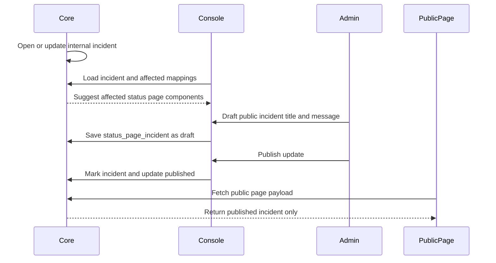
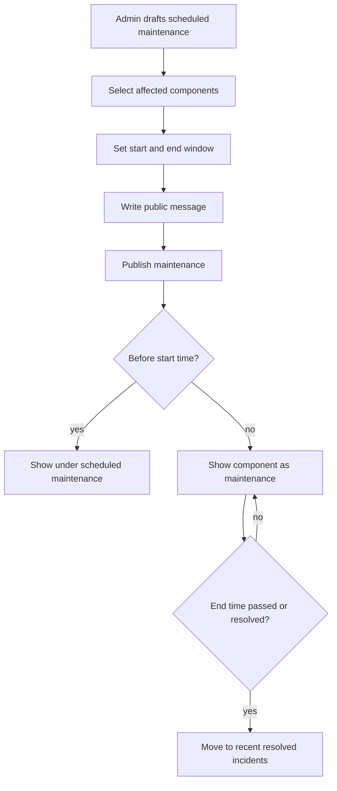
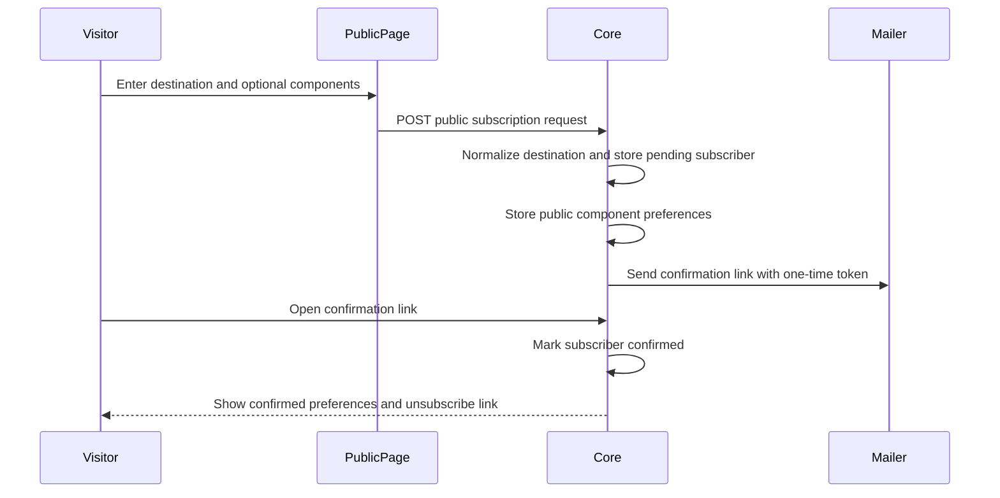
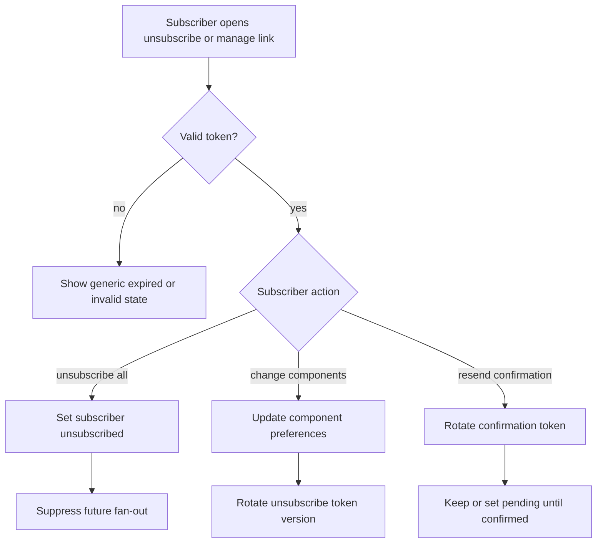
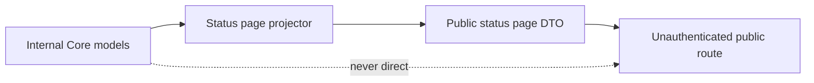

# Status Pages Architecture Plan

## Purpose

Status pages give Orion a public, shareable view of service health. They should answer one question quickly: "Is the service working, and what is affected if it is not?"

The status page is not a mirror of the Console. It is a curated publication layer over existing Core data: agents, monitors, derived health, incidents, and uptime rollups. Administrators decide which operational resources are exposed, how they are named, and which incident details are public.

## Product Goals

- Create one or more status pages from the Console.
- Group public-facing components into sections, such as `API`, `Website`, `Database`, or `Region`.
- Map each public component to one or more internal monitors or servers.
- Show current component health, active incidents, maintenance, and uptime history.
- Publish incident updates intentionally, with safe public wording.
- Keep raw infrastructure details, secrets, report payloads, and internal debugging data private.
- Support private drafts before a page is published.
- Leave room for email, webhook, RSS, Atom, or Slack-style subscriptions later.

## What A Status Page Shows

Default public status page content:

- page name and optional description;
- safe page metadata for browsers and link previews;
- overall status summary;
- component sections and component health;
- active public incidents and scheduled maintenance;
- recent resolved public incidents;
- uptime percentages and daily history by component;
- last updated time;
- optional subscription entry points.

Public component states should use the existing status vocabulary where possible:

- `operational` maps from `up`;
- `degraded` maps from `degraded`;
- `partial_outage` maps from mixed component dependencies;
- `major_outage` maps from `down` or sustained `stale`;
- `maintenance` maps from planned maintenance or Core maintenance mode;
- `unknown` is shown only when an administrator chooses to expose it.

## What A Status Page Does Not Show

Never expose by default:

- Agent ids, monitor ids, bearer tokens, JWTs, webhook URLs, or secrets.
- Raw monitor payloads, command output, stack traces, or internal error text.
- Internal hostnames, IP addresses, exact filesystem paths, kernel details, or location metadata.
- Console-only diagnostics, ingestion latency, SQLite metrics, or archive settings.
- Alert delivery failures or notification channel internals.
- Private incident notes, acknowledgements, assignee names, or operational chat context.

Expose only when explicitly configured:

- internal service names;
- server regions or locations;
- monitor descriptions;
- exact downtime timestamps instead of rounded public timestamps;
- historical incidents older than the default public window.

## Core Concept

Status pages are projections. Core remains the source of truth for monitor health, server health, incidents, and uptime. The status page layer stores publication configuration and public incident content.

## Data Model

Add publication tables rather than changing Agent/Core reporting behavior.

### `status_pages`

Stores page-level configuration:

- id;
- slug;
- title;
- description;
- optional SEO title;
- optional SEO description;
- optional Open Graph image URL;
- optional canonical URL override;
- visibility: `draft`, `public`, or `unlisted`;
- theme settings;
- custom domain fields later;
- default incident visibility policy;
- created, updated, published timestamps.

### `status_page_sections`

Groups components for display:

- id;
- status page id;
- name;
- sort order;
- collapsed by default flag.

### `status_page_components`

Defines public-facing components:

- id;
- status page id;
- section id;
- public name;
- public description;
- display mode: `single_resource`, `aggregate`, or `manual`;
- manual status override and reason;
- sort order;
- visibility flag.

### `status_page_component_mappings`

Maps public components to internal resources:

- component id;
- resource type: `agent`, `monitor`, or future `group`;
- resource id;
- health rollup strategy: `worst`, `best`, `average`, or `manual`;
- uptime rollup strategy.

The default strategy should be `worst` because public status should not hide a failing dependency.

### `status_page_incidents`

Stores public incident records linked to internal incidents when available:

- id;
- status page id;
- optional internal incident id;
- title;
- public status: `investigating`, `identified`, `monitoring`, `resolved`, or `scheduled`;
- severity;
- impact summary;
- visibility: `draft`, `published`, or `private`;
- affected component ids;
- published, resolved, scheduled timestamps.

### `status_page_incident_updates`

Stores public timeline updates:

- incident id;
- status at time of update;
- public message;
- created by;
- published at;
- created at.

Keep public messages separate from internal incident events. Internal incident events are operational facts; public updates are communication.

### `status_page_subscribers`

Stores public subscriber identities and confirmation state. These records are owned by the status page publication layer and must not reference internal alert channel ids, alert destination ids, alert secrets, webhook signing secrets, escalation routes, or operator notification preferences.

Fields:

- id;
- status page id;
- destination type: initially `email`, later `webhook`, `rss`, `atom`, or other public delivery types;
- normalized destination hash for uniqueness and abuse checks;
- encrypted destination value, such as email address or public webhook URL;
- display destination, such as a masked email for admin support views;
- confirmation state: `pending`, `confirmed`, `unsubscribed`, `bounced`, or `disabled`;
- confirmation token hash;
- confirmation token expires at;
- unsubscribe token hash;
- unsubscribe token version;
- bounce count;
- last delivery status and last delivery at;
- source: `public_page`, `admin_import`, or future `api`;
- created, confirmed, unsubscribed, disabled, updated timestamps.

Destination values are public subscriber contact data, not internal alert secrets. They still need encryption at rest and redaction in admin APIs because they are personal or customer data.

### `status_page_subscriber_components`

Stores component-scoped preferences:

- subscriber id;
- component id;
- event scope: `all_updates`, `incidents_only`, or future `maintenance_only`;
- created and updated timestamps.

An empty component preference set means the subscriber wants all visible components on the page. Component ids in this table are public status page component ids only. Do not store monitor ids, agent ids, incident ids, or internal component mapping ids here.

### `status_page_subscriber_deliveries`

Optional delivery ledger for fan-out and audit:

- id;
- subscriber id;
- status page id;
- optional public incident id;
- optional public incident update id;
- delivery type;
- delivery state: `queued`, `sent`, `failed`, `suppressed`, or `bounced`;
- provider message id;
- error code and safe error summary;
- attempt count;
- queued, sent, failed timestamps.

Delivery rows should store public incident ids and public update ids. They must not store internal alert delivery row ids or internal channel configuration.

## Entity Relationship

## Component Health Rollup

Public component health is derived from mapped resources unless a manual override is active.

Default health priority for public rollups:

1. `maintenance`
2. `major_outage`
3. `partial_outage`
4. `degraded`
5. `unknown`
6. `operational`

For mixed dependencies, one down monitor in a multi-monitor component should usually become `partial_outage`. All critical mapped monitors down should become `major_outage`.

## Status Page Creation Flow

Publication validation should block or warn when:

- a public component has no mapped resource and no manual status;
- a slug conflicts with another page;
- the page exposes private names flagged by simple heuristics, such as localhost, IP addresses, or internal domains;
- no components are visible;
- a public incident has no public update message.

## Incident Publishing Flow

Internal incidents should not automatically become public incidents without an explicit policy. The first version should default to manual publication.

Recommended first policy:

- Internal incidents are private by default.
- Admin can create a linked public incident from an internal incident.
- Core suggests affected public components based on component mappings.
- Public updates are written by an admin.
- Resolution can be suggested automatically when the linked internal incident resolves, but publishing the final message remains explicit.

Later policies can allow auto-publishing for trusted components:

- auto-create public incident with templated safe copy;
- auto-update affected component state;
- require manual approval for external notification fan-out.

## Scheduled Maintenance Flow

Scheduled maintenance is public communication, not necessarily the same as Agent maintenance mode. It should be able to exist before any monitor changes.

Do not require Agent maintenance mode for scheduled maintenance. Agent maintenance mode controls collection and incident suppression; status page maintenance controls public communication.

## Subscriber Confirmation Flow

Public subscriptions are opt-in and must be confirmed before Orion sends incident or maintenance notifications.

Lifecycle rules:

- New public subscriptions start as `pending`.
- Pending subscribers do not receive public incident fan-out except a confirmation message.
- Confirmation tokens are one-time hashes with a short expiry, such as 24 hours.
- Re-subscribing with the same normalized destination and page should rotate the confirmation token if still pending, or send a preferences management link if already confirmed.
- Confirmed subscribers can receive only public status page notifications generated from published public incidents, public incident updates, scheduled maintenance, and page-level public announcements.
- Bounced destinations move to `bounced` after the configured bounce threshold.
- Operators can set a subscriber to `disabled` for abuse, support, or compliance reasons.
- `unsubscribed`, `bounced`, and `disabled` subscribers are excluded from notification fan-out.

Confirmation links should resolve through public-safe routes and reveal only masked destination information. Admin APIs can expose subscriber counts and masked destinations, but not raw destination values unless a future support workflow explicitly requires it and adds audit logging.

## Component-Scoped Subscriptions

Subscribers may choose all components on a page or a subset of public components.

Scoping rules:

- Component preferences reference `status_page_components.id` only.
- Hidden components cannot be selected through the public subscription UI.
- If a visible component is later hidden, renamed, or deleted, existing subscriber preferences should be suppressed from fan-out until the subscriber updates preferences.
- A public incident update fans out to a subscriber when at least one affected public component matches their selected component set.
- Subscribers with no component rows receive updates for all visible components on that status page.
- Page-wide announcements and scheduled maintenance can either target selected public components or all subscribers on the page.

Component-scoped subscriptions must use the same public component ids that appear in public DTOs. They must never expose or persist internal monitor ids, agent ids, hostnames, or component mapping ids in subscriber preferences.

## Unsubscribe And Preference Flow

Every subscriber gets an unsubscribe token that is separate from the confirmation token. Tokens are stored as hashes, rotated after successful preference changes, and treated as bearer credentials for public subscriber self-service.

Unsubscribe rules:

- Public incident emails and webhooks must include an unsubscribe URL or documented equivalent for the delivery type.
- Unsubscribe must not require Console authentication.
- Successful unsubscribe should be idempotent and return a generic success page even if the subscriber was already unsubscribed.
- Preference management may require the current unsubscribe token or a fresh magic link sent to the destination.
- Unsubscribe actions should not delete the subscriber immediately; keep the row with `unsubscribed_at` so future re-subscribe, suppression, and compliance behavior are deterministic.
- Hard deletion can be a later privacy/compliance feature if data retention policy requires it.

## Public Subscriber Boundary

Public subscribers are separate from internal alert channels by design.

Allowed reuse:

- shared low-level SMTP or HTTP client code;
- shared retry worker primitives that accept public delivery jobs;
- shared redaction helpers;
- shared rate-limit infrastructure.

Forbidden coupling:

- storing public subscribers in internal alert channel tables;
- reusing internal alert destination ids as subscriber ids;
- exposing internal webhook URLs, SMTP credentials, signing secrets, escalation policies, or operator routing settings to subscriber code paths;
- delivering public status notifications from internal incident alert templates;
- allowing public subscribe, confirm, unsubscribe, or preference routes to read or mutate internal alert channels.

Public subscriber fan-out should have its own queue or queue namespace, template set, delivery ledger, metrics labels, and audit events. If the implementation later reuses the alert delivery engine, it must do so behind an adapter that accepts only public DTOs and provider credentials selected for public subscriber mail. That adapter must not receive internal alert channel records or secrets.

Implementation dependency: the first email subscriber implementation needs a documented public mail sender configuration, including sender identity, reply-to behavior, bounce handling, rate limits, and token URL origin. Until that exists, implementation tickets should create schema and public-safe lifecycle endpoints without sending production fan-out.

## Public API Shape

Add public, read-only routes:

- `GET /status/:slug`
- `GET /status/:slug/history`
- `GET /status/:slug/incidents`
- `GET /status/:slug/incidents/:incident_id`
- `GET /status/:slug/feed.atom` later

Add public subscription mutation routes:

- `POST /status/:slug/subscribers`
- `GET /status/:slug/subscribers/confirm/:token`
- `GET /status/:slug/subscribers/manage/:token`
- `PUT /status/:slug/subscribers/manage/:token`
- `POST /status/:slug/subscribers/unsubscribe/:token`

Add Console-admin routes under `/v1`:

- `GET /v1/status-pages`
- `POST /v1/status-pages`
- `GET /v1/status-pages/:id`
- `PUT /v1/status-pages/:id`
- `POST /v1/status-pages/:id/publish`
- `GET /v1/status-pages/:id/preview`
- `POST /v1/status-pages/:id/sections`
- `PUT /v1/status-pages/:id/sections/:section_id`
- `POST /v1/status-pages/:id/components`
- `PUT /v1/status-pages/:id/components/:component_id`
- `POST /v1/status-pages/:id/incidents`
- `PUT /v1/status-pages/:id/incidents/:incident_id`
- `POST /v1/status-pages/:id/incidents/:incident_id/updates`
- `GET /v1/status-pages/:id/subscribers`
- `POST /v1/status-pages/:id/subscribers/:subscriber_id/disable`
- `GET /v1/status-pages/:id/subscriber-deliveries`

Public routes must never use the Console API response structs directly. Return a dedicated public payload that contains only approved fields.

## Public Payload Boundary

Public DTO rules:

- use public component ids, not internal monitor or agent ids;
- use public labels, not internal resource names;
- include rounded timestamps when configured;
- include public incident text only;
- include uptime percentages and bucket states, not raw report counts unless explicitly chosen;
- omit hidden components and draft incidents.

## Public Metadata Boundary

Published status pages should expose safe browser and social sharing metadata without expanding the public data boundary.

Metadata should be projected from the status page publication layer, not from mapped agents, monitors, raw incidents, reports, or internal Console DTOs. The public metadata projector should return:

- document title;
- meta description;
- canonical URL;
- Open Graph title;
- Open Graph description;
- Open Graph URL;
- Open Graph type, normally `website`;
- Open Graph site name;
- optional Open Graph image URL when explicitly configured.

Safe defaults:

- title defaults to the public status page title;
- description defaults to the public status page description, or a generic public status summary when no description is configured;
- Open Graph title and description default to the safe SEO title and description;
- canonical URL is built from the published public origin and page slug, or from a configured custom domain when custom domains exist;
- Open Graph site name defaults to the public status page title.

Do not derive metadata from internal resource names, agent names, monitor names, hostnames, IP addresses, report payloads, private incident titles, or internal incident events. Component names may only appear in metadata when they are already public component labels and an administrator explicitly configures metadata that includes them.

Metadata should only render for `public` and `unlisted` pages that resolve through the public status page route. Draft previews may show metadata in the Console, but draft metadata must not be indexable and must not be exposed through unauthenticated public routes.

Implementation dependency: this metadata layer depends on the base status page serving model, including status page schema, public read DTOs, and a public page renderer or HTML response path for `/status/:slug`. Until those exist, metadata work should remain schema/design preparation rather than inventing a separate public status implementation.

## Console Experience

Console should treat status pages as a configuration workflow:

- list pages with draft/published state and public URL;
- page editor with tabs for basics, components, incidents, subscribers, and settings;
- component mapper that searches agents and monitors;
- preview mode that uses the public DTO before publishing;
- incident composer that can link an internal incident to public copy;
- validation panel before publish;
- publish/unpublish controls.

The editor should make privacy decisions visible. For example, show the public component name next to the internal monitor name and warn when they are identical.

## Public Page Experience

Public pages should be simple and fast:

- overall status at the top;
- grouped component list;
- active incidents and maintenance near the top;
- uptime history below components;
- recent incident history;
- subscription controls when available.

The public page should not require Console JavaScript or authentication. It can be served by Core as either a lightweight server-rendered page or a dedicated public SPA bundle. The first implementation can reuse the existing Core static asset serving path if routing and payload boundaries remain separate.

## Caching And Freshness

Status pages are read-heavy. Keep reads cheap:

- compute current public status on request for the first version;
- cache the public page payload in memory by page id and invalidation version later;
- invalidate cache when component mappings, incident publication, or monitor health changes;
- send `Cache-Control` headers with a short max age, such as 30 seconds;
- add ETags later for public routes.

Freshness target:

- health changes should appear within one monitor interval plus public cache TTL;
- published incident updates should appear immediately after cache invalidation;
- uptime history can lag behind rollup generation.

## Security And Abuse Controls

Public status routes are unauthenticated by design, so they need narrower behavior:

- no mutation from public routes except rate-limited subscriber self-service endpoints;
- no internal ids in public payloads;
- no raw SQL filters or arbitrary date ranges without limits;
- rate limit subscription creation, confirmation, preference, and unsubscribe endpoints;
- store subscriber confirmation and unsubscribe tokens only as hashes;
- validate slugs and custom domains strictly;
- redact all secrets in admin preview and public output;
- add audit events for publish, unpublish, incident update, component mapping, subscriber disable, and delivery suppression changes.

## Implementation Phases

### Phase 1: Manual Public Pages

- Add status page, section, component, and mapping tables.
- Add admin CRUD routes and public read DTOs.
- Build Console editor for draft pages and component mapping.
- Add public page route with current component health.
- Support manual public incidents and scheduled maintenance.
- No subscriptions yet.

### Phase 2: Incident Integration

- Suggest public incidents from internal incidents.
- Suggest affected components from mappings.
- Add public incident updates and resolution workflow.
- Add validation before publish.
- Add audit events.

### Phase 3: Uptime And History

- Add component uptime aggregation from mapped monitor uptime.
- Add historical incident list.
- Add page history route.
- Add cache invalidation and ETags.

### Phase 4: Subscriptions

- Add subscriber model and confirmation flow.
- Add email or webhook fan-out for public incident updates.
- Add Atom or RSS feed.
- Add component-scoped subscriptions.

### Phase 5: Customization

- Add custom domains.
- Add page theme settings.
- Add public embeddable badges.
- Add optional SEO and Open Graph metadata using the public metadata boundary.

## Decision Records

Resolved status page architecture decisions are recorded in:

- [Public Status Page Serving Model](status-page-decisions/public-status-page-serving-model.md)
- [First-Release Status Page Cardinality](status-page-decisions/first-release-page-cardinality.md)
- [Public Incident Automation Policy](status-page-decisions/public-incident-automation-policy.md)
- [Status Page Subscription Infrastructure Reuse](status-page-decisions/subscription-infrastructure-reuse.md)
- [Public Uptime Formatting](status-page-decisions/public-uptime-formatting.md)

## Open Decisions

- Which public mail sender configuration should power first subscriber confirmation and fan-out emails.

## Decision

Build status pages as a publication layer over Core, not as a second monitoring system. Keep the Agent/Core contract unchanged. Store public configuration and public incident copy separately from internal incidents, then project safe public DTOs through unauthenticated status routes.

Serve public status pages from the Core main binary with a dedicated public status page bundle packaged through the existing static asset path. The first release supports one status page per Core instance while preserving plural schema, slug routes, and APIs so multiple pages can be enabled later without a data migration.

Use a separate public subscriber system for status page subscriptions. Public subscriber records, tokens, preferences, deliveries, templates, and public mail credentials must stay separate from internal alert channel records and secrets. Shared transport helpers are acceptable only behind a public DTO adapter that cannot read or mutate internal alert channels.

The first useful release should prioritize manual control, privacy, and clear component health. Internal incidents stay private by default; Core may draft or suggest public incident updates, but publishing remains explicit unless a later component-level trusted automation policy is enabled.
