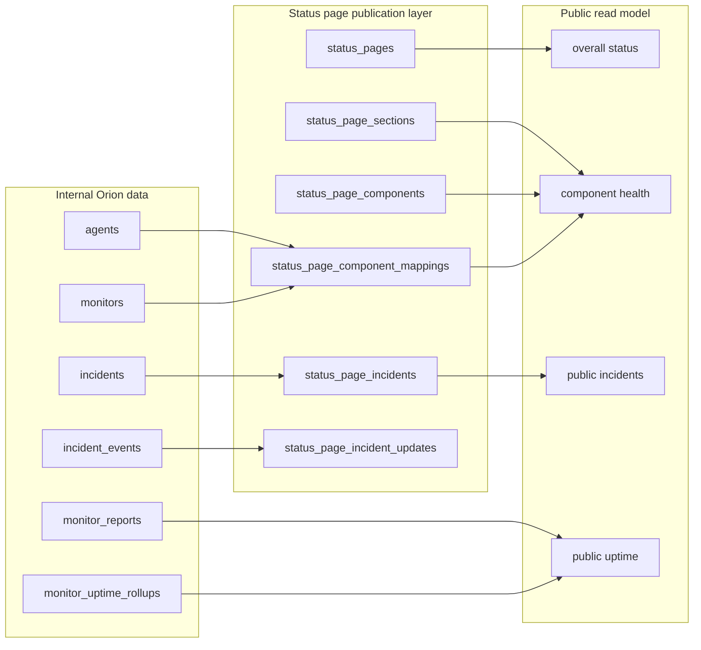
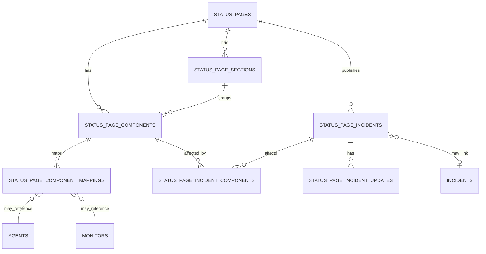
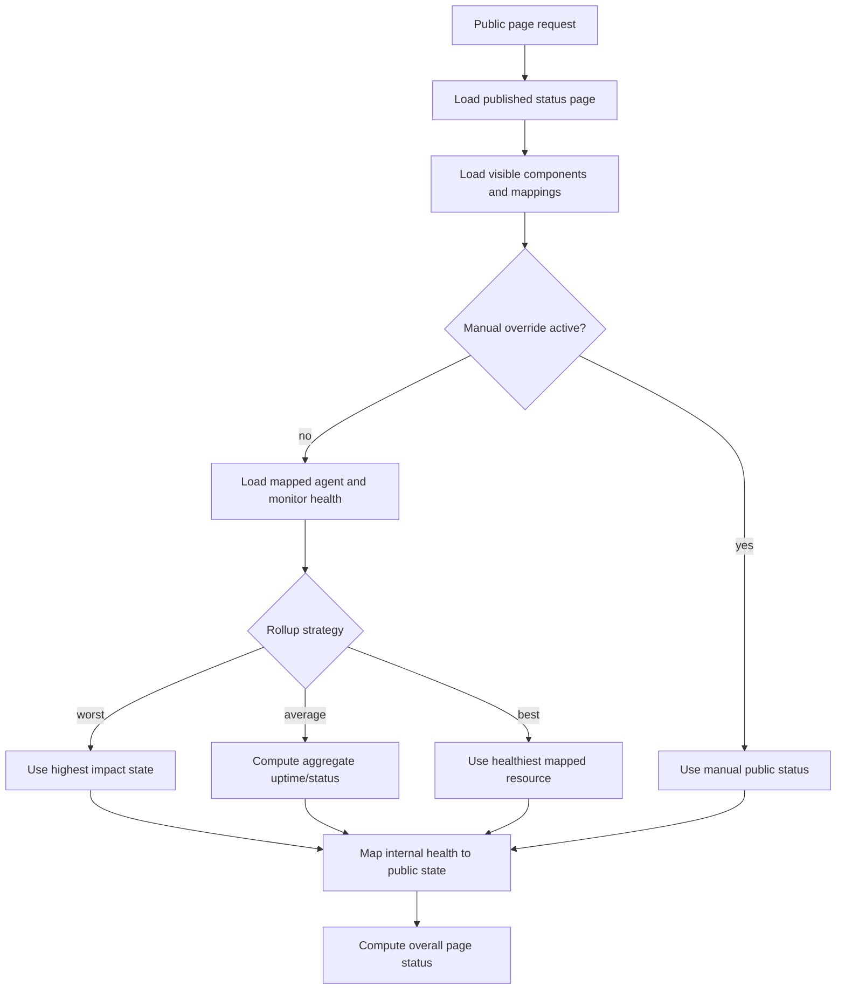
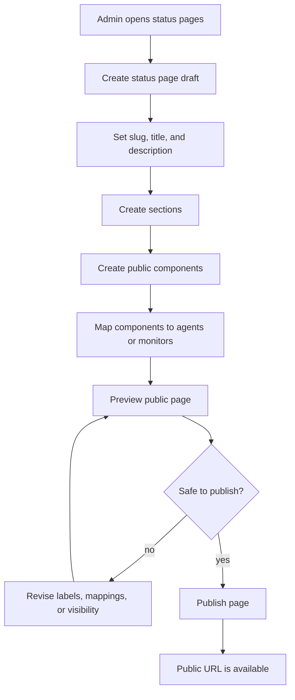
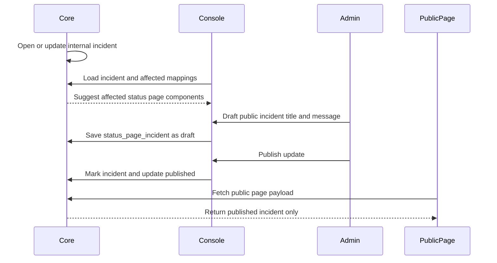
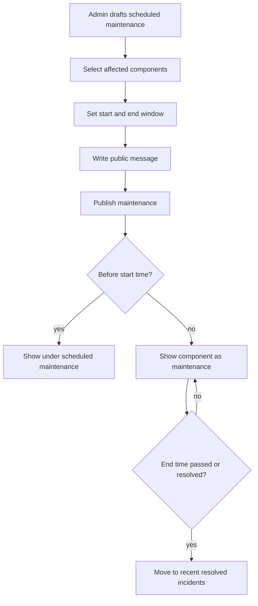
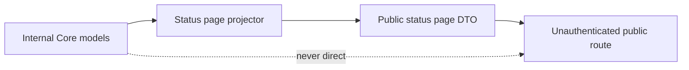

# Status Pages Architecture Plan

## Purpose

Status pages give Orion a public, shareable view of service health. They should answer one question quickly: "Is the service working, and what is affected if it is not?"

The status page is not a mirror of the Console. It is a curated publication layer over existing Core data: agents, monitors, derived health, incidents, and uptime rollups. Administrators decide which operational resources are exposed, how they are named, and which incident details are public.

## Product Goals

- Create one or more status pages from the Console.
- Group public-facing components into sections, such as `API`, `Website`, `Database`, or `Region`.
- Map each public component to one or more internal monitors or servers.
- Show current component health, active incidents, maintenance, and uptime history.
- Publish incident updates intentionally, with safe public wording.
- Keep raw infrastructure details, secrets, report payloads, and internal debugging data private.
- Support private drafts before a page is published.
- Leave room for email, webhook, RSS, Atom, or Slack-style subscriptions later.

## What A Status Page Shows

Default public status page content:

- page name and optional description;
- overall status summary;
- component sections and component health;
- active public incidents and scheduled maintenance;
- recent resolved public incidents;
- uptime percentages and daily history by component;
- last updated time;
- optional subscription entry points.

Public component states should use the existing status vocabulary where possible:

- `operational` maps from `up`;
- `degraded` maps from `degraded`;
- `partial_outage` maps from mixed component dependencies;
- `major_outage` maps from `down` or sustained `stale`;
- `maintenance` maps from planned maintenance or Core maintenance mode;
- `unknown` is shown only when an administrator chooses to expose it.

## What A Status Page Does Not Show

Never expose by default:

- Agent ids, monitor ids, bearer tokens, JWTs, webhook URLs, or secrets.
- Raw monitor payloads, command output, stack traces, or internal error text.
- Internal hostnames, IP addresses, exact filesystem paths, kernel details, or location metadata.
- Console-only diagnostics, ingestion latency, SQLite metrics, or archive settings.
- Alert delivery failures or notification channel internals.
- Private incident notes, acknowledgements, assignee names, or operational chat context.

Expose only when explicitly configured:

- internal service names;
- server regions or locations;
- monitor descriptions;
- exact downtime timestamps instead of rounded public timestamps;
- historical incidents older than the default public window.

## Core Concept

Status pages are projections. Core remains the source of truth for monitor health, server health, incidents, and uptime. The status page layer stores publication configuration and public incident content.

## Data Model

Add publication tables rather than changing Agent/Core reporting behavior.

### `status_pages`

Stores page-level configuration:

- id;
- slug;
- title;
- description;
- visibility: `draft`, `public`, or `unlisted`;
- theme settings;
- custom domain fields later;
- default incident visibility policy;
- created, updated, published timestamps.

### `status_page_sections`

Groups components for display:

- id;
- status page id;
- name;
- sort order;
- collapsed by default flag.

### `status_page_components`

Defines public-facing components:

- id;
- status page id;
- section id;
- public name;
- public description;
- display mode: `single_resource`, `aggregate`, or `manual`;
- manual status override and reason;
- sort order;
- visibility flag.

### `status_page_component_mappings`

Maps public components to internal resources:

- component id;
- resource type: `agent`, `monitor`, or future `group`;
- resource id;
- health rollup strategy: `worst`, `best`, `average`, or `manual`;
- uptime rollup strategy.

The default strategy should be `worst` because public status should not hide a failing dependency.

### `status_page_incidents`

Stores public incident records linked to internal incidents when available:

- id;
- status page id;
- optional internal incident id;
- title;
- public status: `investigating`, `identified`, `monitoring`, `resolved`, or `scheduled`;
- severity;
- impact summary;
- visibility: `draft`, `published`, or `private`;
- affected component ids;
- published, resolved, scheduled timestamps.

### `status_page_incident_updates`

Stores public timeline updates:

- incident id;
- status at time of update;
- public message;
- created by;
- published at;
- created at.

Keep public messages separate from internal incident events. Internal incident events are operational facts; public updates are communication.

### `status_page_subscriptions`

Add later when notification channels are in place:

- status page id;
- subscriber destination;
- destination type;
- confirmation state;
- subscribed component ids;
- created, confirmed, disabled timestamps.

## Entity Relationship

## Component Health Rollup

Public component health is derived from mapped resources unless a manual override is active.

Default health priority for public rollups:

1. `maintenance`
2. `major_outage`
3. `partial_outage`
4. `degraded`
5. `unknown`
6. `operational`

For mixed dependencies, one down monitor in a multi-monitor component should usually become `partial_outage`. All critical mapped monitors down should become `major_outage`.

## Status Page Creation Flow

Publication validation should block or warn when:

- a public component has no mapped resource and no manual status;
- a slug conflicts with another page;
- the page exposes private names flagged by simple heuristics, such as localhost, IP addresses, or internal domains;
- no components are visible;
- a public incident has no public update message.

## Incident Publishing Flow

Internal incidents should not automatically become public incidents without an explicit policy. The first version should default to manual publication.

Recommended first policy:

- Internal incidents are private by default.
- Admin can create a linked public incident from an internal incident.
- Core suggests affected public components based on component mappings.
- Public updates are written by an admin.
- Resolution can be suggested automatically when the linked internal incident resolves, but publishing the final message remains explicit.

Later policies can allow auto-publishing for trusted components:

- auto-create public incident with templated safe copy;
- auto-update affected component state;
- require manual approval for external notification fan-out.

## Scheduled Maintenance Flow

Scheduled maintenance is public communication, not necessarily the same as Agent maintenance mode. It should be able to exist before any monitor changes.

Do not require Agent maintenance mode for scheduled maintenance. Agent maintenance mode controls collection and incident suppression; status page maintenance controls public communication.

## Public API Shape

Add public, read-only routes:

- `GET /status/:slug`
- `GET /status/:slug/history`
- `GET /status/:slug/incidents`
- `GET /status/:slug/incidents/:incident_id`
- `GET /status/:slug/feed.atom` later

Add Console-admin routes under `/v1`:

- `GET /v1/status-pages`
- `POST /v1/status-pages`
- `GET /v1/status-pages/:id`
- `PUT /v1/status-pages/:id`
- `POST /v1/status-pages/:id/publish`
- `GET /v1/status-pages/:id/preview`
- `POST /v1/status-pages/:id/sections`
- `PUT /v1/status-pages/:id/sections/:section_id`
- `POST /v1/status-pages/:id/components`
- `PUT /v1/status-pages/:id/components/:component_id`
- `POST /v1/status-pages/:id/incidents`
- `PUT /v1/status-pages/:id/incidents/:incident_id`
- `POST /v1/status-pages/:id/incidents/:incident_id/updates`

Public routes must never use the Console API response structs directly. Return a dedicated public payload that contains only approved fields.

## Public Payload Boundary

Public DTO rules:

- use public component ids, not internal monitor or agent ids;
- use public labels, not internal resource names;
- include rounded timestamps when configured;
- include public incident text only;
- include uptime percentages and bucket states, not raw report counts unless explicitly chosen;
- omit hidden components and draft incidents.

## Console Experience

Console should treat status pages as a configuration workflow:

- list pages with draft/published state and public URL;
- page editor with tabs for basics, components, incidents, subscribers, and settings;
- component mapper that searches agents and monitors;
- preview mode that uses the public DTO before publishing;
- incident composer that can link an internal incident to public copy;
- validation panel before publish;
- publish/unpublish controls.

The editor should make privacy decisions visible. For example, show the public component name next to the internal monitor name and warn when they are identical.

## Public Page Experience

Public pages should be simple and fast:

- overall status at the top;
- grouped component list;
- active incidents and maintenance near the top;
- uptime history below components;
- recent incident history;
- subscription controls when available.

The public page should not require Console JavaScript or authentication. It can be served by Core as either a lightweight server-rendered page or a dedicated public SPA bundle. The first implementation can reuse the existing Core static asset serving path if routing and payload boundaries remain separate.

## Caching And Freshness

Status pages are read-heavy. Keep reads cheap:

- compute current public status on request for the first version;
- cache the public page payload in memory by page id and invalidation version later;
- invalidate cache when component mappings, incident publication, or monitor health changes;
- send `Cache-Control` headers with a short max age, such as 30 seconds;
- add ETags later for public routes.

Freshness target:

- health changes should appear within one monitor interval plus public cache TTL;
- published incident updates should appear immediately after cache invalidation;
- uptime history can lag behind rollup generation.

## Security And Abuse Controls

Public status routes are unauthenticated by design, so they need narrower behavior:

- no mutation from public routes;
- no internal ids in public payloads;
- no raw SQL filters or arbitrary date ranges without limits;
- rate limit subscription creation and confirmation endpoints later;
- validate slugs and custom domains strictly;
- redact all secrets in admin preview and public output;
- add audit events for publish, unpublish, incident update, and component mapping changes.

## Implementation Phases

### Phase 1: Manual Public Pages

- Add status page, section, component, and mapping tables.
- Add admin CRUD routes and public read DTOs.
- Build Console editor for draft pages and component mapping.
- Add public page route with current component health.
- Support manual public incidents and scheduled maintenance.
- No subscriptions yet.

### Phase 2: Incident Integration

- Suggest public incidents from internal incidents.
- Suggest affected components from mappings.
- Add public incident updates and resolution workflow.
- Add validation before publish.
- Add audit events.

### Phase 3: Uptime And History

- Add component uptime aggregation from mapped monitor uptime.
- Add historical incident list.
- Add page history route.
- Add cache invalidation and ETags.

### Phase 4: Subscriptions

- Add subscriber model and confirmation flow.
- Add email or webhook fan-out for public incident updates.
- Add Atom or RSS feed.
- Add component-scoped subscriptions.

### Phase 5: Customization

- Add custom domains.
- Add page theme settings.
- Add public embeddable badges.
- Add optional SEO and Open Graph metadata.

## Open Decisions

- Whether public status pages should be served from Core's main binary or a separate static/public frontend bundle.
- Whether the first release allows multiple status pages or ships with one default page.
- Whether internal incident resolution should auto-create a draft public resolution update.
- Whether public uptime should round to one decimal place, two decimals, or a simpler `99.9%` style.
- Whether `unknown` should be hidden, shown as degraded, or shown as its own public state by default.
- Whether subscriptions should reuse alert channel infrastructure or use a separate public subscriber system.

## Decision

Build status pages as a publication layer over Core, not as a second monitoring system. Keep the Agent/Core contract unchanged. Store public configuration and public incident copy separately from internal incidents, then project safe public DTOs through unauthenticated status routes.

The first useful release should prioritize manual control, privacy, and clear component health. Automation can come after administrators trust the publishing workflow.
