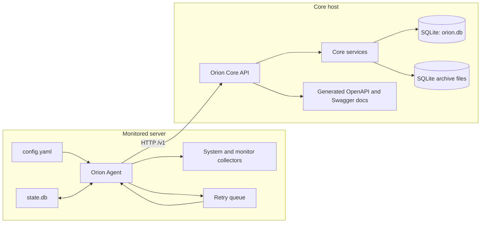
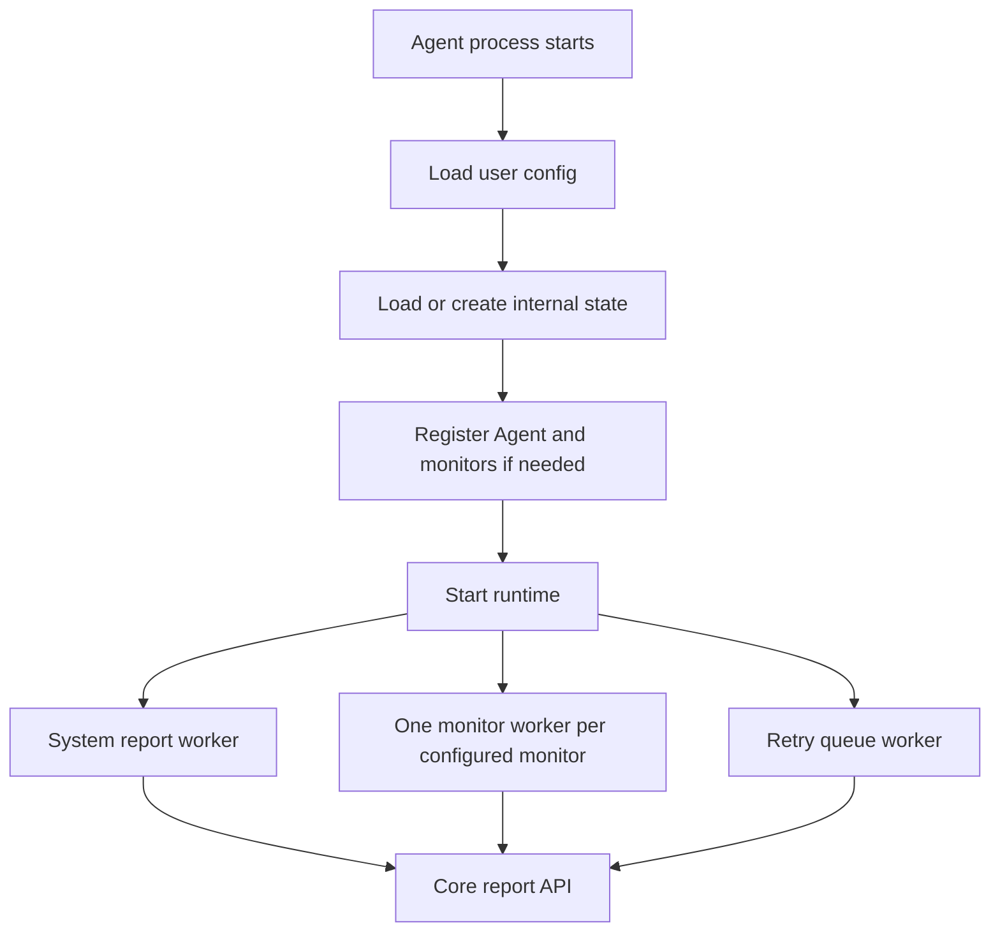
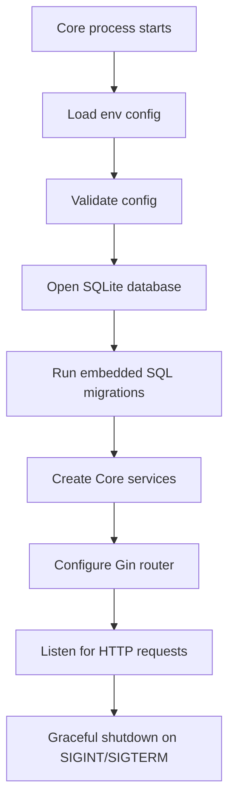

# System Overview

## Purpose

Orion monitors self-hosted servers without Prometheus, Postgres, Kubernetes, or another external metrics stack. The Agent does local collection and pushes data to Core. Core owns persistence, health decisions, incidents, alerts, and lifecycle management.

## Component Map

## Agent Responsibilities

- Load user config from YAML.
- Load user config from YAML and update internal Agent state in SQLite.
- Register the server with Core on first run.
- Register configured monitors and unregister removed monitors.
- Collect system reports on the global interval.
- Run each monitor on its own interval.
- Send reports to Core with the server token.
- Retry transient transport failures with exponential backoff and a bounded retry queue.
- Pause report workers while local Agent state says maintenance mode is enabled.

## Core Responsibilities

- Run embedded SQL migrations against SQLite.
- Register or reconnect Agents by `machine_id`.
- Generate and validate Agent bearer tokens.
- Register, revive, list, and soft-delete monitors.
- Store system reports and monitor reports.
- Update last-seen, monitor health, and last-success timestamps.
- Compute derived health for monitors and servers.
- Open, update, and resolve incidents.
- Send or suppress alert deliveries.
- Manage data lifecycle settings, uptime rollups, and raw report archives.
- Expose API routes and generated OpenAPI/Swagger docs.

## Main Runtime Processes

## Status Language

Implemented server/monitor health states are:

- `up`
- `down`
- `degraded`
- `maintenance`
- `unknown`
- `stale`

Incident statuses are:

- `open`
- `acknowledged`
- `resolved`

Alert delivery statuses are:

- `pending`
- `sent`
- `failed`
- `suppressed`
- `cooldown`
