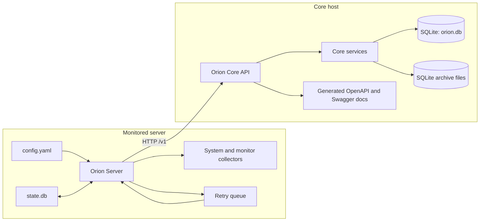
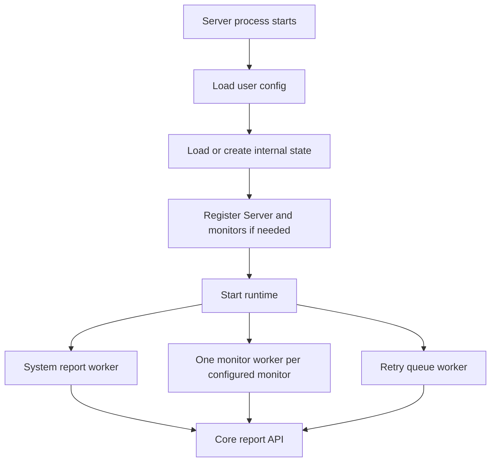
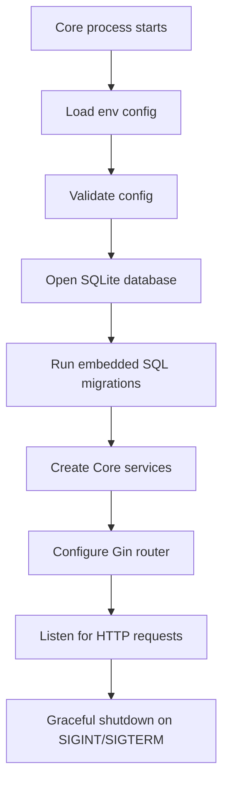

# System Overview

## Purpose

Orion monitors self-hosted servers without Prometheus, Postgres, Kubernetes, or another external
metrics stack. The Server does local collection and pushes data to Core. Core owns persistence,
health decisions, incidents, alerts, and lifecycle management.

## Component Map

## Server Responsibilities

- Load user config from YAML and update internal Server state in SQLite.
- Register the server with Core on first run.
- Register configured monitors and unregister removed monitors.
- Collect system reports on the global interval.
- Run each monitor on its own interval.
- Send reports to Core with the server token.
- Retry transient transport failures with exponential backoff and a bounded retry queue.
- Pause report workers while local Server state says maintenance mode is enabled.

## Core Responsibilities

- Run embedded SQL migrations against SQLite.
- Register or reconnect Servers by `machine_id`.
- Generate and validate Server bearer tokens.
- Register, revive, list, and soft-delete monitors.
- Store system reports and monitor reports.
- Update last-seen, monitor health, and last-success timestamps.
- Compute derived health for monitors and servers.
- Open, update, and resolve incidents.
- Send or suppress alert deliveries.
- Manage data lifecycle settings, uptime rollups, and raw report archives.
- Expose API routes and generated OpenAPI/Swagger docs.

## Distribution and UI Boundary

The supported deployment shape is one Core host plus one Server process on each monitored machine.
Core serves both the API and the bundled Console UI. Servers never require inbound network access;
they push reports to Core over HTTP/S with a bearer token.

The Core API is the product boundary for future interfaces. The bundled Console is the supported UI
today. A TUI, automation script, or custom UI can be built against the same API later, but Orion does
not currently ship a supported headless-only or alternative-UI distribution.

## Main Runtime Processes

## Status Language

Implemented server/monitor health states are:

- `up`
- `down`
- `degraded`
- `maintenance`
- `unknown`
- `stale`

Incident statuses are:

- `open`
- `acknowledged`
- `resolved`

Alert delivery statuses are:

- `pending`
- `sent`
- `failed`
- `suppressed`
- `cooldown`
