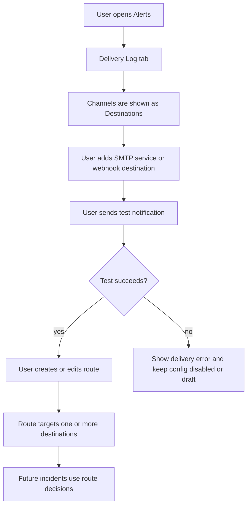
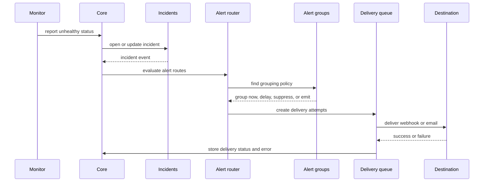
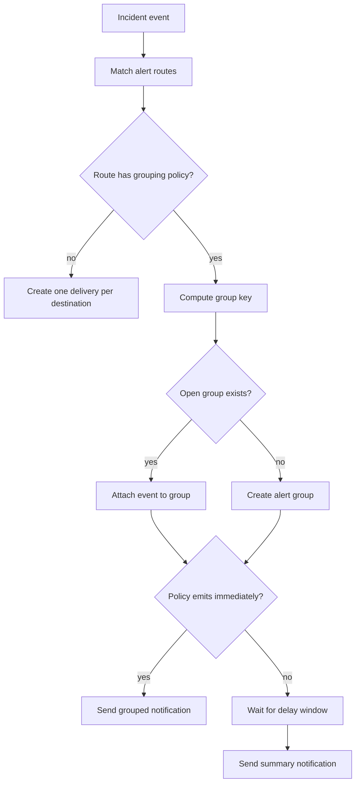

# Alert Routing Redesign Plan

This document rethinks Orion alerts before implementation. The goal is to make alerts feel like a product area, not only a delivery side effect of incidents.

The proposal keeps Orion's current strengths:

- Core owns incident reconciliation and notification delivery.
- Monitor reports open, update, and resolve incidents.
- Alert delivery history is auditable.
- Webhook and SMTP email delivery already exist at the backend level.

It changes the product model around configuration, routing, grouping, and testing so a user can understand why an alert fired, where it went, and what to change next.

## Product Outcome

Orion should let an operator configure alert behavior from Console with three clear jobs:

1. Define destinations: where notifications can be sent.
2. Define routes: which events should notify which destinations.
3. Define grouping and suppression: when multiple events should become one operational notification.

The user should be able to answer these questions from the Alerts screen:

- Which notification services are configured?
- Which incidents and events notify which people or systems?
- Are recovery notifications enabled?
- Are low-value repeat notifications grouped, delayed, or suppressed?
- Did Orion try to send a notification, and what happened?
- Can I send a test message before trusting this configuration?

## Current State

Core currently has:

- `alert_channels` for webhook and email channel configuration;
- `alert_deliveries` for delivery attempts;
- backend delivery through webhook HTTP POST and SMTP email;
- event subscriptions on each channel for `incident_opened` and `incident_resolved`;
- a global alert cooldown from Core config;
- a read-only "Rules" endpoint that derives behavior from config;
- incident detail timelines that include alert delivery attempts.

Console currently behaves as if alerts are webhook-only:

- it filters alert channels to `type === "webhook"`;
- the create/edit dialog only supports webhook name, URL, enabled state, and subscribed events;
- email delivery exists in Core but is effectively hidden from the product;
- routing is implicit on the channel, not a first-class concept;
- grouping is only a global cooldown, not a user-visible policy.

## New Mental Model

Alerting should use four concepts.

### Services

A service is an integration provider or delivery mechanism.

Examples:

- Webhook
- SMTP
- Future: Slack, Discord, PagerDuty, Opsgenie, incident.io, generic email API

Services define how Orion talks to the outside world. SMTP is a service because it has shared connection settings such as host, port, TLS mode, authentication, sender identity, and test behavior.

### Destinations

A destination is a configured place to send a notification.

Examples:

- `ops webhook`
- `home lab email`
- `status page automation hook`
- `on-call inbox`

Destinations reference one service and contain the service-specific target:

- webhook URL, headers, signing secret, and payload template;
- SMTP recipients, reply-to, subject prefix, and formatting choices.

### Routes

A route decides which events go to which destinations.

Examples:

- all critical incidents go to `on-call inbox`;
- production monitor failures go to `ops webhook`;
- recovery notifications go to email but not the deploy webhook;
- maintenance-suppressed incidents do not notify unless manually escalated.

Routes should be ordered and explicit. The first version can support simple matching without becoming a full rule engine.

### Groups

A group controls how related alerts are collected into fewer notifications.

Examples:

- group all repeated failures for the same incident;
- group monitors by service label such as `website`, `database`, or `home-server`;
- group Core-managed monitors separately from Agent-owned monitors;
- delay notifications for 60 seconds so transient failures can recover;
- send one summary for a noisy failure window.

Grouping is separate from routing. A group describes what belongs together; a route describes where it goes.

## Proposed Alert Events

The current events are enough for the existing incident lifecycle, but the redesigned model should reserve room for richer events.

MVP events:

- `incident_opened`
- `incident_acknowledged`
- `incident_resolved`
- `incident_reopened`
- `monitor_recovered`
- `test_notification`

Near-term events:

- `monitor_degraded`
- `monitor_down`
- `monitor_stale`
- `agent_stale`
- `agent_down`
- `core_monitor_failed`
- `maintenance_started`
- `maintenance_ended`

The implementation can begin with current incident events plus `test_notification`, then add more events as monitor and status-page work matures.

## Configuration Model

The Alerts area should have four tabs.

### Delivery Services

This tab manages shared service configuration.

For SMTP:

- display name;
- host;
- port;
- TLS mode: `starttls`, `implicit_tls`, or `none`;
- username;
- password or secret reference;
- from address;
- default reply-to;
- connection timeout;
- enabled state;
- "test connection" action;
- "send test email" action.

For webhooks:

- webhooks can remain destination-level for MVP;
- later, shared webhook service settings can support signing, retries, and default headers.

### Destinations

This tab manages places notifications go.

Webhook destination fields:

- name;
- URL;
- method: default `POST`;
- headers;
- signing secret;
- payload format: Orion JSON v1;
- enabled state;
- subscribed events or route membership summary.

SMTP destination fields:

- name;
- SMTP service;
- recipients;
- CC/BCC, later;
- subject prefix;
- message format: plain text first, HTML later;
- enabled state.

### Routes

This tab explains notification decisions.

Route fields:

- name;
- enabled state;
- event types;
- severity filter;
- monitor owner filter: `agent`, `core`, or `any`;
- agent filter;
- monitor filter;
- label/tag filters;
- maintenance behavior;
- target destinations;
- grouping policy;
- recovery behavior.

The first product version can support:

- event type;
- severity;
- monitor owner;
- target destinations;
- grouping policy;
- enabled state.

### Delivery Log

This tab remains the operational audit trail.

It should show:

- event type;
- route;
- group;
- destination;
- service;
- status;
- attempts;
- last error;
- incident;
- created time;
- sent time;
- next retry time, if any.

The log should use the existing operational data-table pattern for filtering, pagination, and row details.

## Console Flow

This makes the setup path explicit: configure a service, prove it works, route real events.

## Incident To Alert Flow

## Grouping Flow

Recommended MVP group keys:

- by incident id;
- by monitor id;
- by agent id;
- by monitor owner kind;
- by severity;
- by labels/tags when monitor labels exist.

MVP grouping policies:

- `none`: send every matching event;
- `incident`: one notification per incident event type within cooldown;
- `monitor`: group repeated events from the same monitor;
- `service`: group by a label such as `service:web`;
- `owner`: group Core monitors separately from Agent monitors.

## SMTP Design

SMTP should become a first-class service, not just fields on an alert channel.

### Why

SMTP setup is reusable. A single SMTP account can send to multiple destinations. If SMTP settings remain duplicated per email channel, users will have to re-enter secrets and debug the same server repeatedly.

### Service-Level Fields

- name;
- host;
- port;
- TLS mode;
- auth mode: none, plain, login later;
- username;
- password or secret reference;
- from address;
- reply-to;
- timeout;
- enabled state;
- last test status;
- last test time;
- last test error.

### Destination-Level Fields

- name;
- service id;
- recipients;
- subject prefix;
- enabled state;
- route membership.

### Delivery Behavior

- Always record an `alert_delivery` before sending.
- Redact SMTP secrets in API responses.
- Store the transport stage that failed: connect, TLS, auth, envelope, send, response.
- Use plain text email first.
- Add HTML email after route and grouping behavior are stable.

## Webhook Design

Webhooks should remain simple in MVP but gain production-safe controls.

Webhook destination fields:

- name;
- URL;
- enabled state;
- subscribed routes;
- custom headers with secret redaction;
- signing secret;
- payload version;
- timeout;
- retry policy.

Webhook payload v1:

- `event_id`;
- `event_type`;
- `occurred_at`;
- `route`;
- `group`;
- `incident`;
- `monitor`;
- `agent`;
- `severity`;
- `status`;
- `links`;
- `orion_instance`.

The current payload of `event_type` plus full incident can remain as a compatibility mode, but new destinations should use a stable payload version.

## Routing Semantics

Routes should evaluate against an alert event envelope, not directly against database rows.

Event envelope:

- event id;
- event type;
- incident id;
- incident status;
- severity;
- monitor id;
- monitor name;
- monitor owner kind;
- agent id;
- labels/tags;
- maintenance state;
- source report id;
- event time.

Decision outputs:

- matched route ids;
- suppressed reason, if suppressed;
- group key;
- destination ids;
- delivery attempts.

This makes alert decisions testable without actually delivering notifications.

## Suppression And Maintenance

Suppression should be visible, not invisible.

Suppressed deliveries should record:

- route id;
- event id;
- destination id, when known;
- status: `suppressed`;
- reason: no destinations, destination disabled, route disabled, maintenance, cooldown, grouped, event type not subscribed.

Maintenance behavior should be route-controlled:

- suppress all maintenance events;
- send maintenance start/end only;
- send critical incidents even during maintenance;
- annotate notifications as maintenance-related.

The first implementation can keep the existing global maintenance suppression but should expose it clearly on the Rules or Routes screen.

## Retry And Queue Model

Current delivery is synchronous inside incident notification handling. The redesign should move toward queued attempts.

MVP can remain synchronous if scope is tight, but the data model should not assume synchronous delivery forever.

Recommended delivery lifecycle:

- `pending`;
- `sent`;
- `failed`;
- `retrying`;
- `suppressed`;
- `cooldown`;
- `grouped`;
- `canceled`.

Attempt fields:

- delivery id;
- attempt number;
- started at;
- finished at;
- status;
- HTTP status or SMTP stage;
- error;
- response excerpt, redacted.

Retry defaults:

- retry 3 times;
- exponential backoff with jitter;
- do not retry 4xx webhook responses except 408, 409, 425, 429;
- retry network, 5xx, and SMTP transient failures.

## Data Model Direction

Do not force all of this into the current `alert_channels` table. It already mixes destination, service, routing, and secrets.

Recommended tables:

- `alert_services`: shared provider settings such as SMTP server config;
- `alert_destinations`: webhook URLs or SMTP recipient lists;
- `alert_routes`: route filters and target destinations;
- `alert_groups`: open or recently closed grouping windows;
- `alert_events`: normalized alert event envelope, optional if incident events remain source of truth at first;
- `alert_deliveries`: delivery records, extended with route, group, destination, and attempt state;
- `alert_delivery_attempts`: per-try transport results.

Migration path:

1. Keep `alert_channels` working.
2. Introduce destinations as a compatibility wrapper around existing channels.
3. Add SMTP services and email destinations.
4. Add routes that can target both old channels and new destinations.
5. Migrate old webhook channels into destinations.
6. Remove channel-specific routing once routes are stable.

## API Direction

Suggested endpoints:

- `GET /v1/alerts/services`
- `POST /v1/alerts/services`
- `PATCH /v1/alerts/services/{id}`
- `POST /v1/alerts/services/{id}/test`
- `GET /v1/alerts/destinations`
- `POST /v1/alerts/destinations`
- `PATCH /v1/alerts/destinations/{id}`
- `POST /v1/alerts/destinations/{id}/test`
- `GET /v1/alerts/routes`
- `POST /v1/alerts/routes`
- `PATCH /v1/alerts/routes/{id}`
- `POST /v1/alerts/routes/{id}/dry-run`
- `GET /v1/alerts/groups`
- `GET /v1/alerts/deliveries`
- `GET /v1/alerts/deliveries/{id}`

Route dry-run is important. It should accept a sample event and return:

- matched or not matched;
- destination list;
- suppression result;
- grouping result;
- delivery plan.

## UI Direction

The Alerts page should become an operational configuration workspace.

Recommended tabs:

- `Log`: delivery attempts and suppressed decisions;
- `Destinations`: webhook and email destinations;
- `Services`: SMTP and future shared providers;
- `Routes`: event filters, grouping, and targets;
- `Groups`: active grouped notifications and recent summaries.

Important UI states:

- empty state with "Add destination";
- warning when no active route can notify;
- warning when a route has no enabled destinations;
- test result drawer;
- delivery detail drawer;
- route dry-run preview;
- read-only generated compatibility route for old channel subscriptions during migration.

## Rollout Plan

### Phase 1: Make Current Alerts Honest

- Rename Console concepts from webhook-only language to destinations where possible.
- Show email channels if they exist.
- Keep existing channel CRUD behavior.
- Add test notification endpoints for webhook and email.
- Expand delivery log filters by type, channel, event, and incident.
- Document current global rules clearly.

### Phase 2: Add SMTP Services

- Add SMTP service records.
- Add email destinations that reference SMTP services.
- Move SMTP secrets from per-channel records into service config.
- Add connection test and send-test flows.
- Keep legacy email channels readable during migration.

### Phase 3: Add Routes

- Create explicit alert routes.
- Move event subscriptions from destinations/channels to routes.
- Support route filters for event type, severity, monitor owner, and maintenance behavior.
- Add route dry-run.
- Generate a default route from existing channel subscriptions.

### Phase 4: Add Grouping

- Add group policies.
- Support group-by incident, monitor, service label, owner, and severity.
- Add delayed summary notifications.
- Store grouped and suppressed decisions in delivery history.

### Phase 5: Queue And Retry Delivery

- Split deliveries from attempts.
- Add retry scheduling.
- Add backoff.
- Add delivery worker.
- Add failure stages for SMTP and webhook.

### Phase 6: Rich Templates And Integrations

- Add payload versions and templates.
- Add HTML email.
- Add Slack or Discord destinations.
- Add signing and verification helpers.
- Add status-page automation webhooks.

## Review Questions

- Should SMTP be configured as a reusable service immediately, or should we first expose the current email channel fields in Console?
- Should routes replace channel subscriptions in the first implementation, or should routes start as a read-only explanation layer?
- What grouping default feels right: no grouping, incident grouping, or short delay windows?
- Do we want alert groups to be visible as first-class objects in Console from the beginning?
- Should recovery notifications be route-specific instead of a global Core setting?
- Should Core-managed monitors and Agent-owned monitors have separate default routes?
- Do we want a human-facing "notification policy" name, or is "route" clear enough for this product?

## Recommended First Build

The first build should be intentionally small:

1. Add a new planning-backed product language: services, destinations, routes, groups.
2. Expose existing email channels in Console so the backend capability is visible.
3. Add test notification actions for webhook and email.
4. Add a default route view that explains current behavior.
5. Keep grouping limited to the existing cooldown, but show it as a policy.

That gives Orion a usable alert configuration story without forcing the whole routing engine to land at once.
