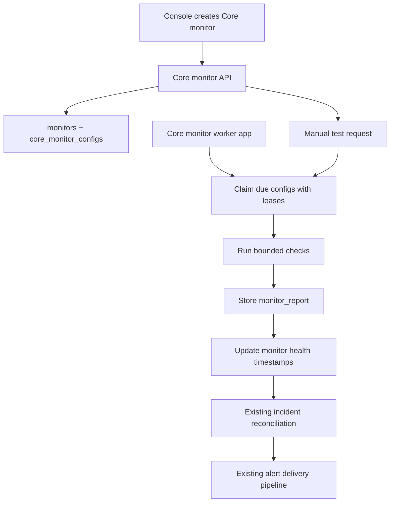

# Core-Managed Monitors Plan

This plan captures the product and implementation path for monitors created in Console and executed by Orion Core. These are not tied to a deployed Agent. The mental model is: Core owns the configuration and history, while a separate Core monitor worker executes the checks.

## Why This Matters

Agent monitors are excellent for local server truth: disk, CPU, Docker, systemd, PM2, local commands, private services, and anything that only the monitored host can see.

Core-managed monitors cover a different job:

- check public sites, APIs, ports, DNS, TLS, and scheduled jobs without installing an Agent;
- let a user register a monitor from Console and see results immediately;
- turn Orion Core into the default monitoring node for internet-facing and Core-visible services;
- make status pages and incident workflows possible for services that are not "servers" in the Agent sense;
- support a lightweight Better Stack style uptime workflow while keeping Orion's self-hosted shape.

## External Product Anchors

Research date: 2026-05-26.

Better Stack Uptime is the best model for monitor creation and check execution. Their API exposes monitor types such as HTTP 2xx status checks, expected status code checks, keyword presence/absence checks, ping, TCP, UDP, DNS, SMTP, POP, IMAP, SSL expiration, domain expiration, Playwright transaction checks, regions, confirmation periods, recovery periods, check frequencies, maintenance windows, and heartbeats for cron/background jobs. Useful references:

- Better Stack monitor API: https://betterstack.com/docs/uptime/api/create-a-new-monitor/
- Better Stack monitor response/status model: https://betterstack.com/docs/uptime/api/get-a-single-monitor/
- Better Stack heartbeat monitor: https://betterstack.com/docs/uptime/cron-and-heartbeat-monitor/
- Better Stack uptime product overview: https://betterstack.com/better-uptime

incident.io is the better model for what happens after a monitor emits a signal. Their docs emphasize alert sources, alert attributes, alert routes, filtering, escalations, incident creation, alert grouping, status page components, sub-pages, customer pages, and maintenance automation. Useful references:

- incident.io alerts and automatic incident creation: https://docs.incident.io/alerts/getting-started
- incident.io alert routes, filtering, escalation, and grouping: https://docs.incident.io/alerts/escalations-from-alerts
- incident.io status page types: https://docs.incident.io/en/collections/3941369-status-pages
- incident.io status page maintenance automation: https://docs.incident.io/articles/8915200122-status-pages-maintenance-automation
- incident.io status page sub-pages and components: https://docs.incident.io/status-pages/sub-pages

The product lesson is to keep monitor creation simple, but make the downstream event model rich enough for routing, grouping, maintenance, and status communication.

## Product Shape

Core-managed monitors should appear beside Agent monitors in the existing Monitors surface, but they need a clear owner label:

- `Agent monitor`: checked by an Orion Agent running on a server.
- `Core monitor`: checked by the Core monitor worker.
- `Heartbeat`: owned by Core, but checked by receiving expected pings instead of polling.

Core monitor detail pages should show:

- monitor type and target;
- owner: `Core`;
- lifecycle: active, paused, deleted;
- health: pending, up, degraded, down, stale, maintenance, unknown;
- latest check result and response time;
- recent check logs using the existing operational data-table pattern;
- active incident, if any;
- next scheduled check and last checked time;
- configuration summary with secrets redacted;
- quick actions: test now, pause, resume, edit, delete.

## Monitor Types

### Now-Scope Types

1. HTTP status monitor

Checks an HTTP/HTTPS URL, follows optional redirects, records status code and latency, and passes when the response matches the configured success rule.

Minimum options:

- URL;
- method: GET or HEAD;
- expected status: default 2xx, optional exact status list later;
- timeout;
- follow redirects;
- check interval;
- request headers with secret redaction.

2. HTTP keyword monitor

Extends HTTP status with body expectations.

Minimum options:

- required substring;
- forbidden substring;
- optional regex later;
- response body capture limit for debugging.

3. TCP port monitor

Checks whether Core can open a TCP connection to host and port.

Minimum options:

- host;
- port;
- timeout;
- interval.

4. TLS certificate monitor

Checks HTTPS certificate validity and days remaining.

Minimum options:

- hostname or URL;
- expiration threshold, such as 30, 14, 7, 3, or 1 day;
- verify chain;
- interval.

5. Heartbeat monitor

Creates a unique endpoint that an external cron job, backup, script, or serverless task calls after it runs.

Minimum options:

- expected interval;
- grace period;
- pending state until first heartbeat;
- success endpoint;
- failure endpoint with optional exit code and output payload;
- last heartbeat and last failure details.

6. DNS monitor

Checks name resolution or a specific record value.

Minimum options:

- hostname;
- record type: A, AAAA, CNAME, TXT, MX, NS;
- expected values;
- resolver selection later;
- timeout;
- interval.

7. Ping monitor

Useful if Core runs with ICMP permissions, otherwise this may need a TCP or HTTP substitute.

Minimum options:

- host;
- timeout;
- interval;
- packet count later;
- fallback TCP probe if ICMP is unavailable.

8. Domain expiration monitor

Checks RDAP/WHOIS domain expiration where provider data is available.

Minimum options:

- domain;
- expiration threshold;
- RDAP first, WHOIS fallback later;
- interval.

9. Expected status code monitor

Can be a variant of HTTP status, but deserves a UI path because it is common for APIs.

Minimum options:

- URL;
- method;
- exact expected status code or status code set;
- timeout;
- interval.

10. API request monitor

Adds method, headers, auth, body, response JSON checks, and stricter debugging output.

Minimum options:

- method;
- URL;
- headers;
- body;
- auth header or token secret;
- expected status;
- JSON path assertions;
- response body capture limit;
- timeout;
- interval.

11. UDP monitor

Needs careful semantics because UDP "success" is service-specific.

Minimum options:

- host;
- port;
- payload;
- expected response bytes or text;
- timeout;
- interval.

12. SMTP, IMAP, POP monitors

Checks mail server availability and TLS behavior without becoming a mailbox workflow product.

Minimum options:

- protocol: SMTP, IMAP, POP;
- host;
- port;
- TLS mode;
- expected banner or login capability;
- optional credentials later;
- timeout;
- interval.

13. Playwright transaction monitor

Runs a browser transaction from the Core monitor worker.

Minimum options:

- script or recorded steps;
- timeout;
- viewport;
- screenshot on failure;
- artifact retention;
- secrets for login flows;
- interval.

14. Synthetic multi-step API/browser flows

Runs a sequence of API or browser checks as one monitor with step-level results.

Minimum options:

- ordered steps;
- shared variables;
- per-step assertions;
- stop-on-failure behavior;
- timeout budget;
- artifact capture;
- interval.

### Implementation Order

All types above are in the target product scope now. Implementation should still land in controlled slices:

1. HTTP status, expected status, keyword, TCP, TLS, and heartbeat.
2. DNS, ping, domain expiration, and API request assertions.
3. UDP and mail protocol checks.
4. Playwright transactions and synthetic multi-step flows.

This keeps the product ambition broad without forcing the first worker release to carry the browser sandbox, protocol edge cases, and artifact retention all at once.

### Explicit Non-Goals

Core should not run local command monitors from Console in the first version. That would create a remote command execution surface on the Core host.

Agent-only monitors should remain Agent-owned:

- resource thresholds;
- Docker container checks;
- systemd checks;
- PM2 checks;
- local commands;
- internal service checks that need host-local process evidence.

## Data Model Direction

Current Orion tables require `monitors.agent_id` and `incidents.agent_id`. That means the lowest-risk path is to introduce Core as a first-class monitor owner while preserving existing monitor and incident tables.

Recommended approach:

1. Add an owner concept without breaking existing Agent monitors.

Options:

- create a system Agent row named `Orion Core`, with `machine_id = core`, and mark it as a Core owner with a new `agents.kind` or `agents.role` field;
- or add `monitors.owner_kind` and make `agent_id` nullable over a larger migration.

The first option is easier for existing list, detail, incident, uptime, and rollup paths. The second is cleaner long-term, but touches more query and response code.

Recommendation: start with a Core owner row plus an explicit owner/source field on monitors. This keeps compatibility while making the UI honest.

2. Add Core monitor configuration.

Use a separate table instead of stuffing runtime config into `monitors.meta`:

- `core_monitor_configs.monitor_id`;
- `kind`: http, tcp, tls, dns, heartbeat;
- `config_json`: redacted on read;
- `secret_ref_json` or future secret references;
- `interval_seconds`;
- `timeout_seconds`;
- `confirmation_period_seconds`;
- `recovery_period_seconds`;
- `paused`;
- `next_run_at`;
- `last_run_at`;
- `last_success_at`;
- `last_failure_at`;
- `lease_owner`;
- `lease_expires_at`;
- `created_at`, `updated_at`.

3. Continue using `monitor_reports`.

Core-executed checks should create the same report records Agent reports create. The payload should include:

- runner: `core`;
- target summary;
- result status;
- collected_at;
- duration_ms;
- type-specific metrics;
- failure stage, such as dns, tcp, tls, http, body_match, timeout;
- redacted request metadata;
- truncated response/error details.

4. Extend monitor responses.

Console needs to distinguish monitor owners:

- `owner_kind`: agent or core;
- `owner_id`;
- `owner_name`;
- `runner`: agent or core;
- `target_summary`;
- `next_run_at`;
- `last_checked_at`;
- `paused`.

Existing `agent_id` and `agent_name` can remain for compatibility, but the new owner fields should become the UI language.

## Core Monitor Worker Architecture

Do not run polling work inside the Core API main instance. Core should remain the API, persistence, Console, contract, incident, and alert control plane. A separate worker app/process should own check execution so polling, network timeouts, retries, slow targets, and future browser checks cannot overload the API server.

Recommended shape:

- `apps/core`: Core API and shared internal services remain here.
- `apps/core/cmd/worker`: deployable Core monitor worker binary for the first implementation.
- Core API writes monitor definitions and schedules.
- Core worker claims due checks, executes them with bounded concurrency, writes reports, and triggers the same incident reconciliation path.
- Core API can expose a test-now route that enqueues an immediate check or asks the worker through a queue/DB claim mechanism.

A `cmd/worker` under `apps/core` is the lowest-friction first step because it can reuse Core DB models, migrations, config loading, logging, and service code without creating a new Go module. If the worker grows materially different deployment needs, it can later move to `apps/core-worker`.

Worker responsibilities:

- scan for due Core monitor configs;
- claim work using DB leases so multiple workers can run later;
- execute HTTP, TCP, TLS, DNS, ping, domain, API, UDP, mail, heartbeat, Playwright, and synthetic checks;
- write monitor reports and update schedule timestamps;
- call shared health and incident services after reports are written;
- expose health/metrics for the worker process itself;
- shut down gracefully without losing in-flight results.

API responsibilities:

- create, edit, pause, resume, delete, and list monitor configs;
- validate and redact config;
- show schedule and worker status;
- enqueue or mark manual test requests;
- serve Console and public API traffic without doing polling work.

Runtime requirements:

- bounded worker concurrency so checks cannot exhaust the worker host;
- per-check timeout;
- minimum interval, probably 30 or 60 seconds for self-hosted defaults;
- jitter to avoid thundering herds;
- DB leases or a durable queue so restarts do not duplicate too many checks;
- explicit pause/resume;
- startup recovery that schedules overdue checks;
- one manual "test now" path that stores a report only when requested;
- no unchecked goroutine growth.

Worker deployment requirements:

- Docker Compose should run Core API and Core monitor worker as separate services.
- Both processes need access to the same Core SQLite database path, or the worker must submit reports through authenticated internal API routes.
- The first version should prefer shared SQLite access only if file locking and deployment paths are documented and tested.
- If shared SQLite is too fragile for the deployment target, use internal API ingestion from worker to Core instead.
- Core API health should not go red only because the worker is temporarily paused, but the UI should show worker status and stale Core monitor execution clearly.

## API Plan

New public admin routes should not live under Agent routes:

- `POST /v1/monitors`: create Core-managed monitor;
- `PATCH /v1/monitors/{id}`: edit Core monitor config;
- `DELETE /v1/monitors/{id}`: soft-delete or disable monitor;
- `POST /v1/monitors/{id}/pause`;
- `POST /v1/monitors/{id}/resume`;
- `POST /v1/monitors/{id}/test`: execute one check now;
- `POST /v1/heartbeats/{token}`: receive heartbeat success;
- `POST /v1/heartbeats/{token}/fail`: receive heartbeat failure;
- `GET /v1/monitors/{id}/config`: return redacted config for Console editing.

Contract work:

- route annotations in Core;
- regenerated OpenAPI;
- regenerated Console SDK;
- docs update in `docs/agent-core-contract.md` because Core becomes an owner of monitor definitions while the Core monitor worker becomes a report producer.

Internal worker contract:

- preferred first decision: worker writes through shared service methods against the Core DB, or worker reports through internal Core API;
- if using DB access, document the lease fields, transaction behavior, SQLite busy timeout, and single-host deployment assumption;
- if using internal API, add worker credentials and keep the report ingestion path private/admin-only;
- in either model, Console should never call the worker directly for normal product flows.

## Console Plan

The Monitors page should become the natural entry point:

- add a primary create action;
- choose monitor source: Core monitor or Agent monitor guidance;
- show monitor type cards or a compact segmented type picker;
- use type-specific forms;
- include "test monitor" before save;
- show clear owner badges in monitor rows;
- add filters for owner and type;
- keep operational history tables on the OpenStatus data-table pattern;
- keep secret values write-only after creation.

Create flow:

1. Choose type.
2. Enter target and interval.
3. Configure success criteria.
4. Configure incident behavior: confirmation period, recovery period, severity, notification behavior.
5. Test.
6. Save.

This should feel closer to creating a check than configuring an Agent. The user should not have to understand Agent registration to create a Core monitor.

## Incidents, Alerts, And Status Pages

Core-managed reports should feed the existing incident reconciliation flow. The important additions are noise controls and ownership context.

Incident behavior:

- confirmation period before opening an incident;
- recovery period before auto-resolving an incident;
- pending state for never-run monitors and heartbeats before first signal;
- clear incident titles, such as `Core monitor down: API healthcheck`;
- timeline events that include check stage and owner;
- manual acknowledge and resolve controls remain shared.

incident.io-inspired next steps:

- alert routes that can filter by owner, type, severity, environment, service, or component;
- grouping similar monitor failures into one incident by component or service;
- mapping monitors to components for status pages;
- maintenance windows attached to monitors or components;
- status page sub-pages later, probably by service, environment, region, or customer.

## Security And Safety

Core-managed monitors create new risk because Core will initiate network requests based on Console input.

MVP guardrails:

- require admin authentication for create/edit/delete/test;
- restrict methods to GET/HEAD for first release;
- set strict timeouts;
- cap request body, response capture, headers, and error payload sizes;
- redact secrets in API responses, reports, logs, and event payloads;
- consider denylisting link-local metadata IPs by default;
- decide whether private RFC1918 targets are allowed, since self-hosted users may intentionally monitor LAN services;
- disable redirects to blocked hosts;
- record the final URL/host after redirects;
- avoid arbitrary command execution;
- avoid Playwright until sandboxing is designed.

Open security decision: Orion is self-hosted, so some users will want to monitor internal hosts from Core. The safest default is to allow private targets only behind an explicit Core config flag or Console setting.

## Operational Limits

Core monitors have a built-in blind spot: if the Core monitor worker is down, Core cannot execute Core-managed polling checks. If the Core API is down, Console and incident/alert handling are unavailable. Orion should distinguish those conditions.

Design implications:

- Core monitors are best for services visible from the Core worker host.
- Agent monitors remain the right answer for remote host-local checks.
- Core API and Core worker should have separate health states in diagnostics.
- Core monitor rows should become stale when the worker stops checking them.
- The worker should be restartable without impacting Console responsiveness.
- A future "remote Core runner" or "synthetic Agent" could provide multi-location checks.
- Multi-region checks should be future work, not MVP.

## Milestones

Milestones map directly to Maat goals. Ticket rows under each milestone map to Maat tickets.

| Milestone row | Outcome | Ticket rows |
|---|---|---|
| M1: Core owner, worker app, and HTTP MVP | A Core-owned HTTP monitor can be created by API, claimed and executed by the Core monitor worker, reported into `monitor_reports`, and shown in the existing monitor list. | Design Core monitor ownership and migration; Build Core monitor worker app foundation; Add due-check leasing and scheduling; Add HTTP status monitor runner; Wire Core monitor reports into incident reconciliation; Add Core worker diagnostics and deployment wiring. |
| M2: Console creation workflow | A user can create, test, pause, resume, edit, delete, filter, and inspect Core monitors from Console without editing Agent YAML. | Add Core monitor create/edit/test API; Build Console Core monitor create workflow; Add Console owner and monitor type filters; Add Core monitor detail config summary; Redact Core monitor secrets in Console and API responses. |
| M3: Heartbeats | Core supports cron, backup, script, and scheduled-job monitoring through generated heartbeat endpoints and worker-side missed-heartbeat reconciliation. | Add heartbeat token and ingest routes; Add heartbeat missed-check reconciliation worker; Add heartbeat Console copy and setup affordances; Add heartbeat failure payload inspection. |
| M4: Better incident controls | Core monitors have enough noise controls to be useful in production without opening incidents for short transient failures. | Add monitor confirmation periods; Add monitor recovery periods; Add Core monitor flapping handling; Add Core monitor severity defaults; Add Core monitor maintenance windows. |
| M5: Components and status page groundwork | Core and Agent monitors can be mapped to service/status-page components so incidents identify impacted components and future status pages can consume monitor health. | Design component data model; Add monitor-to-component mapping; Add incident component fields; Update status page architecture for monitor components. |
| M6: Full monitor catalog expansion | Orion implements the full now-scope monitor catalog through the Core monitor worker with clear safety limits, report shapes, and incident behavior. | Add HTTP keyword monitor; Add expected status code monitor; Add TCP port monitor; Add TLS certificate monitor; Add DNS monitor; Add ping monitor; Add domain expiration monitor; Add API request monitor; Add UDP monitor; Add SMTP IMAP and POP monitors; Add Playwright transaction monitor; Add synthetic multi-step monitor. |

## Maat Loading Rows

Loaded into Maat on 2026-05-27. Each milestone row is a Maat goal. Each ticket row is a Maat ticket under that milestone goal.

| Maat goal row | Goal ID | Ticket IDs |
|---|---|---|
| M1: Core owner, worker app, and HTTP MVP | `G-20260527-111522-f2ee` | `T-20260527-111641-85ec`, `T-20260527-111653-3a22`, `T-20260527-111705-6c56`, `T-20260527-111715-8985`, `T-20260527-111724-8c57`, `T-20260527-111737-edb2` |
| M2: Console creation workflow | `G-20260527-111543-5f4e` | `T-20260527-111749-59d7`, `T-20260527-111759-a920`, `T-20260527-111824-6353`, `T-20260527-111835-b813`, `T-20260527-111846-2d78` |
| M3: Heartbeats | `G-20260527-111553-dcc5` | `T-20260527-111856-87f6`, `T-20260527-111907-416e`, `T-20260527-111918-7ad7`, `T-20260527-111931-a4dc` |
| M4: Better incident controls | `G-20260527-111602-3269` | `T-20260527-111943-73e5`, `T-20260527-111956-14f8`, `T-20260527-112007-e8ac`, `T-20260527-112022-51a5`, `T-20260527-112035-ca71` |
| M5: Components and status page groundwork | `G-20260527-111616-a92c` | `T-20260527-112050-0cfb`, `T-20260527-112103-2087`, `T-20260527-112118-7764`, `T-20260527-112139-910e` |
| M6: Full monitor catalog expansion | `G-20260527-111626-e3b0` | `T-20260527-112154-d351`, `T-20260527-112209-1875`, `T-20260527-112220-3115`, `T-20260527-112232-63ef`, `T-20260527-112242-b01d`, `T-20260527-112250-8206`, `T-20260527-112259-4dfc`, `T-20260527-112313-2c00`, `T-20260527-112337-7951`, `T-20260527-112346-811e`, `T-20260527-112401-3ba3`, `T-20260527-112412-1f05` |

## Review Questions

- Should Core monitors be represented as a special Core Agent row for the first implementation, or should we pay the cost now for an `owner_kind` abstraction?
- Should the worker write directly to the shared SQLite database through Core services, or report back through internal Core API routes?
- Should the first worker live under `apps/core/cmd/worker`, or should it be a separate `apps/core-worker` app from day one?
- How should Docker Compose and local development start the API and worker together?
- Should private network targets be allowed by default for self-hosted users, or require an explicit setting?
- Should MVP include only HTTP status, or should TCP and TLS ship alongside it?
- Should heartbeats be part of the first release or the second?
- Do we want monitor incident routing now, or keep current alert channels until status pages and components are further along?

## Recommendation

Start small but make the ownership model explicit.

The best first release is: Core owner, separate Core monitor worker, HTTP status checks, Console creation, test now, pause/resume, and existing incident reconciliation. Then add TCP/TLS, heartbeats, and the rest of the now-scope monitor catalog in type-focused slices. Status page components and incident grouping should follow after Core monitors are producing reliable history.
