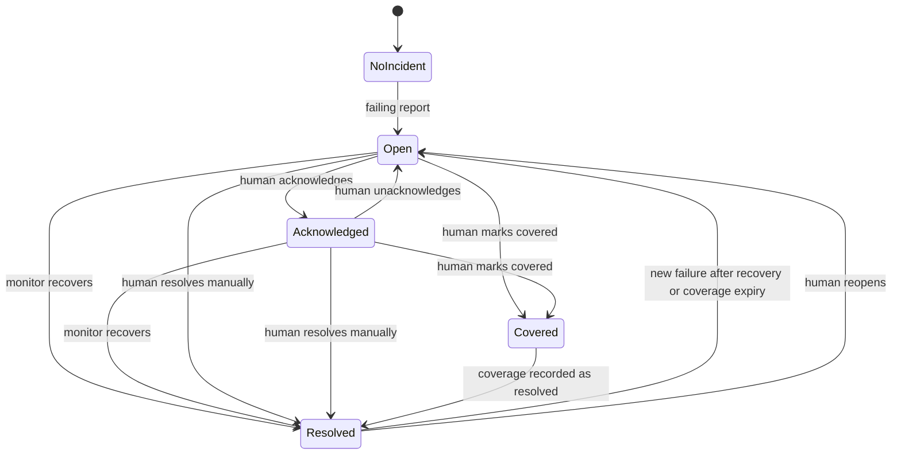
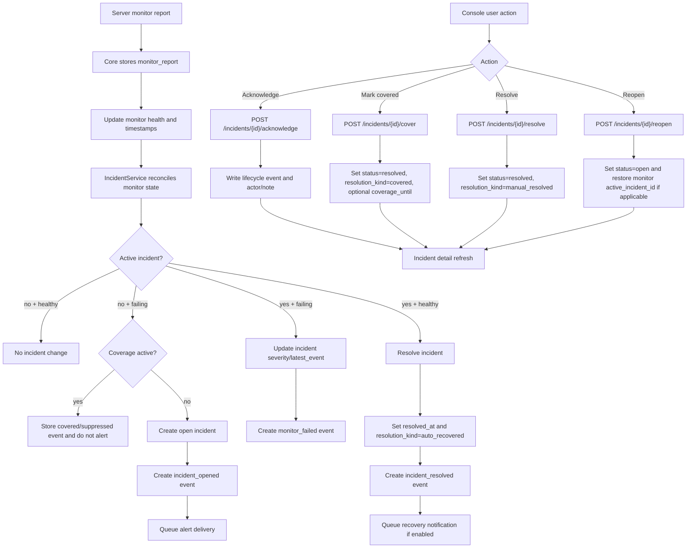

# Incident And Detail View Information Architecture Plan

This document plans the next incident and detail-view improvements. It focuses on the information Orion should show, how operators can use that information to make better decisions, and what Core and Console need in order to support manual incident lifecycle actions such as "mark covered" or "resolve manually".

## Product Outcome

Incident detail should answer four questions quickly:

1. What is affected?
2. What changed, and when?
3. What evidence proves the current state?
4. What should I do next?

The current implementation already gives Orion a useful base: incidents have list and detail screens, related server and monitor links, timeline events, alert deliveries, and linked monitor reports. The missing step is turning incident detail from a passive record into an operator workflow.

The target workflow is:

- understand impact from the incident header and affected-resource summary;
- inspect evidence from the triggering report, latest report, timeline, notifications, and raw payloads;
- choose a lifecycle action: acknowledge, mark covered, manually resolve, reopen, or defer;
- preserve the decision as structured audit data so future lists, status pages, and alerting can use it.

## Current Implementation

### Core

Core stores incidents in `incidents`, events in `incident_events`, monitor reports in `monitor_reports`, and alert attempts in `alert_deliveries`.

Implemented incident statuses are:

- `open`
- `acknowledged`
- `resolved`

Current incident behavior:

- monitor reports open, update, and automatically resolve incidents;
- `monitors.active_incident_id` caches the active incident for fast reconciliation;
- `monitors.incident_state` records the last incident-relevant monitor state;
- incident detail returns `incident`, `timeline`, `events`, `alert_deliveries`, and `monitor_reports`;
- timeline is derived from incident events plus alert delivery attempts;
- alert recovery notifications may be queued when Core resolves an incident.

Current API surface:

- `GET /v1/incidents`
- `GET /v1/incidents/{id}`
- `GET /v1/incidents/{id}/timeline`
- `GET /v1/incidents/candidates`

Missing API surface:

- no manual acknowledge endpoint;
- no manual resolve endpoint;
- no covered/suppressed-by-human concept;
- no structured resolution kind, actor, note, or expiry;
- no explicit reopen behavior after a human closes an incident while reports still fail.

### Console

The incidents list has status filters, summary counts, server-side pagination, severity, notification state, server links, monitor links, and incident detail navigation.

The incident detail view currently shows:

- incident status, severity, notification state, and duration;
- affected server, monitor, and monitor type;
- opened, latest event, and resolved timestamps;
- first failing result, latest report, and latest timeline event;
- tabs for timeline, notifications, and monitor reports.

Related detail views already connect back to incidents:

- server detail highlights an active or requested incident;
- monitor detail highlights an incident, shows latest result, uptime, related incidents, history, and config.

Missing Console behavior:

- no primary incident action bar;
- no acknowledge, mark covered, manual resolve, or reopen dialogs;
- no visible distinction between auto-resolved and human-resolved incidents;
- no raw report drawer for evidence inspection from the incident page;
- no opinionated "next best action" section.

## Information Architecture

Incident detail should be organized around action, evidence, and auditability.

```mermaid
flowchart TD
  A["Incident Detail"] --> B["Header"]
  A --> C["Action Bar"]
  A --> D["Impact"]
  A --> E["Evidence"]
  A --> F["Timeline"]
  A --> G["Notifications"]
  A --> H["Related Context"]

  B --> B1["Title"]
  B --> B2["Status, severity, duration"]
  B --> B3["Latest summary"]

  C --> C1["Acknowledge"]
  C --> C2["Mark covered"]
  C --> C3["Resolve manually"]
  C --> C4["Reopen"]

  D --> D1["Server"]
  D --> D2["Monitor"]
  D --> D3["Monitor type and target"]
  D --> D4["User-facing impact label"]

  E --> E1["Triggering report"]
  E --> E2["Latest report"]
  E --> E3["Raw payload drawer"]
  E --> E4["Suggested diagnosis"]

  F --> F1["Incident events"]
  F --> F2["Lifecycle actions"]
  F --> F3["Monitor state changes"]

  G --> G1["Delivery attempts"]
  G --> G2["Suppressed or cooldown reason"]
  G --> G3["Retry or test action later"]

  H --> H1["Monitor history"]
  H --> H2["Server health"]
  H --> H3["Event log"]
  H --> H4["Related incidents"]
```



### Incident List IA

The list should become a triage surface.

Primary columns:

- incident title;
- status;
- severity;
- affected server;
- affected monitor;
- age or duration;
- latest event;
- owner or actor, once lifecycle actions exist;
- notification state.

Primary filters:

- status: active, acknowledged, covered, resolved, all;
- severity;
- needs review;
- server;
- monitor;
- notification failed;
- manually handled.

`covered` should be a filter derived from structured resolution or coverage fields, not necessarily a top-level incident status.

### Incident Detail IA

Suggested sections:

- Header: title, active state, severity, duration, latest event, primary actions.
- Impact: affected resource, monitor type, target, service label later, active user-facing impact.
- Lifecycle: opened, acknowledged, covered/resolved, actor, note, coverage expiry, recovery notification state.
- Evidence: triggering report, latest report, payload summary, raw payload drawer.
- Timeline: combined incident events, lifecycle actions, alert delivery attempts, and linked monitor reports.
- Notifications: delivery attempts, failures, cooldown/suppression reasons, target channels.
- Related context: monitor history, server health, logs/events, similar prior incidents.

### Server And Monitor Detail IA

Server detail should show incidents as context for server health, not as the whole reason the server is unhealthy.

Monitor detail should show incidents as the lifecycle wrapper around monitor reports.

Cross-navigation should preserve context:

- incident to monitor: `/monitors/{monitor_id}?incident={incident_id}`;
- incident to server: `/agents/{agent_id}?tab=monitors&incident={incident_id}`;
- monitor to incident: latest active or highlighted incident;
- event log to incident: event rows link to incident detail.

## Lifecycle Model

The cleanest model is to keep the primary status values small and add structured lifecycle metadata.

Primary status:

- `open`: active and unhandled;
- `acknowledged`: seen by a human, still active;
- `resolved`: closed by recovery, human decision, or monitor lifecycle event.

Resolution kind:

- `auto_recovered`: Core resolved it because the monitor recovered;
- `manual_resolved`: a human says the incident is resolved;
- `covered`: a human says the issue is known, accepted, or being handled elsewhere;
- `monitor_removed`: Core closed it because the monitor was removed;
- `stale_reconciled`: Core closed or corrected it during reconciliation.

"Mark covered" should be a product action that sets `status = resolved` with `resolution_kind = covered`, records a note, and optionally creates a temporary coverage window so the same still-failing monitor does not immediately reopen another incident.



## Architecture Flow



## Data Improvements

### Incident Fields

Add structured lifecycle fields to incidents:

- `acknowledged_at`
- `acknowledged_by`
- `resolved_by`
- `resolution_kind`
- `resolution_note`
- `covered_until`
- `reopened_at`
- `reopened_by`

Keep `latest_event` for display, but do not make it carry product logic.

### Incident Events

Add event types:

- `incident_acknowledged`
- `incident_unacknowledged`
- `incident_marked_covered`
- `incident_manually_resolved`
- `incident_reopened`
- `incident_auto_resolved`
- `incident_suppressed_by_coverage`

Incident events should be the audit log. Incident columns should hold the current lifecycle state and common query fields.

### Coverage

Coverage needs to prevent the bad loop where a human closes a still-failing incident and the next report immediately creates a duplicate.

MVP option:

- store `covered_until` on `incidents`;
- when resolving as covered, also write a monitor-level coverage record or suppression field;
- suppress opening a new incident for the same monitor until either the monitor reports healthy once or the coverage expires.

More flexible option:

- create `incident_coverages` with `monitor_id`, `incident_id`, `covered_by`, `covered_at`, `covered_until`, `reason`, and `ended_at`;
- let incident reconciliation check active coverage before opening a new incident;
- end coverage automatically on recovery.

The flexible option is better if covered incidents will later drive status page behavior, maintenance windows, or alert routing.

### API Endpoints

Add lifecycle endpoints:

- `POST /v1/incidents/{id}/acknowledge`
- `POST /v1/incidents/{id}/unacknowledge`
- `POST /v1/incidents/{id}/resolve`
- `POST /v1/incidents/{id}/cover`
- `POST /v1/incidents/{id}/reopen`

Shared request body:

```json
{
  "note": "Investigated and handled by provider failover.",
  "actor": "admin",
  "notify": false,
  "covered_until": "2026-05-26T23:00:00Z"
}
```

For MVP, `actor` can come from the authenticated admin identity when auth is expanded. Until then, Core can use a fixed `admin` actor or omit it.

### Detail Response

Extend incident detail with:

- `lifecycle`: structured current state, actors, notes, and resolution kind;
- `actions`: booleans for allowed actions based on status and monitor state;
- `evidence`: normalized trigger and latest report summaries;
- `coverage`: active coverage state, expiry, and reason;
- `related_incidents`: prior incidents for the same monitor.

This lets Console avoid duplicating product rules and makes the UI easier to keep consistent.

## How The Data Becomes More Useful

### Better Triage

Operators can filter active incidents by urgency, failed notifications, acknowledged state, and whether a human has already handled them.

### Better Detail Views

Incident detail can show "why this is happening" rather than only "what rows exist". Triggering report, latest report, lifecycle action, notification attempt, and related monitor history are all part of one operational story.

### Better Alerting

Covered incidents can suppress repeat alerts without hiding the historical incident. Recovery notifications can be controlled separately for auto recovery versus manual/covered closure.

### Better Postmortems

Resolution kind and notes make incident history searchable:

- recurring monitor failures;
- most common manual resolution reasons;
- incidents that were covered but later reopened;
- notification failures during high-severity incidents.

### Better Status Pages

Covered incidents can later decide whether a component should stay degraded, show a maintenance-style notice, or disappear from the public status page.

## Implementation Plan

### Phase 1: Lifecycle Actions

Goal: make incidents actionable from Console.

Core:

- add migration for lifecycle fields;
- add acknowledge, resolve, cover, and reopen service methods;
- add API routes and OpenAPI annotations;
- generate OpenAPI and SDK;
- test status transitions, event creation, monitor `active_incident_id`, and alert notification behavior.

Console:

- add incident action bar;
- add confirmation dialogs with note fields;
- add lifecycle summary on detail;
- invalidate incident list/detail, monitor detail, and server detail queries after actions.

### Phase 2: Coverage Semantics

Goal: stop duplicate reopen noise after a human marks an incident covered.

Core:

- add monitor-level coverage check to incident reconciliation;
- suppress new incident creation while coverage is active;
- end coverage when a healthy report arrives;
- record `incident_suppressed_by_coverage` events for audit.

Console:

- show coverage expiry and reason;
- add "End coverage" or "Reopen" action;
- add list filter for covered incidents.

### Phase 3: Evidence And Debugging

Goal: make incident detail explain the failure.

Core:

- normalize trigger and latest report summaries;
- include related incidents for the same monitor;
- expose raw report payload safely.

Console:

- add raw payload drawers from incident, monitor history, and server logs;
- show trigger versus latest report side by side;
- link timeline rows to their report or delivery detail.

### Phase 4: Operational Analytics

Goal: use incident history for product intelligence.

Core:

- add filters for resolution kind, actor, and covered state;
- add aggregate endpoints for recurring failures and mean time to acknowledge/resolve.

Console:

- add incident insights to the list summary;
- add recurring-incident callouts on monitor detail;
- show notification reliability alongside incident severity.

## Recommended MVP Scope

Build this first:

- `POST /v1/incidents/{id}/acknowledge`
- `POST /v1/incidents/{id}/resolve`
- `POST /v1/incidents/{id}/cover`
- lifecycle fields: `acknowledged_at`, `resolved_by`, `resolution_kind`, `resolution_note`, `covered_until`
- incident events for acknowledge, manual resolve, and covered;
- Console action bar and dialogs;
- list/detail badges that distinguish `auto recovered`, `manually resolved`, and `covered`.

Defer this until the first lifecycle actions feel right:

- full actor identity;
- recurring incident analytics;
- public status page policy;
- advanced coverage records;
- alert grouping and route-level suppression.

## Open Decisions

- Should "covered" be time-boxed by default, or should it last until the monitor recovers?
- Should marking covered send a recovery notification, a distinct covered notification, or no notification?
- Should a covered monitor still appear as degraded on status pages?
- Should manual resolve be allowed while the latest monitor report is still failing?
- Should deleting a monitor automatically resolve its active incident with `resolution_kind = monitor_removed`?

## Success Criteria

This plan is successful when a user can:

- open an incident and immediately understand impact, cause, and latest evidence;
- mark an incident acknowledged, covered, or resolved from the detail page;
- see who or what closed the incident and why;
- avoid duplicate incident noise after a covered still-failing monitor;
- navigate cleanly between incident, monitor, server, logs, and notifications;
- use incident history to improve monitors, alerts, and future status-page behavior.
